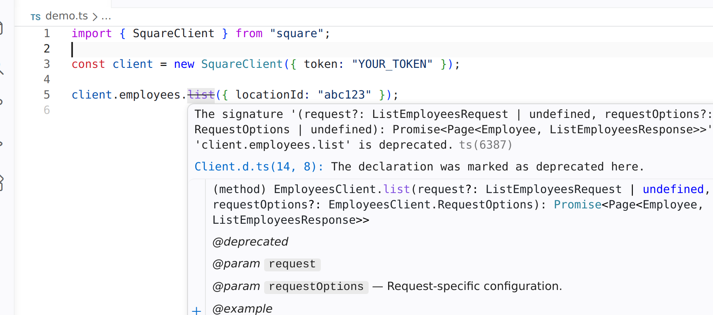

The `x-fern-availability` extension marks the availability of an endpoint within your OpenAPI definition. The availability information propagates into the generated Fern Docs website as visual tags and SDKs.

## Endpoint

Set `x-fern-availability` on an endpoint to one of the following values:

| Value | Description | Tag |
| --- | --- | --- |
| `alpha` | Early experimental stage | `Alpha` |
| `beta` | Stable enough for early adopters | `Beta` |
| `preview` | Feature-complete but subject to change | `Preview` |
| `generally-available` | Stable and ready for production | `GA` |
| `deprecated` | No longer recommended for new use | `Deprecated` |
| `legacy` | Superseded but still supported | `Legacy` |

The example below marks that the `POST /pet` endpoint is `deprecated`.

```yaml title="x-fern-availability in openapi.yml" {4}
paths:
  /pet:
    post:
      x-fern-availability: deprecated
```

### API Reference output

The endpoint renders with the corresponding tag in your API Reference docs.

<Frame caption="A deprecated endpoint">

</Frame>

### SDK output

Availability values propagate into [generated SDKs](/learn/sdks/deep-dives/sdk-user-features#availability) as doc comments on client methods (JSDoc in TypeScript, docstrings in Python, Javadoc in Java, etc.). IDEs surface these as warnings and strikethrough styling so SDK users see at a glance which endpoints to avoid.

```typescript title="Generated TypeScript SDK"
export class PetClient {
    /** @deprecated */
    public addPet( ... ): Promise<Pet> { ... }

    /** @beta This endpoint is in pre-release and may change. */
    public getPetById( ... ): Promise<Pet> { ... }
}
```

<Frame caption="Deprecated method with strikethrough in the [Square TypeScript SDK](https://github.com/square/square-nodejs-sdk/blob/master/src/api/resources/employees/client/Client.ts)">

</Frame>

To attach a custom message, write `x-fern-availability` as an object with `status` and `message` fields:

```yaml title="openapi.yml" {4-6}
paths:
  /pet:
    put:
      x-fern-availability:
        status: deprecated
        message: Use PATCH /pet instead.
```


## Section

<Markdown src="/products/api-def/snippets/availability.mdx" />

