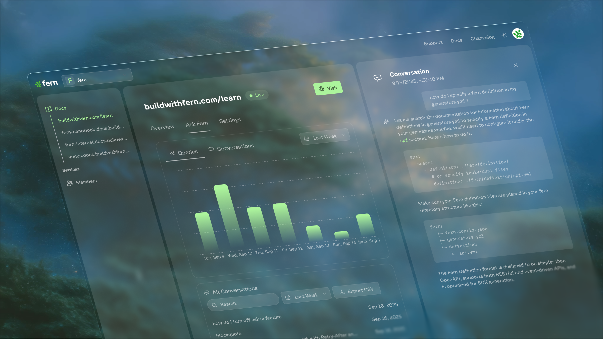

The Ask Fern tab of your [Fern Dashboard](http://dashboard.buildwithfern.com) displays queries and conversations per day on your documentation site. You can view data by week, month, year, or all-time periods.

Drill down into individual conversations to see the exact user queries and Ask Fern responses, helping you understand how users interact with your documentation. 

<Frame>
  
</Frame>

You can also export data to CSV format to identify trends and optimize your documentation strategy.