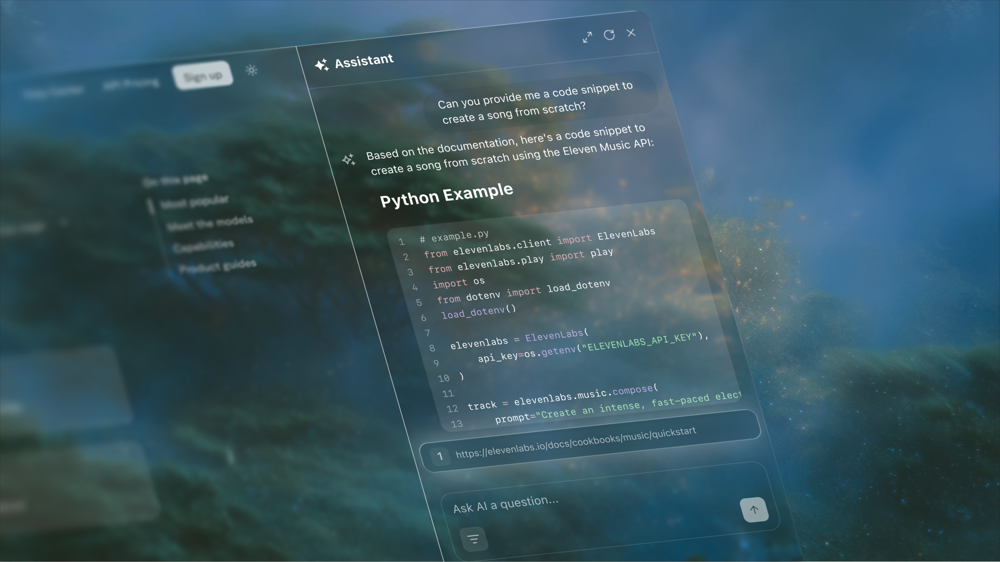

Fern's AI search includes citations that link directly to source documentation, showing users where information comes from and providing immediate context. By referencing specific documentation sections, citations verify answer sources while enabling users to easily explore topics in greater depth.

When Ask Fern references content from [custom documents added via the Documents API](/ask-fern/configuration/content-sources), it includes the associated URL as a citation, allowing users to access the original source material.

<Frame>
  
</Frame>

