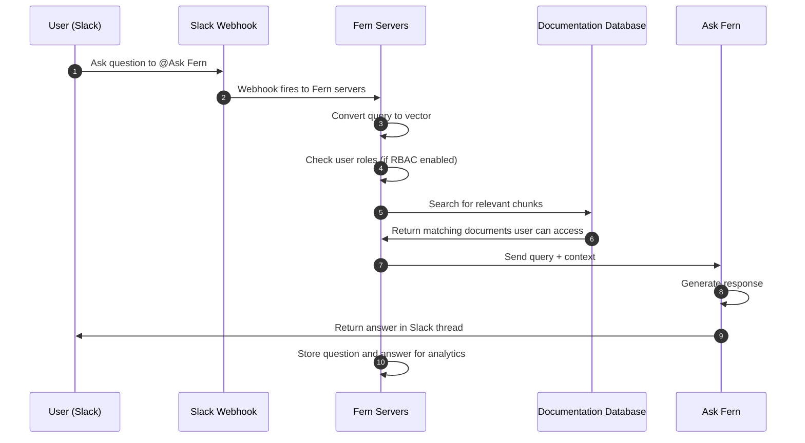

The Ask Fern Slack app allows customers to ask questions about your products directly in Slack channels and receive AI-generated answers from your documentation database.

Fern stores all questions and answers from Slack interactions for [analytics purposes](/ask-fern/features/analytics).

## Setup

Install the Ask Fern app and add the bot to customer channels. 

<AccordionGroup>
<Accordion title="Install for your organization">

To install Ask Fern in your organization's Slack workspace, you must be a Slack admin. Follow these steps:

1. In your Fern dashboard, click the **Install to Slack** button. You'll be redirected to Slack to authorize the app 
1. Select the workspace where you want to add Ask Fern and click **Allow**

<Frame>
  
</Frame>

</Accordion>
<Accordion title="Enable for customer workspaces">

To give customers access to the Ask Fern bot in their own Slack workspaces:

1. Generate a customer installation link by making a request to:
   ```
   https://fai.buildwithfern.com/slack/get-install?domain={your-domain}
   ``` 
   This returns a unique URL that your customers can use to install Ask Fern to their own Slack workspace.

    <Frame>
    
    </Frame>
1. Forward this link to your customer so they can install the Ask Fern app to their workspace.
1. Once the customer has installed the Ask Fern app, you must add the bot to your customer Slack channel to give it access.


Once added, customers will see that `@Ask Fern was added to the channel`. They can start asking questions immediately.
</Accordion>
</AccordionGroup>

## Configuration

Customize the bot's behavior to match your workflow needs.

<AccordionGroup>
<Accordion title="Bot settings per channel">

Use the `/configure` slash command in any channel to adjust the settings:

| Command | Description | Example |
|---------|-------------|---------|
| **respond_to** | Controls whether the Ask Fern bot responds to all messages (`all`) or only when directly mentioned with `@Ask Fern` (`mentions_only`) | `/configure respond_to all` |
| **roles** | Specifies which RBAC roles should be used to filter Ask Fern responses (if you have [role-based access control](/docs/authentication/rbac) configured) | `/configure roles developer, admin` |
| **show** | Show the current settings | `/configure show` |
| **help** | Get help with Ask Fern slash commands | `/configure help` |

<Frame>
  
</Frame>

</Accordion>
<Accordion title="Customize the bot name">

You can rename the bot to match your brand (example: "YourCompanyName Support"):

1. In Slack, go to **Apps** in the sidebar and click **Ask Fern**
1. Click the **About** tab, then **Configuration**
1. Scroll to **Bot User** section and click **Edit**
1. Enter your preferred bot name and save changes


<Frame>
  
</Frame>

Now customers will see `@YourCompanyName Support was added to the channel` instead of the default `@Ask Fern` name.
</Accordion>
</AccordionGroup>

## Architecture

When a user asks Ask Fern a question in Slack, a webhook triggers Fern's servers to search your documentation database and retrieve relevant context. Using that context, Ask Fern generates a response.

<Accordion title="Diagram">


</Accordion>