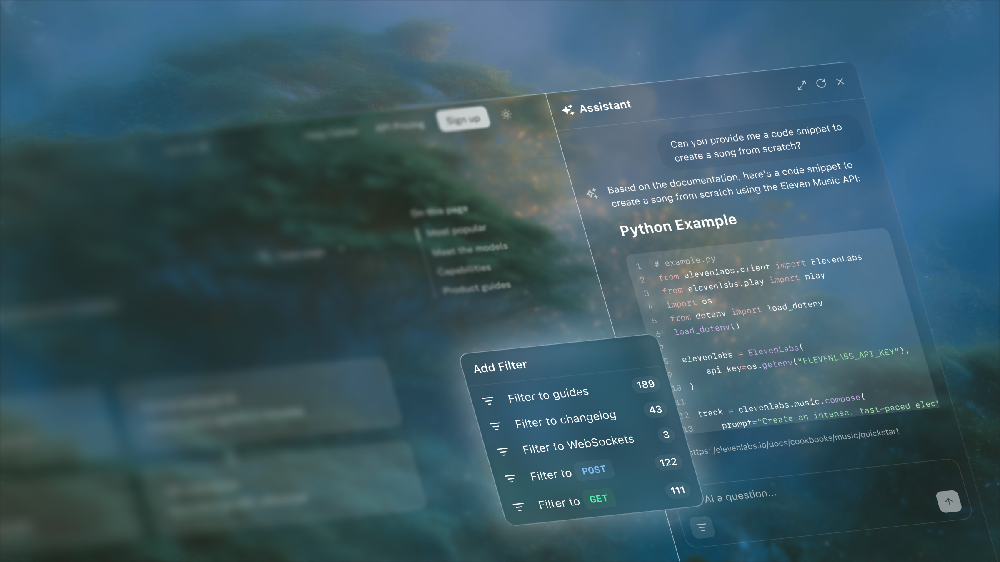
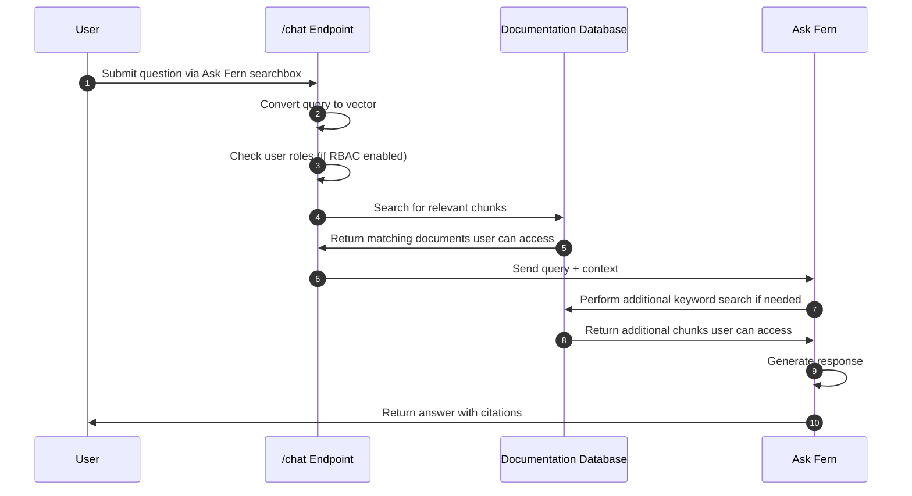

Ask Fern is a **Retrieval Augmented Generation (RAG)** system that appears as a side panel on your documentation site, transforming your documentation into an intelligent, searchable knowledge base.

## Visual design and behavior

Ask Fern appears as a resizable side panel on your documentation site. Users can drag to resize it or use the expand/minimize button to control their viewing experience.

<CardGroup cols={3}>
  <Card title="Adaptive layout" icon="regular layer-group">
    Works with all [Fern Docs layouts](/docs/configuration/site-level-settings#layout-configuration).
  </Card>
  <Card title="Persistent navigation" icon="regular window-restore">
    Stays open as users navigate pages and links.
  </Card>
  <Card title="Document-specific queries" icon="regular file-lines">
    Ask questions about the current page via dropdown.
  </Card>
  <Card title="Mobile optimization" icon="regular mobile">
    Expands to full screen on mobile when typing.
  </Card>
  <Card title="Filtered responses" icon="regular filter">
    Respects versions, products, and roles for relevant results.
  </Card>
  <Card title="Code-aware" icon="regular code">
    Understands and references your SDK code alongside docs.
  </Card>
</CardGroup>

<Frame>
  
</Frame>

<Tip>The interface maintains your site's design language while providing a familiar chat experience that feels native to your documentation.</Tip>

## How it works

<Steps>
  <Step title="Content and code indexing">
    Fern automatically processes your documentation pages and Fern-generated SDK code, breaking them into semantic chunks and converting each chunk into a vector using sentence embedding models. They're stored in a database that serves as Ask Fern's search index.
  </Step>
  <Step title="Query processing">
    When users ask questions, Ask Fern vectorizes their query and searches the database to find the most relevant documentation and code chunks. If you have [role-based access control](/docs/authentication/rbac) configured, Ask Fern filters results based on the user's permissions.
  </Step>
  <Step title="Response generation">
    Ask Fern uses the retrieved chunks as context to generate accurate answers with [citations](/ask-fern/features/citations) for the user. If the initial context isn't sufficient, it performs an additional keyword search.
  </Step>
</Steps>

<Accordion title="Architecture diagram">

Each Ask Fern user query follows these steps:

</Accordion>
