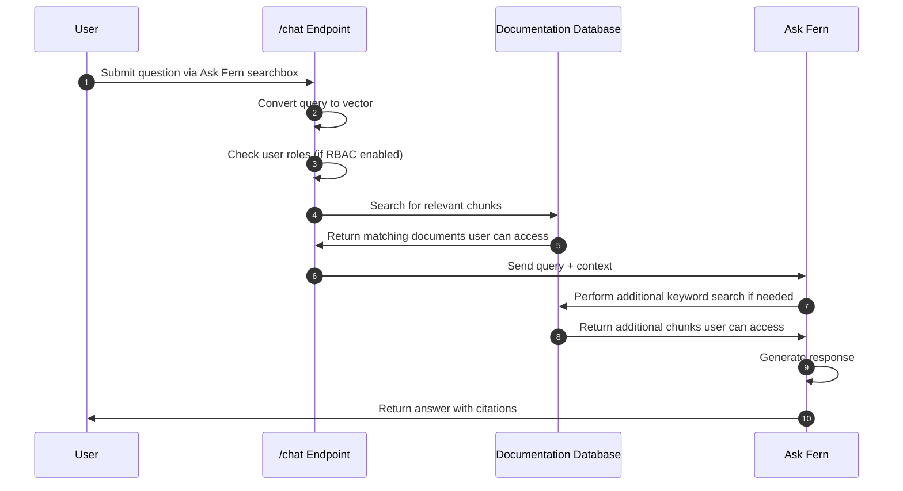

Ask Fern is a **Retrieval Augmented Generation (RAG)** system that appears as a side panel on your documentation site, transforming your documentation into an intelligent, searchable knowledge base.

## Visual design and behavior

Ask Fern appears as a resizable side panel on your documentation site. Users can drag to resize it or use the expand/minimize button to control their viewing experience.

Key behaviors:
- **Adaptive layout** – Seamlessly integrates with all [Fern Docs layouts](/docs/configuration/site-level-settings#layout-configuration)
- **Persistent navigation** – Side panel stays open as users browse different pages or click links provided by the AI responses
- **Document-specific queries** – Users can ask questions about the current page through a dropdown option
- **Mobile optimization** – Expands to full screen when users start typing on mobile devices
- **Filtered responses** – Ask Fern automatically respects versions, products, and roles, so users only see what's relevant to them

<Frame>
  
</Frame>

The interface maintains your site's design language while providing a familiar chat experience that feels native to your documentation.

## How it works

The main parts of the Ask Fern system are:

* **Content and code indexing** – Fern automatically processes your
  documentation pages and Fern-generated SDK code, breaking them into semantic
  chunks and converting each chunk into a vector using sentence embedding
  models. They're stored in a database that serves as Ask Fern's search index. 
* **Query processing** – When users ask questions, Ask Fern vectorizes their
  query and searches the database to find the most relevant documentation and
  code chunks. If you have [role-based access control](/docs/authentication/rbac) configured, Ask Fern filters results based on the user's permissions.
* **Response generation** – Ask Fern uses the retrieved chunks as context to
  generate accurate answers with [citations](/ask-fern/features/citations) for the user. If the initial context isn't sufficient, it performs an additional keyword search.

## Additional content sources

Ask Fern can use content beyond your core documentation to provide more comprehensive answers. There are two ways to add additional content:

### Datasources (coming soon)

Datasources allow Ask Fern to automatically crawl and index external websites. You configure datasources in your `docs.yml` file by providing URLs that Ask Fern will crawl, index, and include in its search results. This is useful for indexing marketing sites, blog posts, or other web-based content that you want Ask Fern to reference.

```yaml docs.yml
ai-search:
  datasources:
    - url: https://example.com/blog
      title: Company blog
```

When Ask Fern references content from a datasource, it will cite the original URL where the content was found.

### Documents API

The [Documents API](/learn/ask-fern/api-reference/document/create-document) allows you to programmatically upload custom content that Ask Fern should reference. Unlike datasources, the Documents API does not crawl URLs. Instead, you provide the full content directly in your API request.

Each document consists of three parts:

- **document** (required): The actual text content that Ask Fern will index and search
- **title** (required): A descriptive title for the content
- **url** (required): A URL that will be shown as a citation when Ask Fern references this content

The URL parameter is used solely for citation purposes. When Ask Fern includes information from your uploaded document in a response, it will display this URL as the source, allowing users to click through to learn more. Ask Fern does not crawl or fetch content from this URL.

This approach is ideal for content that isn't publicly accessible via a URL, such as internal FAQs, support ticket summaries, or proprietary knowledge base articles. You control exactly what content is indexed by providing it directly in the API request.

<Accordion title="Architecture diagram">

Each Ask Fern user query follows these steps:


</Accordion>
