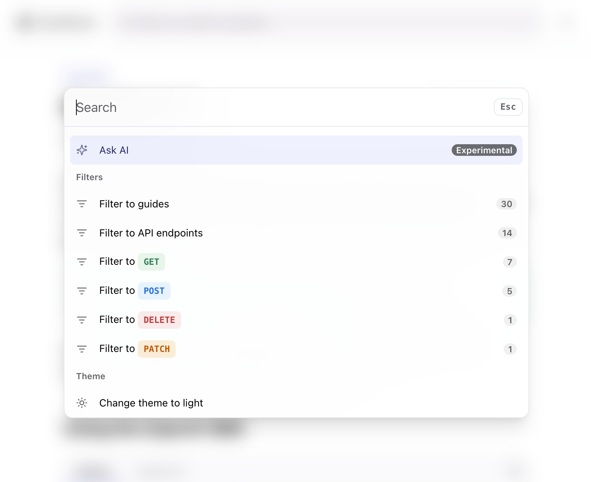
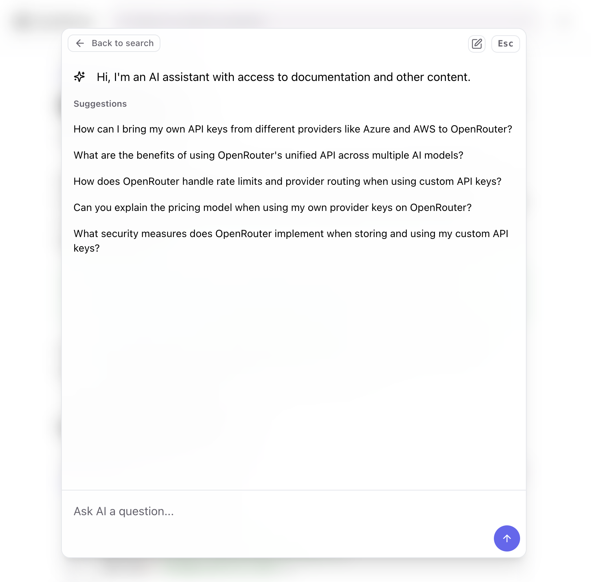
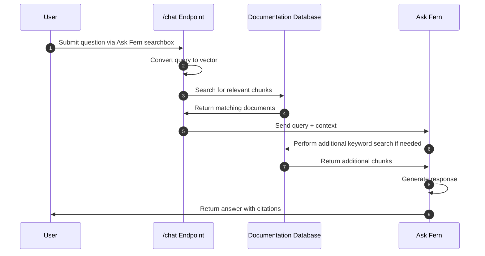

<Note>Ask Fern is available on the [Pro plan](https://buildwithfern.com/pricing#Docs) of Fern Docs. Billing is by usage.</Note>

## Overview

<Frame caption="AI Search is accessed via the search bar, alongside keyword search.">

</Frame>

Ask Fern is Fern's AI Search feature that indexes your documentation and provides an interface for your users to ask questions and get answers. It helps our customers

- **Decrease the time to find needed information** – Help users quickly locate crucial documentation without navigating through a maze of tabs and endpoints.
- **Integrate your product faster** – Accelerate implementation with ready-to-use code samples that demonstrate practical applications.
- **Surface where your docs have gaps** – Identify documentation weaknesses through user feedback and search patterns.

<Frame caption="Users can ask questions and get support in an intuitive chat interface.">

</Frame>

## Features 

<CardGroup cols={2}>
  <Card 
    title="Custom prompting"
    icon="regular book-open"
    href="/learn/ai-search/custom-prompting"
  >
    Tailor Ask Fern behavior to your users' needs. 
  </Card>

  <Card 
    title="Citations" 
    icon="regular quote-right"
    href="/learn/ask-fern/features/citations" 
    >
    Point users to the exact source of the answer. 
  </Card>

  <Card 
    title="Guidance" 
    icon="regular fa-question-circle"
    href="/learn/ask-fern/features/guidance" 
    >
    Add custom FAQs to Ask Fern. 
  </Card>

  <Card 
    title="Documents" 
    icon="regular file-alt"
    href="/learn/ask-fern/features/documents" 
    >
    Add custom documents to Ask Fern. 
  </Card>

  <Card 
    title="Integration with Algolia" 
    icon="regular plug"
    href="/learn/docs/building-and-customizing-your-docs/search" 
    >
    Users can "Ask AI" or search your docs directly with Algolia. 
  </Card>

  <Card 
    title="All-in-one platform" 
    icon="regular fa-layer-group"
    href="/learn/docs/getting-started/overview"
  >
    Create seamless UX by offering a one-stop-shop for all API questions. 
  </Card>

</CardGroup>

##  How it works

Ask Fern is a **Retrieval Augmented Generation (RAG)** system built on top of your documentation site that transforms your documentation into an intelligent, searchable knowledge base. The main parts of the Ask Fern system are:

* **Content indexing** – Fern automatically processes your documentation pages,
  breaking them into semantic chunks and converting each chunk into a vector
  using sentence embedding models. They're stored in a database that serves as
  Ask Fern's search index. 
* **Query processing** – When users ask questions, Ask Fern vectorizes their
  query and searches the database to find the most relevant documentation
  chunks.
* **Response generation** – Ask Fern uses the retrieved chunks as context to
  generate accurate answers with [citations](/ask-fern/features/citations) for the user. If the initial context isn't sufficient, it performs an additional keyword search. 

### Life of a query

Each Ask Fern user query follows these steps:

