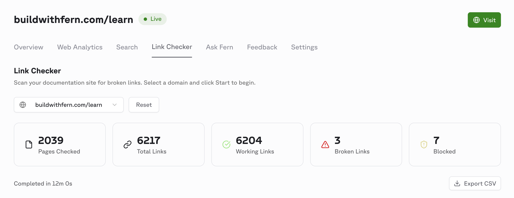

## Broken link checker

<ChangelogTags>developer-tools</ChangelogTags>

The Fern Dashboard now includes a link checker that scans your published documentation for broken links, validating both internal links (links to other pages within your docs) and external links (links to external websites).

To check for broken links, open the [Fern Dashboard](https://dashboard.buildwithfern.com), navigate to the **Link Checker** tab, and select the domain you want to scan. The checker displays any broken (404) or blocked (403) links found, along with the source page and link type.

<Frame>
  
</Frame>
