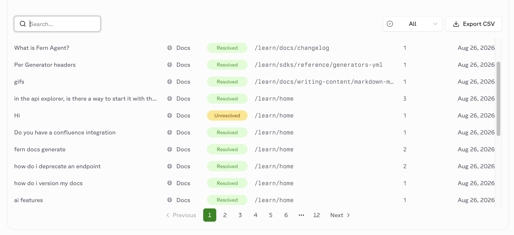

## Ask Fern conversation filters and origin pages

<ChangelogTags>ai</ChangelogTags>

The **Ask Fern** tab in the [Dashboard](https://dashboard.buildwithfern.com/) now shows whether each conversation was resolved, plus the page the question was asked from. Filter by **All**, **Resolved**, or **Unresolved** to find documentation gaps; the CSV export matches the filtered table and includes both new columns.

<Frame>
  
</Frame>

<Button intent="none" outlined rightIcon="arrow-right" href="/learn/docs/ai-features/ask-fern/overview#features">Read the docs</Button>
