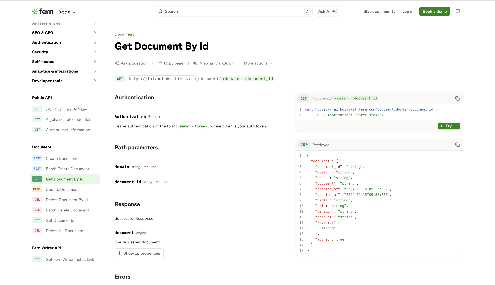
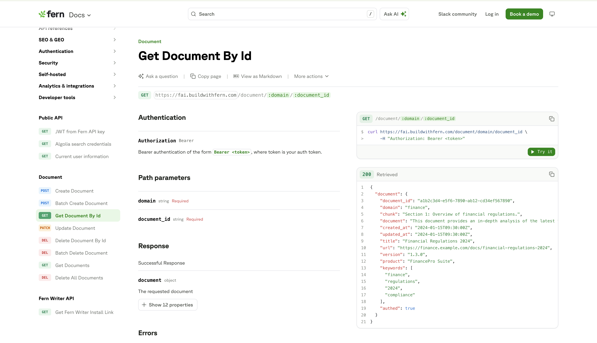

Using AI, Fern automatically creates request and response examples that contain believable data based on your OpenAPI specs. Where we previously showed placeholder text like `username: "string"` and `price: 1.1`, we now show examples that make sense given your endpoint properties and descriptions. These examples stay up to date with your changing spec - if you change or add a field, your generated examples will keep up.

<Tabs>
  <Tab title="Before">
    <Frame>
      
    </Frame>
  </Tab>
  <Tab title="After">
    <Frame>
      
    </Frame>
  </Tab>
</Tabs>

## Backwards compatible

Fern respects any examples you've previously hand-crafted, whether in `x-fern-examples`, the OpenAPI `example` property, or property-level examples in your OpenAPI spec. AI-generated examples only fill in where you haven't provided your own.

## Customizability

### Style your examples

To theme your examples to better fit your brand, add `ai-example-style-instructions` in the `experimental` section of your `docs.yml`. This guides the general content and style of the generated examples.

```yaml docs.yml
experimental:
  ai-example-style-instructions: "Use names and emails that are inspired by plants."
```

### Edit generated examples

If you prefer to give the finishing touches, you can use the generated AI examples as scaffolding and make specific edits to get the result you want. All AI-generated examples get written to `ai_examples_overrides.yml`. You can edit and commit the generated content as desired, and it will be used when you re-publish docs.

<Note>
If you prefer to leave it to the AI, add `**/ai_examples_overrides.yml` to your `.gitignore`:

```txt .gitignore
**/ai_examples_overrides.yml
```
</Note>

### Disable AI examples

If you decide that you prefer how examples were previously generated, you can disable AI examples in the `experimental` section of your `docs.yml`:

```yaml docs.yml
experimental:
  ai-examples: false
```
