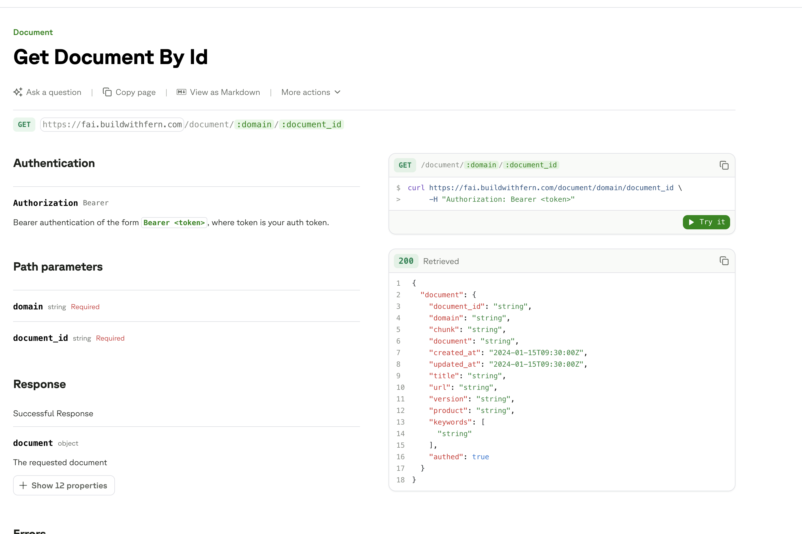
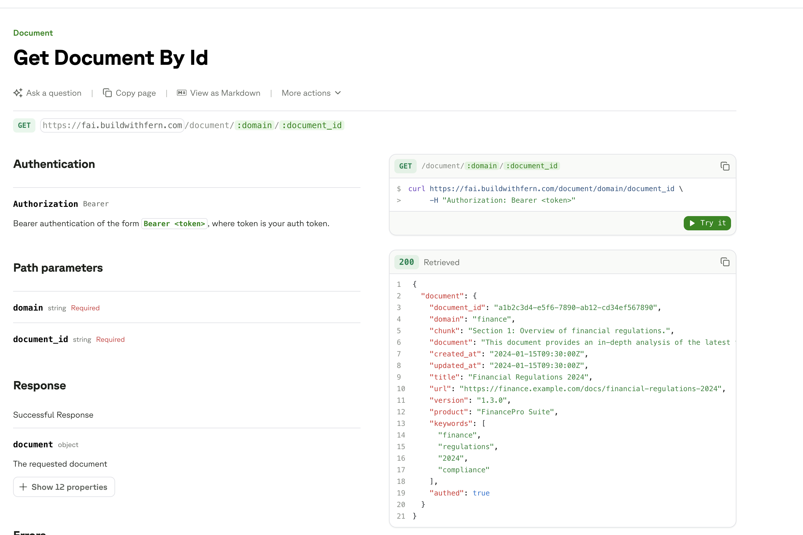

Fern uses AI to automatically generate realistic request and response examples for your [API Reference](/learn/docs/api-references/overview) documentation. This feature is enabled by default for all API Reference pages. Instead of placeholder values like `username: "string"`, you get believable data that reflects your endpoint properties and descriptions. Examples update automatically as your spec changes.

AI examples work alongside manual examples defined in [`x-fern-examples`](/learn/api-definitions/openapi/extensions/request-response-examples), with manual examples taking priority.

<Tabs>
  <Tab title="Before">
    <Frame>
      
    </Frame>
  </Tab>
  <Tab title="After">
    <Frame>
      
    </Frame>
  </Tab>
</Tabs>

## Configuration

Customize the style of generated examples:

```yaml docs.yml
ai-examples:
  style: "Use names and emails that are inspired by plants."
```

Or disable the feature entirely:

```yaml docs.yml
ai-examples:
  enabled: false
```

AI-generated examples are written to `ai_examples_override.yml`. Edit this file to customize specific examples. To regenerate examples on each build instead, add the file to `.gitignore`:

```txt .gitignore
**/ai_examples_override.yml
```

<Tip>
To make AI-generated examples portable to non-Fern OpenAPI tools, use [`fern api enrich`](/learn/cli-api-reference/cli-reference/commands#fern-api-enrich) to merge them into native OpenAPI example fields.
</Tip>
