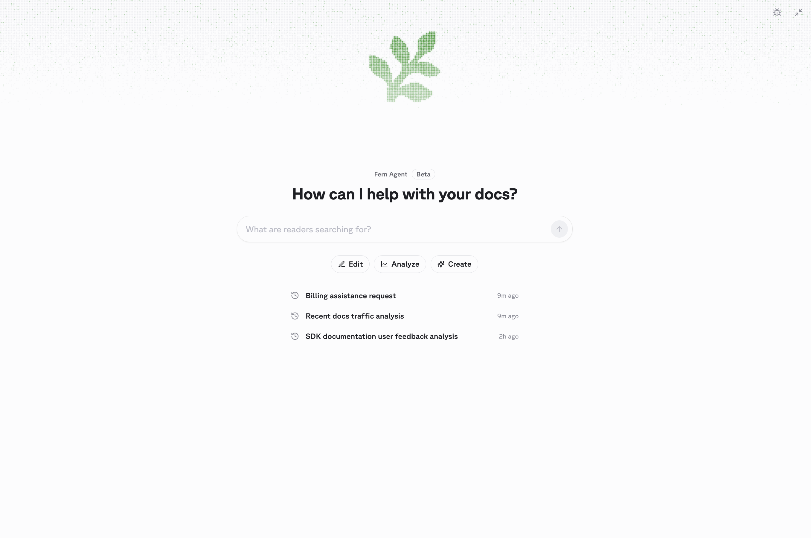
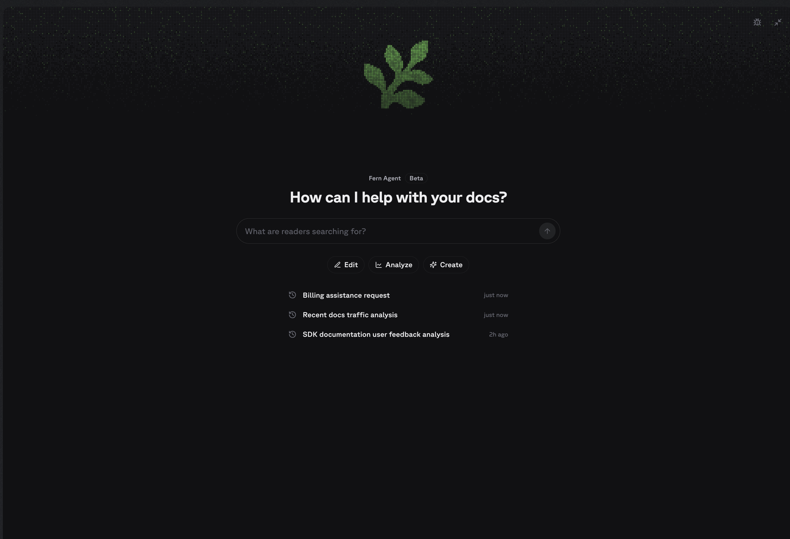

Fern Agent edits your documentation and analyzes your organization's Fern data, including traffic, reader questions, deployments, and site configuration. It's an expert in Fern configuration, from `docs.yml` and components to versioning, redirects, and access control.

<div className="dark:hidden">
  <Frame>
    
  </Frame>
</div>

<div className="hidden dark:block">
  <Frame>
    
  </Frame>
</div>

Talk to it in the [Fern Dashboard](https://dashboard.buildwithfern.com/) chat panel, or [integrate](#setup) it with your Slack or your coding agent (via MCP) in one click. Fern Agent can open a PR or iterate live in the [visual editor](/learn/docs/writing-content/fern-editor).

Editing requires a GitHub repository, since Fern Agent delivers changes as pull requests and GitLab and other Git providers aren't supported. Every other tool, including analysis and insights, works regardless of your Git provider.

## What it can do

<Frame>
  <video
    src="./assets/agent.mp4"
    autoPlay
    loop
    playsInline
    muted
  >
  </video>
</Frame>

<AccordionGroup>

<Accordion title="Edit your docs">

Fern Agent reads your docs site's source repository and makes the changes you describe.

Requests can be about structure and settings as much as page copy, because Fern Agent knows how Fern sites are put together: [navigation](/learn/docs/configuration/navigation) and product switchers, [versions](/learn/docs/configuration/versions), [redirects](/learn/docs/seo/redirects), the [component library](/learn/docs/writing-content/components/overview), and [authentication and RBAC](/learn/docs/authentication/overview). It writes the configuration the way Fern expects it, so a moved page gets its redirect and a new page gets its navigation entry.

<Prompt title="Add a new page">
Add a page about authentication to my getting-started guide.
</Prompt>

<br />

<Prompt title="Rewrite existing content">
Identify which pages in my documentation could be more concise.
</Prompt>

</Accordion>

<Accordion title="Explore analytics">

Fern Agent queries pageviews, visitors, sessions, 404s, referring domains, search queries, reader feedback, and LLM bot traffic for any docs site in your organization. Ask for a fix alongside the question and it carries the specifics it found into the change it makes.

<Prompt title="Check traffic">
List the pages with the most traffic last month.
</Prompt>

<br />

<Prompt title="Repair broken URLs">
List the top 404 paths on my site over the last 30 days and add redirects for them.
</Prompt>

<br />

<Prompt title="Reorganize navigation">
Give me suggestions about how to optimize my navigation based on site analytics.
</Prompt>

<br />

<Prompt title="Follow up on empty searches">
Find the search queries that returned no results, then add the missing content to the API reference guide.
</Prompt>

<br />

<Prompt title="Rewrite an underperforming page">
Find the page with the worst reader feedback and rewrite it to address what readers complained about.
</Prompt>

</Accordion>

<Accordion title="Review Ask Fern activity">

Fern Agent summarizes what readers ask [Ask Fern](/learn/docs/ai-features/ask-fern/overview), including resolution rates and individual conversations, so you can find topics that need better coverage — then write that coverage without leaving the conversation.

<Prompt title="Summarize reader questions">
Summarize what readers asked Ask Fern this week and suggest ways I can expand our documentation based off of those topics.
</Prompt>

<br />

<Prompt title="Find unresolved conversations">
List the unresolved Ask Fern conversations.
</Prompt>

<br />

<Prompt title="Close a documentation gap">
Find the most common unresolved Ask Fern question this week and draft a page that answers it.
</Prompt>

</Accordion>

<Accordion title="Review configuration and deployments">

Fern Agent reports a site's deployment history, connected git repository, Fern CLI version, custom domain, and reader-facing settings such as search behavior and password protection. Since it reads the same `docs.yml` it edits, it can trace a failed build back to the configuration that caused it and fix it.

<Prompt title="Check deployments">
List the recent deployments for docs.plantstore.com.
</Prompt>

<br />

<Prompt title="Review site settings">
List the features enabled on docs.plantstore.com.
</Prompt>

</Accordion>

<Accordion title="Manage your organization">

Account administration stays read-only: it can't create API keys, change members, or update billing. When you ask Fern Agent to perform an administration action, it links you to the page that does it.

<Prompt title="Check organization members">
List the admins in my organization.
</Prompt>

<br />

<Prompt title="Update billing">
Where can I update billing information for my organization?
</Prompt>

</Accordion>

</AccordionGroup>

## Setup

Open the [Fern Dashboard](https://dashboard.buildwithfern.com/) and start a conversation in the chat panel. From the chat panel, you can also:

* **Connect Fern Agent to Slack.** Click **Connect Slack**, select the workspace, and add Fern to the Slack channels where your team discusses documentation. Authorizing the app requires Slack admin access.
* **Connect your agents.** Click **Onboard your agent** to connect your coding agent to [Fern's MCP server](/learn/docs/ai-features/fern-mcp-servers).

<Frame>
  <video
    src="./assets/agent-install.mp4"
    autoPlay
    loop
    playsInline
    muted
  >
  </video>
</Frame>

Alternatively, install manually. Connect Slack with your [Fern API key](/learn/dashboard/configuration/api-keys) and the `organization` field from `fern/fern.config.json`:

```bash
curl -X POST https://fai.buildwithfern.com/slack/agent/install \
  -H "Authorization: Bearer <FERN_TOKEN>" -H "Content-Type: application/json" \
  -d '{"org_id":"<org>"}'
```

Onboard your agent by handing it this prompt:

<Prompt title="Set up Fern Agent in your terminal">
Fetch and execute the appropriate instructions to set me up for Fern from https://buildwithfern.com/learn/docs/ai-features/agent-setup.md
</Prompt>

## Making requests in Slack

Tag `@Fern` in a channel where it has been added and describe the change you need or analysis you want to conduct. It only responds when directly tagged. Fern replies to your prompt and opens PRs on your documentation as needed. At any time, you can click a link to continue your session in the Fern Dashboard.

Image and file attachments provide additional context. When tagged in an existing thread, Fern Agent reads the full conversation before responding. Request changes by replying in the thread, and merge the pull request like any other once it meets your requirements.

<Note title="Fern Agent vs. Fern Writer">
Fern Agent is an expansion of Fern Writer. Fern Writer opened documentation pull requests from Slack, and it still does — existing installations keep working and the request flow is unchanged.

What Fern Agent adds is context on your organization and more places to work from. Alongside editing, it answers questions about your traffic, reader questions, deployments, and site configuration, and the same capabilities are now available in the Fern Dashboard and in your coding agent over MCP rather than in Slack alone.
</Note>

## Automations

Create an automation on the **Automations** page of the [Fern Dashboard](https://dashboard.buildwithfern.com/). You can also describe the recurring work you want done in the chat panel or @Fern in Slack, and Fern Agent sets up the automation for you. 

Each run starts a fresh conversation from the prompt, works it in a single turn, and reports back on what it did, found, or skipped. An automation only changes the docs when the prompt explicitly requests it.

<Frame>
  <video
    src="./assets/automations.mp4"
    autoPlay
    loop
    playsInline
    muted
  >
  </video>
</Frame>

### Setup

<Steps>
<Step title="Write the prompt">
Open **Automations**, select **New automation** (choose **Manual** or **Template**), and describe what each run should look at and produce. Every run has your organization's docs, analytics, reader feedback, Ask Fern conversations, and search queries available to it. A prompt holds up to 2,000 characters.
</Step>

<Step title="Set the schedule">
Choose daily or a day of the week, a time of day, and timezone. A schedule fires at most once every 20 hours.
</Step>

<Step title="Check what a run produces">
**Save** your new automation. 

After creating your automation, select **Run now** to test the prompt. Manually running an automation doesn't affect the next scheduled run. Runs take a few minutes, and finished runs are reported via email or Slack when you [connect Fern Agent to Slack](#setup).
</Step>
</Steps>

Everyone in your organization sees every automation, and only its creator can change, delete, or run one. Turning an automation off keeps its prompt and history, while deleting it discards both — pull requests its runs opened are unaffected. Run history covers the last 30 days.

### Examples

<Prompt title="Fix what readers complained about">
Review the feedback readers left on our docs pages and fix the pages they said were missing information, wrong, or unclear. Make the changes and open a pull request. Ignore feedback about the product rather than the docs.
</Prompt>

<br />

<Prompt title="Report on how the docs are doing">
Report on how our docs are doing: the pages readers spend the most time on, where they drop off, the searches that return nothing, and what changed since last week.
</Prompt>

## Privacy and data handling

Fern Agent acts with your own Fern permissions on every surface, so it reads and edits only the sites, analytics, and organization data your account can already see. Requests are scoped to a single session: the prompt, any Slack message or thread you tag it in, and attached files are stored to complete the task and aren't retained afterward.

Editing is powered by [Devin from Cognition](https://cognition.ai/blog/introducing-devin). Neither Fern nor [Devin](https://docs.devin.ai/admin/security#how-is-your-data-used-to-improve-devin) uses your data to train AI models: Fern configures its Devin integration to opt out of any data collection for model training, so your messages, code, and documentation content are never used for training.
