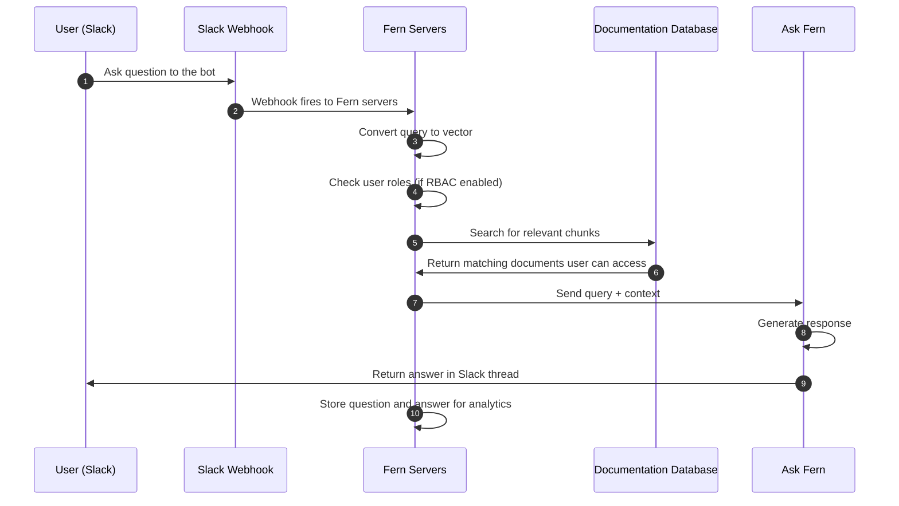

Fern brings your documentation into Slack in two ways: a bot that answers questions with cited answers from your docs, and a writing agent that turns a described change into a GitHub pull request. Each capability installs as its own Slack app, so you can add one or both.

<CardGroup>
  <Card title="Answer questions" icon="fa-regular fa-circle-question">
    Ask a question in any channel and the bot searches your documentation and replies with a cited answer in the thread.
  </Card>
  <Card title="Update your docs" icon="fa-regular fa-pen-to-square">
    Describe a docs change and Fern opens a GitHub pull request with the edits. Review and iterate in the thread, then merge when ready.
  </Card>
</CardGroup>

Installing either app in a Slack workspace requires Slack admin access.

## Answering questions

The Ask Fern bot searches your documentation database and replies in the thread with a cited answer. Questions and answers are stored for [analytics](/learn/docs/ai-features/ask-fern/overview#analytics).

### Setup

<Steps>
<Step title="Get your unique install link">
Use the [API Explorer](/learn/docs/ai-features/ask-fern/api-reference/slack-ask-fern/get-slack-install-link) to get a unique Slack installation link for your organization. Provide:
- Your [Fern API key](/learn/cli-api-reference/cli-reference/commands#fern-token)
- Your domain without protocol or path (e.g., `website.com`, not `https://website.com/docs`)

You can alternatively use this cURL request:
```bash
curl -G https://fai.buildwithfern.com/slack/get-install \
     -H "Authorization: Bearer <YOUR_FERN_TOKEN>" \
     --data-urlencode domain=<YOUR_DOMAIN>
```

Follow the URL returned in the `install_url` response field.
</Step>
<Step title="Add to your workspace">
You'll be redirected to Slack to authorize the app. Select the workspace where you want to add it, then select **Allow**.

<Frame>
  
</Frame>
</Step>
<Step title="Add to channels">
Add the bot to the channels where you want it available. Members see that the bot was added to the channel and can start asking questions immediately.
</Step>
</Steps>

### Channel settings

Use the `/fern` slash command in any channel to control how the bot responds:

| Command | Description | Example |
|---------|-------------|---------|
| **respond_to** | Controls whether the bot responds to all messages (`all`), responds only when directly mentioned (`mentions_only`), or determines when to respond depending on context (`auto`). Set to `auto` by default. | `/fern respond_to all` |
| **roles** | Specifies which RBAC roles (comma-separated) filter the bot's answers, for sites with [role-based access control](/learn/docs/authentication/features/rbac) configured. | `/fern roles developer,admin` |
| **show** | Show the current channel settings. | `/fern show` |
| **help** | Get help with the slash commands. | `/fern help` |

<Frame caption="After configuring respond_to all, the bot responds to messages even when not directly mentioned">
  
</Frame>

### Customize the bot name

Rename the bot to match your brand (example: "YourCompanyName Support"):

1. In Slack, go to **Apps** in the sidebar and select **Ask Fern**
2. Select the **About** tab, then **Configuration**
3. Scroll to the **Bot User** section and select **Edit**
4. Enter your preferred bot name and save changes

<Frame>
  
</Frame>

Members then see `@YourCompanyName Support was added to the channel` instead of the default name.

### Improve answers over time

Teaching the bot from real conversations improves the answers it gives later:

1. **A member asks a question** - The bot responds in the channel
2. **Review the response** - If the answer needs improvement, reply in the thread to the bot's message
3. **Provide corrections** - Add missing context, correct inaccuracies, or clarify the response
4. **Request indexing** - Ask the bot to index the improved response (e.g., "Index this response")
5. **Iterate if needed** - The bot drafts an improved Q&A pair. Continue refining until it looks right
6. **Confirm indexing** - Tell the bot to save the pair, and it confirms the Q&A pair has been indexed

Once indexed, the curated question-answer pair informs the bot's answers to similar questions.

<Accordion title="Indexing conversation example">

**User –** *@PlantSupport* what's the best way to care for succulents
indoors?

**Plant Support bot –** Succulents need bright, indirect light and should be watered every 2-3 weeks. Make sure the soil dries out completely between waterings.

**Support Lead –** *@PlantSupport* This is good but you should mention drainage holes and the
risk of root rot. Also, watering frequency depends on the season - less in
winter. Let's index this thread.

**Plant Support bot:** I'd be happy to help you index this thread! Let me work
with you to create a clear Q&A pair for your knowledge base. Based on the
conversation, the main question is about caring for indoor succulents. Let me
draft an improved Q&A pair:

Question: "What's the best way to care for succulents indoors?"

Ideal Response:

Succulents thrive indoors with the following care:*

- Light: Provide bright, indirect sunlight (6+ hours daily near a south or east-facing window)
- Watering: Water thoroughly every 2-3 weeks during spring and summer,
reducing to once a month in winter. Always wait until the soil is
completely dry between waterings
- Drainage: Use pots with drainage holes and well-draining soil
(cactus/succulent mix) to prevent root rot
- Warning: Overwatering is the most common cause of succulent death. Root rot
develops quickly in waterlogged soil

Does this capture the question and response accurately? Would you like me to adjust anything before saving it to your knowledge base?

**Support Lead:** *@PlantSupport* Perfect! Please save this.

**Plant Support bot –** Successfully indexed! This Q&A pair has been added to your knowledge base and will be used to inform future responses about indoor succulent care.

</Accordion>

### Architecture

When a member asks a question, a webhook triggers Fern's servers to search your documentation database and retrieve relevant context. Using that context, Ask Fern generates a response.

<Accordion title="Diagram">

</Accordion>

## Updating docs

The writing agent keeps your docs aligned as your product evolves. It's powered by [Devin from Cognition](https://cognition.ai/blog/introducing-devin), understands Fern components and your writing style, and can be customized with an `AGENTS.md` file in your docs repository.

<Frame>
<video
    src="assets/fern-writer.mp4"
    autoPlay
    loop
    playsInline
    muted
>
</video>
</Frame>

### Making a request

Tag the agent in a channel where it has been added and describe the change you need. It only responds when directly tagged. It reacts to your message to confirm receipt, then opens a pull request and replies with a link.

Image and file attachments provide additional context. When tagged in an existing thread, the agent reads the full conversation before responding.

### Reviewing and merging

Request changes by replying in the Slack thread. Once the pull request meets your requirements, merge it like any other pull request.

### Pull request attribution

<Frame>
    
</Frame>

Each pull request includes a **Requested by** field in the description, attributing the change to the person or team that initiated the request. Commits are signed and attributed to `fern-support`, making automated changes clearly distinguishable from manual contributions in your repository's history.

### Example requests

<Prompt title="Document a new feature from a pull request">
Document the new rate limiting feature added in PR #123
</Prompt>

<br />

<Prompt title="Add new content to existing pages">
Add a section about webhook retry behavior to the webhooks guide
</Prompt>

<br />

<Prompt title="Reorganize and consolidate content">
Merge the authentication and authorization pages, and add a redirect from the old auth page
</Prompt>

<br />

<Prompt title="Fix errors and improve clarity">
Fix the broken code example in the quickstart and update the package version to v2.1.0
</Prompt>

### Setup

Docs updates require a GitHub repository. GitLab and other Git providers aren't supported.

<Steps>
<Step title="Confirm the Fern GitHub App is installed">
If you connected a repo through the [Fern Dashboard](/learn/dashboard/configuration/github-repo), the [Fern GitHub App](https://github.com/apps/fern-api) is already installed and this step can be skipped.

Otherwise, install it on your docs repo (requires GitHub org admin access). The app lets the agent read your code and pull requests, open documentation pull requests, and push commits attributed to `fern-support`.
</Step>
<Step title="Get your unique install link">
[Get a unique Slack installation link](/learn/docs/scribe-api/fern-writer-api/get-fern-writer-install-link) for your organization. Provide:
- Your [Fern API key](/learn/cli-api-reference/cli-reference/commands#fern-token)
- The GitHub repository in `owner/repo` format (e.g., `acme/docs`)

You can alternatively use this cURL request:
```bash
curl -G https://fai.buildwithfern.com/scribe/slack/get-install \
     -H "Authorization: Bearer <YOUR_FERN_TOKEN>" \
     --data-urlencode github_repo=<OWNER/REPO>
```

Follow the URL returned in the response.
</Step>
<Step title="Add to your workspace">
You'll be redirected to Slack to authorize the app. Select the workspace where you want to add it, then select **Allow**.
</Step>
<Step title="Add to channels">
Once installed, add the agent to Slack channels where your team discusses documentation.
</Step>
</Steps>

## Privacy and data handling

Fern doesn't store your Slack messages directly. When you tag Fern or reference a message or thread, the content is stored in a session to complete the task and isn't retained after the task completes. Questions and answers from Q&A interactions are stored for [analytics purposes](/learn/docs/ai-features/ask-fern/overview#analytics).

Neither Fern nor [Devin](https://docs.devin.ai/admin/security#how-is-your-data-used-to-improve-devin) uses your data to train AI models. Fern explicitly configures its Devin integration to opt out of any data collection for model training. Your channel messages, code, and documentation content are never used for training purposes. See Devin's documentation on [Slack integration security](https://docs.devin.ai/admin/security#integrating-with-slack) for additional details.
