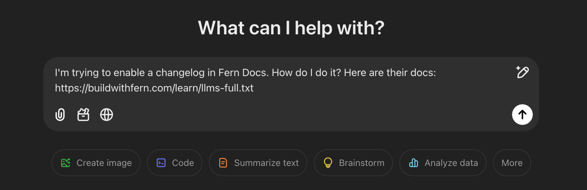

[`llms.txt`](https://llmstxt.org/) is a standard for exposing website content to AI developer tools. Fern implements this standard, automatically generating and maintaining an `llms.txt` Markdown file so AI tools can discover and index your documentation. For single pages, agents can also fetch [Markdown directly](/learn/docs/ai-features/markdown).

`llms.txt` is a root-level file Fern serves to non-human consumers, alongside [`robots.txt`](/learn/docs/seo/robots-txt). `robots.txt` decides which crawlers reach your site and what AI training signals you broadcast; `llms.txt` shapes what AI agents receive once they do.

<Frame>
  
</Frame>

## What `llms.txt` contains

`llms.txt` contains a lightweight summary of your documentation site with each page distilled into a one-sentence description and URL. For sites with API endpoints, it also links to your [OpenAPI specification](/learn/docs/developer-tools/openapi-spec) as a standalone, machine-readable file so AI tools can parse your full API schema directly. For sites with WebSocket channels, it also links to your [AsyncAPI specification](/learn/docs/developer-tools/asyncapi-spec). Fetching an endpoint page listed in `llms.txt` returns its [parameters, body, response, and authentication as a readable property list](/learn/docs/ai-features/markdown#api-reference-pages).

Fern serves `llms.txt` at the site root and for every navigation node that contains pages: sections, products, versions, tabs, API References, and changelogs (`/llms.txt`, `/docs/llms.txt`, `/docs/ai-features/llms.txt`, etc.). Individual pages don't have their own `llms.txt`. A request for `/<page>/llms.txt` returns a `301` redirect to the page's [Markdown](/learn/docs/ai-features/markdown) at `/<page>.md`, with the query string preserved (for example, `?lang=python`), so existing links and crawlers still receive the page content.

Example: [Eleven Labs llms.txt](https://elevenlabs.io/docs/llms.txt).

<Note>
Fern doesn't generate `llms-full.txt`. Full-site concatenation exceeded most model context windows, added heavy serving overhead, and saw little use compared to `llms.txt` combined with per-page [Markdown access](/learn/docs/ai-features/markdown). Use `llms.txt` to discover pages and fetch them individually.
</Note>

## Page descriptions

`llms.txt` includes page descriptions pulled from [frontmatter](/learn/docs/configuration/page-level-settings). Fern uses the `description` field if present, otherwise falls back to `subtitle`.

```mdx title="Frontmatter"
---
title: Fern Docs
subtitle: Build beautiful documentation websites with Fern.
---
```

Each page appears in its section's `llms.txt` as a link followed by its description:

```txt title=".../section/llms.txt"
- [Fern Docs](https://example.com/docs): Build beautiful documentation websites with Fern.
```

## Learn more

<CardGroup cols={3}>
  <Anchor id="custom-files">
    <Card title="Customize LLM output" icon="sliders" href="/learn/docs/ai-features/customize-llm-output">
      Exclude pages, filter content with tags, or serve your own custom files.
    </Card>
  </Anchor>
  <Card title="Agent directives" icon="compass" href="/learn/docs/ai-features/agent-directives">
    Configure the default directive prepended to every page served to AI agents.
  </Card>
  <Card title="Analytics and integration" icon="chart-line" href="/learn/docs/ai-features/llms-txt-analytics">
    Track LLM traffic and surface `llms.txt` endpoints to readers.
  </Card>
</CardGroup>

