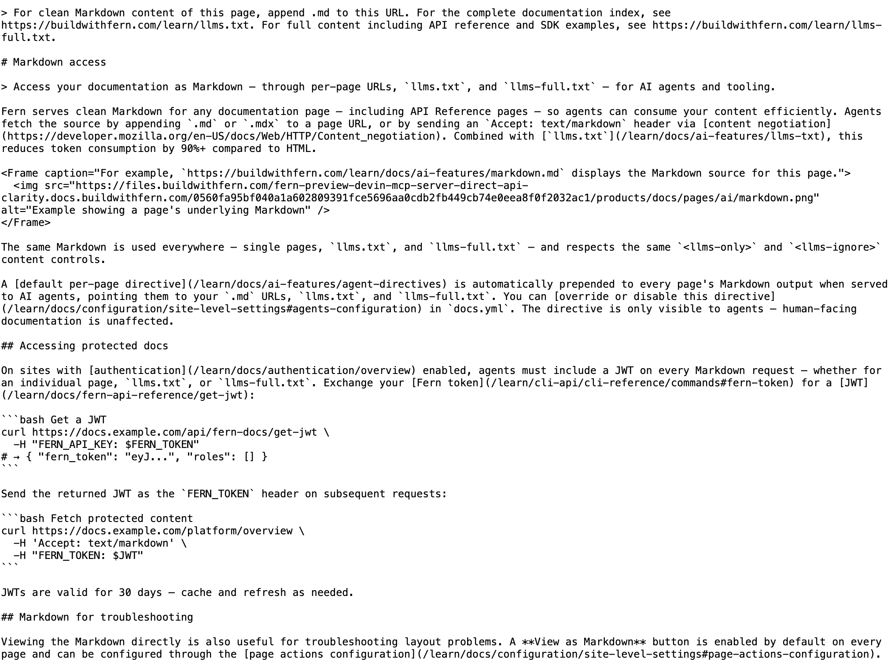

Fern serves clean Markdown for any documentation page — including API Reference pages — so agents can consume your content efficiently. Agents fetch the source by appending `.md` or `.mdx` to a page URL, or by sending an `Accept: text/markdown` header via [content negotiation](https://developer.mozilla.org/en-US/docs/Web/HTTP/Content_negotiation). Combined with [`llms.txt`](/learn/docs/ai-features/llms-txt), this reduces token consumption by 90%+ compared to HTML.

<Frame caption="For example, `https://buildwithfern.com/learn/docs/ai-features/markdown.md` displays the Markdown source for this page.">
  
</Frame>

The same Markdown is used everywhere — single pages and `llms.txt` — and respects the same `<llms-only>` and `<llms-ignore>` content controls.

A [default per-page directive](/learn/docs/ai-features/agent-directives) is automatically prepended to every page's Markdown output when served to AI agents, pointing them to your `.md` URLs and `llms.txt`. You can [override or disable this directive](/learn/docs/configuration/site-level-settings#agents-configuration) in `docs.yml`. The directive is only visible to agents — human-facing documentation is unaffected.

## Interactive components in Markdown output

Interactive components such as [`<EndpointRequestSnippet>`](/learn/docs/writing-content/components/request-snippet), [`<EndpointResponseSnippet>`](/learn/docs/writing-content/components/response-snippet), and [`<EndpointSchemaSnippet>`](/learn/docs/writing-content/components/endpoint-schema-snippet) render as fenced code blocks and structured content in the Markdown output, so agents receive the full request and response examples without parsing HTML.

## Missing pages

When an agent requests a `.md` URL that doesn't exist, the response includes up to three suggested pages under a `## Similar pages` heading, each linking to the closest matching `.md` source. This mirrors the "Were you looking for one of these?" suggestions human readers see on the 404 page.

## Accessing protected docs

On sites with [authentication](/learn/docs/authentication/overview) enabled, agents must include a JWT on every Markdown request — whether for an individual page or `llms.txt`. Exchange your [Fern API key](/learn/cli-api/cli-reference/commands#fern-token) for a [JWT](/learn/docs/fern-api-reference/get-jwt):

```bash Get a JWT
curl https://docs.example.com/api/fern-docs/get-jwt \
  -H "FERN_API_KEY: $FERN_TOKEN"
# → { "fern_token": "eyJ...", "roles": [] }
```

Send the returned JWT as the `FERN_TOKEN` header on subsequent requests:

```bash Fetch protected content
curl https://docs.example.com/platform/overview \
  -H 'Accept: text/markdown' \
  -H "FERN_TOKEN: $JWT"
```

JWTs are valid for 30 days — cache and refresh as needed.

## Markdown for troubleshooting

Viewing the Markdown directly is also useful for troubleshooting layout problems. A **View as Markdown** button is enabled by default on every page and can be configured through the [page actions configuration](/learn/docs/configuration/site-level-settings#page-actions-configuration).
