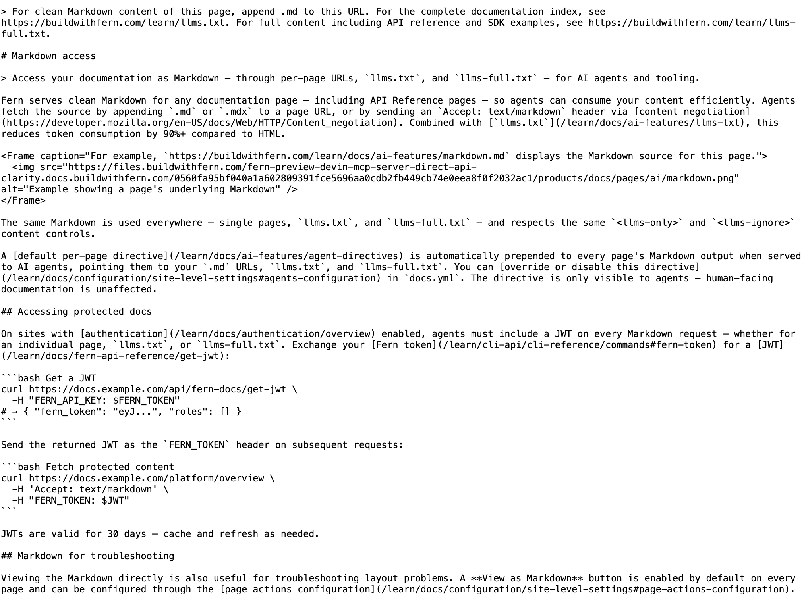

Fern serves clean Markdown for any documentation page so agents can consume your content efficiently. Agents fetch the source by appending `.md` or `.mdx` to a page URL, or by sending an `Accept: text/markdown` header via [content negotiation](https://developer.mozilla.org/en-US/docs/Web/HTTP/Content_negotiation). Combined with [`llms.txt`](/learn/docs/ai-features/llms-txt), this reduces token consumption by 90%+ compared to HTML.

`.md` and `.mdx` URLs resolve for every routable page, including API Reference endpoint pages that don't appear in the navigation, `sitemap.xml`, or `llms.txt`. Any URL that renders as HTML returns its Markdown twin.

<Frame caption="For example, `https://buildwithfern.com/learn/docs/ai-features/markdown.md` displays the Markdown source for this page.">
  
</Frame>

The same Markdown is used everywhere — single pages and `llms.txt` — and respects the same `<llms-only>` and `<llms-ignore>` content controls.

A [default per-page directive](/learn/docs/ai-features/agent-directives) is automatically prepended to every page's Markdown output when served to AI agents, pointing them to your `.md` URLs and `llms.txt`. You can [override or disable this directive](/learn/docs/configuration/site-level-settings#agents-configuration) in `docs.yml`. The directive is only visible to agents — human-facing documentation is unaffected.

## API Reference pages

Endpoint and webhook pages render as a flattened property list. Fern emits a `## Request` section covering path parameters, query parameters, headers, and body properties, a `## Response` section with the response shape for each status code, and an `## Authentication` section for the endpoint's security schemes. 

Each property renders as a bullet with its name, type, required flag, and description, with nested objects indented one level and types written in the same shorthand as the docs UI (`string`, `list of objects`, `map from string to integer`). Internal component schema names and `$ref` chains are omitted.

```md title="plants/update-plant.md"
## Authentication

- `Authorization` header (bearer token, required)

## Request

### Path parameters

- `plantId` (string, required) — The plant to update.

### Body (application/json)

- `name` (string, required) — Common name of the plant.
- `sunlight` (object, optional)
  - `hoursPerDay` (integer, required)

## Response

### 200

- `id` (string, required) — Unique identifier for the plant.
```

## Changelog pages

Appending `.md` to a changelog URL (e.g. `/changelog.md`) returns an aggregated Markdown document rather than a single entry's source.

The document opens with the changelog's overview page — its title, description, and body — if one is configured. When no overview page exists, Fern emits a `# <changelog title>` heading instead. Each of the 20 most recent public entries follows as a `## <entry title>` section, sorted newest-first by date. Hidden or access-gated entries are excluded.

When the changelog has more than 20 entries, a trailing note in the document points to the changelog's `/llms.txt` for the complete index. That `llms.txt` lists every public entry under an `## Entries` heading without inlining entry bodies, so agents can discover the full history and fetch individual entries on demand.

## Interactive components in Markdown output

Interactive components such as [`<EndpointRequestSnippet>`](/learn/docs/writing-content/components/request-snippet), [`<EndpointResponseSnippet>`](/learn/docs/writing-content/components/response-snippet), and [`<EndpointSchemaSnippet>`](/learn/docs/writing-content/components/endpoint-schema-snippet) render as fenced code blocks and structured content in the Markdown output, so agents receive the full request and response examples without parsing HTML.

## Custom component Markdown output

Custom React components registered via [`experimental.mdx-components`](/learn/docs/customization/custom-react-components) render rich HTML in the browser, but their content is invisible to `.md` twins, `llms.txt`, and `llms-full.txt` by default: self-closing tags are dropped entirely, and wrapping tags are unwrapped to expose only their children.

A component module can opt in by exporting a `toMarkdown(props): string` function alongside the React component. Fern calls this function when generating the Markdown twin and splices the returned string in place of the JSX tag.

**Pattern 1 — module-level export.** Use this when the module exports a single component or a shared serializer:

```tsx components/FeatureAccess.tsx
export function FeatureAccess({ access }: Props) {
  // React component — renders rich HTML
}

export function toMarkdown({ access }: Props): string {
  // Returns Markdown — used in .md twins and llms.txt
  return `**Access:** ${access}`;
}
```

**Pattern 2 — static method on the component.** Use this for multi-component modules where each component needs its own serializer:

```tsx components/Price.tsx
export function Price({ amount }: { amount: number }) {
  return <span>${amount.toFixed(2)}</span>;
}

Price.toMarkdown = ({ amount }: { amount: number }) =>
  `**$${amount.toFixed(2)}**`;
```

`toMarkdown` must be synchronous and return a `string`. Async functions (returning a `Promise`) are ignored and the tag falls back to default behavior. Any failure — compile error, thrown exception, or non-string return — is logged and leaves the tag untouched; the `.md` request never fails because of a broken `toMarkdown`.

The returned Markdown is processed by the same LLM cleanup pass as the rest of the page, so tables, lists, and headings work normally. Children of the component tag are passed to `toMarkdown` as the raw MDX source string under the `children` prop. Components without `toMarkdown` keep today's behavior: self-closing tags are dropped and wrapping tags are unwrapped.

## Redirects

The [`redirects` configured in `docs.yml`](/learn/docs/seo/redirects) apply to Markdown URLs. A redirected page's `.md` or `.mdx` twin returns a `308` to the destination's twin, preserving the requested extension: `/old/page.md` redirects to `/new/page.md`, and `/old/page.mdx` to `/new/page.mdx`.

## Missing pages

When an agent requests a `.md` URL that matches no page and no redirect, the response includes up to five suggested pages under a `## Similar pages` heading, each linking to the closest matching `.md` source. This mirrors the "Were you looking for one of these?" suggestions human readers see on the 404 page.

## Accessing protected docs

On sites with [authentication](/learn/docs/authentication/overview) enabled, agents must include a JWT on every Markdown request — whether for an individual page or `llms.txt`. Exchange your [Fern API key](/learn/cli-api-reference/cli-reference/general-commands#fern-token) for a [JWT](/learn/docs/fern-api-reference/get-jwt):

```bash Get a JWT
curl https://docs.example.com/api/fern-docs/get-jwt \
  -H "FERN_API_KEY: $FERN_TOKEN"
# → { "fern_token": "eyJ...", "roles": [] }
```

Send the returned JWT as the `FERN_TOKEN` header on subsequent requests:

```bash Fetch protected content
curl https://docs.example.com/platform/overview \
  -H 'Accept: text/markdown' \
  -H "FERN_TOKEN: $JWT"
```

JWTs are valid for 30 days — cache and refresh as needed.

## Markdown for troubleshooting

Viewing the Markdown directly is also useful for troubleshooting layout problems. A **View as Markdown** button is enabled by default on every page and can be configured through the [page actions configuration](/learn/docs/configuration/site-level-settings#page-actions-configuration).
