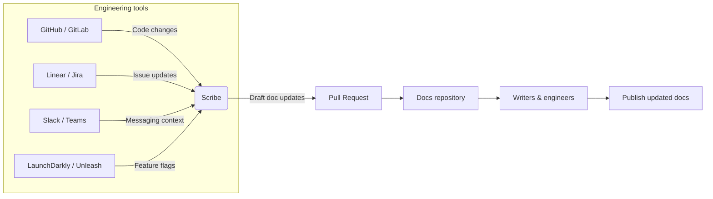

<Note>
Fern Scribe is not yet generally available. Interested in early access? Reach out via Slack or support@buildwithfern.com.
</Note>

Fern Scribe is a technical writing agent that keeps your documentation aligned with a constantly-changing product. Instead of relying on engineers or writers to notice every change, Scribe proactively identifies updates across your engineering tools and drafts accurate, high-quality documentation changes.

Scribe opens pull requests with either ready-to-merge edits or a clear outline for a human writer to refine. It augments your technical writing team by eliminating the tedious, mechanical parts of doc maintenance.

## How Fern Scribe works

Scribe monitors signals from your product development workflow—code changes, issue transitions, feature rollouts, messaging threads, and more. When something relevant happens, Scribe understands what changed and why it matters, determines which documentation pages need to be updated, generates concise, targeted edits aligned with your writing style, and opens a pull request in your repo for review.

Scribe understands Fern components like code snippets, callouts, and tables—as well as your custom MDX components and design system. It also learns your voice, tone, and structure so updates feel native—not machine-generated.

Scribe is fully compatible with [Vale](https://vale.sh), allowing teams to enforce style guides as part of the automated doc-update workflow.

## Architecture

## Connectors

Scribe uses connectors to gather the context it needs to write accurate, up-to-date documentation. These reflect the tools your engineering and product org already uses.

### Version control

Scribe integrates with GitHub and GitLab to detect meaningful code changes such as new endpoints, schema updates, or feature flag usage.

### Messaging

Scribe integrates with Slack and Microsoft Teams to understand intent, internal announcements, and product context that doesn't always appear in code.

### Issue tracking

Scribe integrates with Jira and Linear to interpret issue transitions, milestones, and completed work to infer user-facing impact.

### Feature flags

Scribe integrates with LaunchDarkly and Unleash to enable documentation that reflects staged rollouts, beta features, or gradual feature exposure.

## Customization

You can tailor Scribe to match your style guides (including Vale rules), documentation structure and navigation, custom components, topics or areas Scribe should ignore, and your preferred review and publishing workflow. Scribe becomes a collaborative writing partner that writes in your team's voice and conventions.
