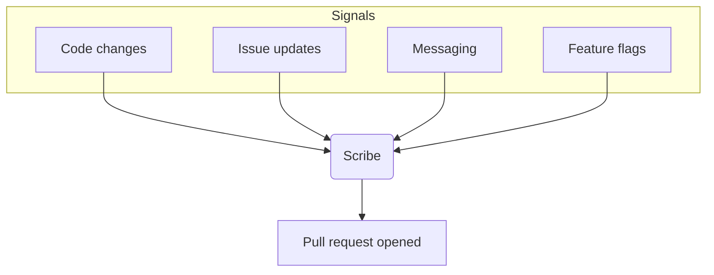

<Note>
Fern Scribe is not yet generally available. Interested in early access? Reach out via Slack or support@buildwithfern.com.
</Note>

Fern Scribe is a technical writing agent that keeps your documentation aligned with a constantly changing product. Instead of relying on engineers or writers to notice every change, Scribe proactively identifies updates across your engineering tools and drafts accurate, high-quality documentation changes.

Scribe opens pull requests with either ready-to-merge edits or a clear outline for a human writer to refine. It augments your technical writing team by eliminating the tedious, mechanical parts of doc maintenance.

## How Scribe works

<Steps>
<Step title="Detect signals">
Scribe monitors code changes, issue transitions, feature rollouts, and messaging threads across your engineering tools.
</Step>
<Step title="Determine impact">
It maps changes to affected documentation pages and identifies the right locations to update.
</Step>
<Step title="Draft edits">
It generates concise, targeted edits aligned with your writing style, understanding Fern components, custom MDX, and your design system.
</Step>
<Step title="Open pull request">
It opens a PR in your repo for review, with either ready-to-merge edits or a clear outline for refinement.
</Step>
</Steps>

Scribe is fully compatible with [Vale](https://vale.sh), allowing teams to enforce style guides as part of the automated doc-update workflow.

## Architecture

## Connectors

Scribe uses connectors to gather the context it needs to write accurate, up-to-date documentation. These reflect the tools your engineering and product org already uses.

<AccordionGroup>
<Accordion title="Version control">
GitHub and GitLab. Detects meaningful code changes such as new endpoints, schema updates, and feature flag usage.
</Accordion>
<Accordion title="Messaging">
Slack and Microsoft Teams. Captures intent, internal announcements, and product context that doesn't always appear in code.
</Accordion>
<Accordion title="Issue tracking">
Jira and Linear. Interprets issue transitions, milestones, and completed work to infer user-facing impact.
</Accordion>
<Accordion title="Feature flags">
LaunchDarkly and Unleash. Enables documentation that reflects staged rollouts, beta features, and gradual feature exposure.
</Accordion>
</AccordionGroup>

## Customization

You can tailor Scribe to match your style guides (including Vale rules), documentation structure and navigation, custom components, topics or areas Scribe should ignore, and your preferred review and publishing workflow. Scribe becomes a collaborative writing partner that writes in your team's voice and conventions.

<Tip>Use Vale locally and in CI to keep Scribe's drafts aligned with your style rules.</Tip>
