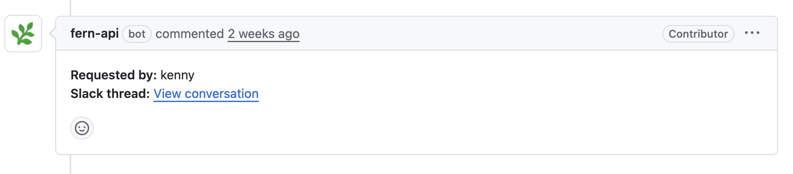

Fern Writer is a Slack-based technical writing agent that keeps your docs aligned as your product evolves. It's powered by [Devin from Cognition](https://cognition.ai/blog/introducing-devin). Fern Writer understands Fern components and your writing style, and can be customized via an `AGENTS.md` file in your docs repository.

<Frame>
<video
    src="assets/fern-writer.mp4"
    autoPlay
    loop
    playsInline
    muted
>
</video>
</Frame>

## How it works

### Making a request

In Slack channels where you've added Fern Writer, tag `@Fern Writer` and describe the change you need. Fern Writer [only responds when directly tagged](#privacy-and-data-handling). It will react to your message to confirm receipt, then create a pull request and reply with a link.

Fern Writer supports image and file attachments for additional context. When tagged in an existing thread, it reads the full conversation to understand context before responding.

### Reviewing and merging

Request changes by commenting in the Slack thread. Once the PR meets your requirements, merge it like any other pull request.

### Pull request attribution

<Frame>
    
</Frame>

Each pull request includes a **Requested by** field in the description, attributing the change to the person or team that initiated the request. Commits are signed and attributed to `fern-support`, ensuring that automated changes are clearly distinguishable from manual contributions in your repository's history.

## Example requests

<Prompt title="Document a new feature from a pull request">
@Fern Writer document the new rate limiting feature added in PR #123
</Prompt>

<br />

<Prompt title="Add new content to existing pages">
@Fern Writer add a section about webhook retry behavior to the webhooks guide
</Prompt>

<br />

<Prompt title="Reorganize and consolidate content">
@Fern Writer merge the authentication and authorization pages, and add a redirect from the old auth page
</Prompt>

<br />

<Prompt title="Fix errors and improve clarity">
@Fern Writer fix the broken code example in the quickstart and update the package version to v2.1.0
</Prompt>

## Setup

<Info>
    Fern Writer only supports GitHub. GitLab and other Git providers aren't supported.
</Info>

To start using Fern Writer, add it to your Slack workspace (you must be a Slack admin) and invite it to channels where your team discusses documentation.

<Steps>
<Step title="Confirm the Fern GitHub App is installed">

If you connected a repo through the [Fern Dashboard](/learn/dashboard/configuration/github-repo), the [Fern GitHub App](https://github.com/apps/fern-api) is already installed and you can skip this step.

Otherwise, install it on your docs repo (requires GitHub org admin access). The app lets Fern Writer read your code and pull requests, open documentation PRs, and push commits attributed to `fern-support`.

</Step>
<Step title="Get unique Slack install link">

[Get a unique Slack installation link](/learn/docs/scribe-api/fern-writer-api/get-fern-writer-install-link) for your organization. Provide:
- Your [Fern API key](/learn/cli-api-reference/cli-reference/general-commands#fern-token)
- The GitHub repository in `owner/repo` format (e.g., `acme/docs`)

You can alternatively use this cURL request:
```bash
curl -G https://fai.buildwithfern.com/scribe/slack/get-install \
     -H "Authorization: Bearer <YOUR_FERN_TOKEN>" \
     --data-urlencode github_repo=<OWNER/REPO>
```

Follow the URL returned in the response.

</Step>
<Step title="Add to your workspace">
You'll be redirected to Slack to authorize Fern Writer. Select the workspace where you want to add Fern Writer and click **Allow**.

</Step>
<Step title="Add to channels">

Once installed, add Fern Writer to Slack channels where your team discusses documentation.

</Step>
</Steps>

## Privacy and data handling

Fern Writer doesn't store your Slack messages directly. When you tag `@Fern Writer` or reference a message or thread, the content is stored in a session to generate the documentation pull request. Session data isn't retained after the task completes.

Neither Fern nor [Devin](https://docs.devin.ai/admin/security#how-is-your-data-used-to-improve-devin) uses your data to train AI models. Fern explicitly configures its Devin integration to opt out of any data collection for model training. Your channel messages, code, and documentation content are never used for training purposes. See Devin's documentation on [Slack integration security](https://docs.devin.ai/admin/security#integrating-with-slack) for additional details.
