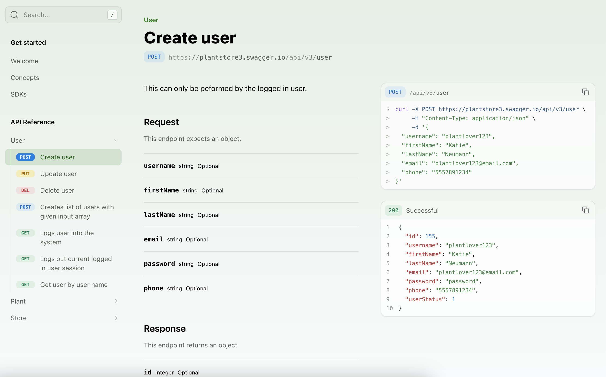
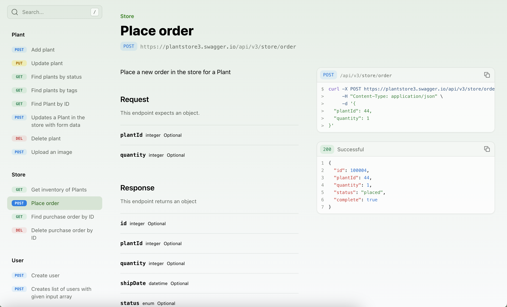
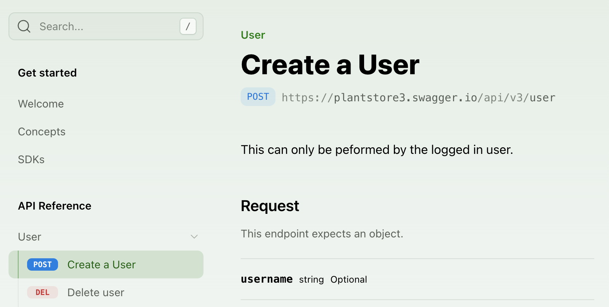
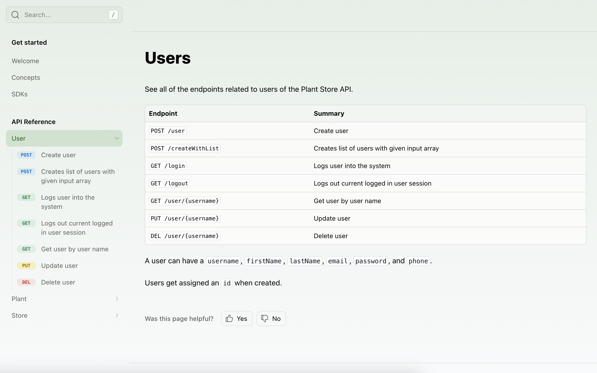

When you [include an API in your `docs.yml` file](/learn/docs/api-references/generate-api-ref), you can customize how the endpoints and sections are displayed in the sidebar navigation. By default, the reference will generate a navigation hierarchy based on the structure of the API spec, but several customizations can be configured.

<Note title="API Sections">
For OpenAPI specifications, sections are created based on the `tags` property, converted to `lowerCamelCase` convention (e.g., createUser).
</Note>

If you would like to only display a subset of endpoints, read more about the Audiences property for [OpenAPI specifications](/learn/api-definitions/openapi/extensions/audiences).

## Ordering the API Reference

### Alphabetizing endpoints and sections

To sort all sections and endpoints alphabetically, unless explicitly ordered in `layout`, set `alphabetized` to `true`.

```yaml title="docs.yml"
navigation: 
  - api: API Reference
    alphabetized: true
```

### Ordering top-level sections

The `layout` option allows you to specify the order of sub-packages, sections, endpoints, and pages at the top level of your API Reference.

```yaml title="docs.yml"
navigation: 
  - api: API Reference
    layout: 
      - POST /user
      - user
      - store
      - plant
```

If your API uses [namespaces](/learn/api-definitions/overview/project-structure#combined-sdks-from-multiple-apis), prefix the endpoint with the namespace and `::`:

```yaml title="docs.yml"
navigation: 
  - api: API Reference
    layout: 
      - payments::POST /user
      - user
      - store
```

<Frame>

</Frame>

### Ordering section contents

<Tabs>
  <Tab title="OpenAPI">
  You can reference an endpoint using the format `METHOD /path`. 
  ```yaml title="docs.yml"
  navigation: 
    - api: API Reference
      layout: 
        - user: 
            - POST /user
            - PUT /user/{username}
            - DELETE /user/{username}
  ```
  </Tab>
  <Tab title="WebSocket">
  You can reference a WebSocket endpoint using the format `WSS /path/name`.
  ```yaml title="docs.yml"
  navigation:
    - api: API Reference
      layout:
        - plants:
            - GET /plants
            - WSS /plants/live-updates
            - WSS /plants/growth-monitor
  ```
  </Tab>
</Tabs>

<Frame>

</Frame>

### Ordering properties within a schema

The `layout` option orders sections, endpoints, and pages, but not the properties within a request, response, or schema. Property order follows a fixed set of rules:

1. **Required properties render before optional ones.** A property is required when its name appears in the schema's `required` array, regardless of its position in the `properties` block.
2. **Within each group, properties follow their definition order** in the `properties` block. To reorder properties within a group, reorder them in your API definition.
    <Note>
      Schemas composed with `allOf` are an exception: their properties sort alphabetically within each group instead of by definition order. To keep definition order, inline the composed properties by setting [`inline-all-of-schemas`](/learn/api-definitions/openapi/generators-yml-reference#settingsinline-all-of-schemas) to `true` in `generators.yml`. A `oneOf` nested inside an `allOf` renders as one object of optional properties instead of a variant selector unless [`preserve-one-of-in-all-of`](/learn/api-definitions/openapi/generators-yml-reference#settingspreserve-one-of-in-all-of) is enabled.
    </Note>
3. **[Deprecated properties](/learn/api-definitions/openapi/extensions/availability) render after non-deprecated ones** within each group.

Required and optional properties always render as separate groups. You can't mix the two or set an arbitrary order across them.


## Customizing the API Reference

### Renaming sections

By default, section display names come from tag names in your OpenAPI spec.

To override the display name of a section, use the `section` property in your `docs.yml`.

```yaml title="docs.yml" {4-6}
navigation:
  - api: API Reference
    layout:
      - section: "Billing" # New section display name
        referenced-packages:
          - billing # lowerCamelCase version of original tag name from your spec
        contents: []
      - section: "Bank Accounts"
        referenced-packages:
          - bankAccounts
        contents: []
```

<Note>
  You can alternatively customize tag display names directly in your spec (or overlays file) using the [`x-displayName` extension](/learn/api-definitions/openapi/extensions/tag-display-names).
</Note>

### Flattening sections

To remove the API Reference title and display the section contents, set `flattened` to `true`.

```yaml title="docs.yml"
navigation: 
  - api: API Reference
    flattened: true
```

<Frame>

</Frame>

### Paginating endpoints

By default, the API Reference renders as a single long-scrolling page containing every endpoint. Set `paginated` to `true` to split it into one page per endpoint instead.

```yaml title="docs.yml"
navigation: 
  - api: API Reference
    paginated: true
```

<Info>
`paginated` controls page layout only. It's unrelated to [endpoint pagination](/learn/api-definitions/openapi/extensions/pagination), which navigates through a response using cursors or offsets and requires no `docs.yml` configuration.
</Info>

### Styling endpoints

To customize the display of an endpoint, you can add a `title`. You can also use `slug` to customize the endpoint URL.

<Tabs>
  <Tab title="OpenAPI">
  ```yaml title="docs.yml" {6-7}
  navigation: 
    - api: API Reference
      layout: 
        - user: 
            - endpoint: POST /user
              title: Create a User
              slug: user-creation
            - DELETE /user/{username}
  ```
  </Tab>
  <Tab title="WebSocket">
  ```yaml title="docs.yml" {5-7}
  navigation:
    - api: API Reference
      layout:
        - plants:
            - endpoint: WSS /plants/live-updates
              title: Live plant updates
              slug: live-updates
  ```
  </Tab>
</Tabs>

<Frame>

</Frame>

### Hiding endpoints

You can hide an endpoint from the API Reference by setting `hidden` to `true`. The endpoint will still be accessible at its URL but is automatically excluded from search engine indexing (`noindex`), so [you don't need to set `noindex`](/learn/docs/customization/hiding-content#hiding-an-api-endpoint).

<Tabs>
  <Tab title="OpenAPI">
  ```yaml title="docs.yml" {10}
  navigation: 
    - api: API Reference
      layout: 
        - user: 
            - endpoint: POST /user
              title: Create a User
              slug: user-creation
            - endpoint: DELETE /user/{username}
              hidden: true
  ```
  </Tab>
  <Tab title="WebSocket">
  ```yaml title="docs.yml" {6}
  navigation:
    - api: API Reference
      layout:
        - plants:
            - endpoint: WSS /plants/live-updates
              hidden: true
  ```
  </Tab>
</Tabs>

### Setting API Explorer options

The `playground` property sets three API Explorer options: `oauth` enables the [OAuth client-credentials flow](/learn/api-definitions/openapi/authentication), `environments` restricts which server environments are available (an empty list disables the Explorer), and `send-optional-defaults` [pre-fills and sends the declared defaults](/learn/docs/api-references/api-explorer#autopopulate-with-examples) of optional parameters. Set it on the `- api` entry to apply a default across all endpoints, then override it on a section or endpoint in `layout`:

```yaml title="docs.yml" {3-8,12,16}
navigation:
  - api: API Reference
    playground:                     # Defaults for every endpoint in this API
      oauth: true
      environments:
        - Production
        - Sandbox
      send-optional-defaults: true
    layout:
      - section: Auth
        playground:
          oauth: true               # Override for this section
        contents:
          - endpoint: POST /token
            playground:
              oauth: false          # Override for this endpoint
```

Environment names are the [server names](/learn/api-definitions/openapi/extensions/server-names-and-url-templating) from your API definition.

### Adding custom sections

You can add arbitrary folders in the sidebar by adding a `section` to your API Reference layout. A section can comprise entire groups of endpoints, individual endpoints, or even just Markdown pages. Sections can be customized by adding properties like a `icon`, `summary`, `slug` (or `skip-slug`), `availability`, and `contents`. 

```yaml title="docs.yml"
navigation: 
  - api: API Reference
    layout: 
      - section: My Section
        icon: flower
        contents: 
          - PUT /user/{username}
          - plant
          - plantInfo # tag names are converted to camelCase convention
```

<Frame>

</Frame>

### Adding a section overview

You can add overview pages to your API Reference or individual sections in two ways:

<AccordionGroup>
  <Accordion title="Manual summary pages">
    The `summary` property allows you to add an `.md` or `.mdx` page as an overview.

    ```yaml title="docs.yml"
    navigation:
      - api: API Reference
        summary: pages/api-overview.mdx
        layout:
          - user:
              summary: pages/user-overview.mdx
    ```
  </Accordion>
  <Accordion title="Automatic summaries from OpenAPI tags">
    If you're using an OpenAPI spec, set `tag-description-pages: true` to use tag descriptions as summary pages for each section.

    ```yaml title="docs.yml"
    navigation:
      - api: API Reference
        tag-description-pages: true
    ```

    <Note>
      If you enable `tag-description-pages: true` and manually specify a `summary` for a section, the manual summary will take precedence.
    </Note>
  </Accordion>
</AccordionGroup>

<Frame>

</Frame>

### Adding pages and links

You can add regular pages and external links within your API Reference. 

```yaml title="docs.yml"
navigation: 
  - api: API Reference
    layout: 
      - user: 
          contents: 
            - page: User Guide
              path: ./docs/pages/user-guide.mdx
            - link: Link Title
              href: http://google.com
```

### Adding availability

You can set the availability for the entire API Reference or for specific sections. Options are: `stable`, `generally-available`, `in-development`, `pre-release`, `deprecated`, or `beta`. 

```yaml title="docs.yml" {3, 6}
navigation: 
  - api: API Reference
    availability: generally-available
    layout: 
      - section: My Section
        availability: beta
        icon: flower
        contents: 
        # endpoints here
```

When you set availability for a section, all endpoints in that section will inherit the section-level availability unless explicitly overridden in your API definition.

Non-default availability renders as a [badge in the sidebar navigation](/learn/docs/configuration/navigation#availability) next to the section or endpoint. The default available states (`stable` and `generally-available`) don't render a sidebar badge.
  
<Warning>
  You can't set availability for individual OpenAPI endpoints in `docs.yml` — endpoint availability must be configured directly in your API definition. Learn more about [availability for OpenAPI](/learn/api-definitions/openapi/extensions/availability).

</Warning>

### Displaying endpoint errors

Set `display-errors` to `true` to show error schemas on endpoint pages. The error names, status codes, and response objects are pulled from your API definition.

```yaml title="docs.yml"
navigation:
  - api: API Reference
    display-errors: true
```

<Frame>

</Frame>

Clicking on an error expands it to show the error name, code, and object returned. The response also updates to show the error object.

<Frame>

</Frame>

## Configuration options reference

The following properties can be set on the `- api` entry in your `docs.yml` navigation.

<ParamField path="alphabetized" toc={true} type="boolean">
  When `true`, organizes all sections and endpoints in alphabetical order.

</ParamField>

<ParamField path="api" toc={true} type="string" required={true}>
  Title of the API Reference section.

</ParamField>

<ParamField path="audiences" toc={true} type="list<string>">
  List of [audiences](/learn/docs/api-references/audiences) that determines which endpoints, schemas, and properties are displayed in your API Reference.

</ParamField>

<ParamField path="availability" toc={true} type="string">
  Set the [availability status](#adding-availability) for the entire API Reference or specific sections.

</ParamField>

<ParamField path="display-errors" toc={true} type="boolean">
  Displays [error schemas](#displaying-endpoint-errors) on endpoint pages of your API Reference.

</ParamField>

<ParamField path="flattened" toc={true} type="boolean">
  Displays all endpoints at the top level and hides the API Reference section title.

</ParamField>

<ParamField path="icon" toc={true} type="string">
  Icon to display next to the API section in the navigation.

</ParamField>

<ParamField path="layout" toc={true} type="list">
  Customize the order that your API endpoints are displayed in the docs site. See [Ordering the API Reference](#ordering-the-api-reference) for details.

</ParamField>

<ParamField path="paginated" toc={true} type="boolean">
  When `true`, splits the API Reference into [one page per endpoint](#paginating-endpoints) instead of a single long-scrolling page (the default). Controls page layout only; unrelated to [endpoint pagination](/learn/api-definitions/openapi/extensions/pagination).

</ParamField>

<ParamField path="skip-slug" toc={true} type="boolean">
  When `true`, skips slug generation for the API section.

</ParamField>

<ParamField path="slug" toc={true} type="string">
  Customize the slug for the API section. By default, the slug is generated from the API title.

</ParamField>

<ParamField path="summary" toc={true} type="string">
  Relative path to a Markdown file displayed at the top of the API section.

</ParamField>

<ParamField path="tag-description-pages" toc={true} type="boolean">
  When `true`, uses OpenAPI tag descriptions as summary pages for each section.

</ParamField>

<ParamField path="playground" toc={true} type="object">
  Settings for the [API Explorer](/learn/docs/api-references/api-explorer) that affect all endpoints in this API section. Can also be [set on individual sections or endpoints](#setting-api-explorer-options) in `layout` to override.

</ParamField>

<ParamField path="playground.oauth" toc={true} type="boolean">
  When `true`, enables the [OAuth client-credentials flow](/learn/docs/api-references/api-explorer#authentication) in the API Explorer.

</ParamField>

<ParamField path="playground.environments" toc={true} type="list<string>">
  Restricts which server environments are available in the API Explorer. An empty list disables the Explorer.

</ParamField>

<ParamField path="playground.send-optional-defaults" toc={true} type="boolean">
  When `true`, [pre-fills and sends the declared defaults](/learn/docs/api-references/api-explorer#autopopulate-with-examples) of optional header, query, and path parameters. Defaults to `false`.

</ParamField>

<ParamField path="api-name" toc={true} type="string">
  Only used when your project has [multiple APIs](/learn/docs/api-references/generate-api-ref#include-more-than-one-api-reference). The value must match the folder name containing the API definition. Don't set this property if you only have a single API, as it will cause errors.

</ParamField>
