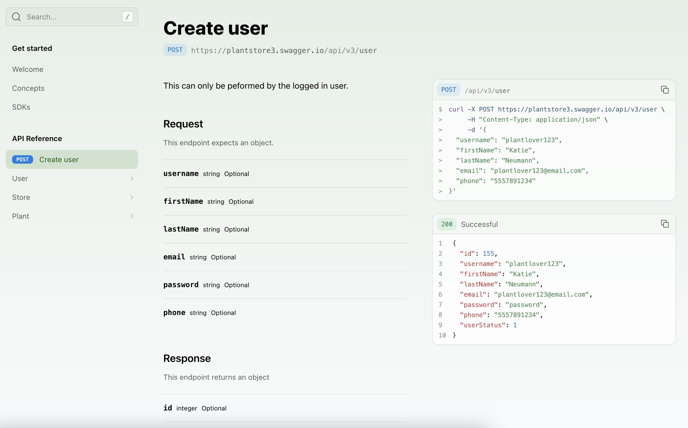
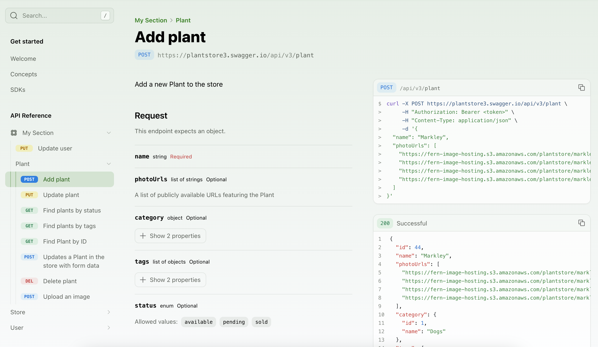

When you [include an API in your `docs.yml` file](/learn/docs/api-references/generate-api-ref), you can customize how the endpoints and sections are displayed in the sidebar navigation. By default, the reference will generate a navigation hierarchy based on the structure of the API spec, but several customizations can be configured.

<Note title="API Sections">
If you are using an OpenAPI Specification, sections are created based on the `tags` property, converted to `lowerCamelCase` convention (e.g., createUser). If you are using a Fern Definition, sections are created based on the [`service`](/learn/api-definition/fern/endpoints#service-definition) file names.
</Note>

If you would like to only display a subset of endpoints, read more about the Audiences property for [OpenAPI Specifications](/learn/api-definitions/openapi/extensions/audiences) or [Fern Definitions](/learn/api-definition/fern/audiences).

## Ordering the API Reference

### Alphabetizing endpoints and sections
To sort all sections and endpoints alphabetically, unless explicitly ordered in `layout`, set `alphabetized` to `true`.

```yaml title="docs.yml"
navigation: 
  - api: API Reference
    alphabetized: true
```

### Ordering top-level sections
The `layout` option allows you to specify the order of sub-packages, sections, endpoints, and pages at the top level of your API Reference.

<Tabs>
  <Tab title="OpenAPI Specification">
  ```yaml title="docs.yml"
  navigation: 
    - api: API Reference
      layout: 
        - POST /user
        - user
        - store
        - plant
  ```
  </Tab>
  <Tab title="Fern Definition">
  ```yaml title="docs.yml"
  navigation: 
    - api: API Reference
      layout: 
        - user.create
        - user
        - store
        - plant
  ```
  </Tab>
</Tabs>

<Frame>

</Frame>

### Ordering section contents
Adding a `:` after the section name allows you to specify the order of its nested sub-packages and endpoints. 

<Note title="Referencing Endpoints">
To reference an endpoint, you can use either:
- `METHOD /path/name` (best for OpenAPI Specification)
- `serviceName.endpointName` (best for Fern Definition)
</Note>

<Tabs>
  <Tab title="OpenAPI Specification">
  You can reference an endpoint using the format `METHOD /path`. 
  ```yaml title="docs.yml"
  navigation: 
    - api: API Reference
      layout: 
        - user: 
            - POST /user
            - PUT /user/{username}
            - DELETE /user/{username}
  ```
  </Tab>
  <Tab title="Fern Definition">
  You can reference an endpoint using the format `serviceName.endpointName`.
  ```yaml title="docs.yml"
  navigation: 
    - api: API Reference
      layout: 
        - user: 
            - user.create
            - user.update
            - user.delete        
  ```
  </Tab>
</Tabs>

<Frame>

</Frame>

## Customizing the API Reference

### Renaming sections

By default, section display names come from [service file names](/api-definitions/ferndef/endpoints/overview#service-definition) (Fern
Definition) or tag names (OpenAPI) in your spec.

To override the display name of a section, use the `section` property in your `docs.yml` and reference the `lowerCamelCase` version of the original service file name (Fern Definition) or tag name (OpenAPI) in `referenced-packages`.

```yaml title="docs.yml" {4-6}
navigation: 
  - api: API Reference
    layout:
      - section: "Billing" # New section display name
        referenced-packages: 
          - billing # lowerCamelCase version of original tag/service file name from your spec
        contents: []
      - section: "Bank Accounts"
        referenced-packages: 
          - bankAccounts
        contents: []
```
<Note>
  For OpenAPI, you can alternatively customize tag display names directly in your spec (or `overrides.yml` file) using the [`x-displayName` extension](/api-definitions/openapi/extensions/tag-display-names). 
</Note>

### Flattening sections
To remove the API Reference title and display the section contents, set `flattened` to `true`.

```yaml title="docs.yml"
navigation: 
  - api: API Reference
    flattened: true
```

<Frame>

</Frame>

### Styling endpoints
To customize the display of an endpoint, you can add a `title`. You can also use `slug` to customize the endpoint URL.

<Tabs>
  <Tab title="OpenAPI Specification">
  ```yaml title="docs.yml" {6-7}
  navigation: 
    - api: API Reference
      layout: 
        - user: 
            - endpoint: POST /user
              title: Create a User
              slug: user-creation
            - DELETE /user/{username}
  ```
  </Tab>
  <Tab title="Fern Definition">
  ```yaml title="docs.yml" {6-7}
  navigation: 
    - api: API Reference
      layout: 
        - user: 
            - endpoint: user.create
              title: Create a User
              slug: user-creation
            - user.delete
  ```
  </Tab>
</Tabs>

<Frame>

</Frame>

### Hiding endpoints
You can hide an endpoint from the API Reference by setting `hidden` to `true`. The endpoint will still be accessible at its URL.

<Tabs>
  <Tab title="OpenAPI Specification">
  ```yaml title="docs.yml" {10}
  navigation: 
    - api: API Reference
      layout: 
        - user: 
            - endpoint: POST /user
              title: Create a User
              slug: user-creation
            - endpoint: DELETE /user/{username}
              hidden: true
  ```
  </Tab>
  <Tab title="Fern Definition">
  ```yaml title="docs.yml" {10}
  navigation: 
    - api: API Reference
      layout: 
        - user: 
            - endpoint: user.create
              title: Create a User
              slug: user-creation
            - endpoint: user.delete
              hidden: true
  ```
  </Tab>
</Tabs>

### Adding custom sections
You can add arbitrary folders in the sidebar by adding a `section` to your API Reference layout. A section can comprise entire groups of endpoints, individual endpoints, or even just Markdown pages. Sections can be customized by adding properties like a `icon`, `summary`, `slug` (or `skip-slug`), `availability`, and `contents`. 

<Tabs>
  <Tab title="OpenAPI Specification">
  ```yaml title="docs.yml"
  navigation: 
    - api: API Reference
      layout: 
        - section: My Section
          icon: flower
          contents: 
            - PUT /user/{username}
            - plant
            - plantInfo # tag names are converted to camelCase convention
  ```
  </Tab>
  <Tab title="Fern Definition">
  ```yaml title="docs.yml"
  navigation: 
    - api: API Reference
      layout: 
        - section: My Section
          icon: flower
          contents: 
            - user.update
            - plant
  ```
  </Tab>
</Tabs>

<Frame>

</Frame>

### Adding a section overview

You can add overview pages to your API Reference or individual sections in two ways:

<AccordionGroup>
  <Accordion title="Manual summary pages">
    The `summary` property allows you to add an `.md` or `.mdx` page as an overview.

    ```yaml title="docs.yml"
    navigation:
      - api: API Reference
        summary: pages/api-overview.mdx
        layout:
          - user:
              summary: pages/user-overview.mdx
    ```
  </Accordion>
  <Accordion title="Automatic summaries from OpenAPI tags">
    If you're using an OpenAPI spec, set `tag-description-pages: true` to use tag descriptions as summary pages for each section.

    ```yaml title="docs.yml"
    navigation:
      - api: API Reference
        tag-description-pages: true
    ```

    <Note>
      If you enable `tag-description-pages: true` and manually specify a `summary` for a section, the manual summary will take precedence.
    </Note>
  </Accordion>
</AccordionGroup>

<Frame>

</Frame>

### Adding pages and links
You can add regular pages and external links within your API Reference. 

```yaml title="docs.yml"
navigation: 
  - api: API Reference
    layout: 
      - user: 
          contents: 
            - page: User Guide
              path: ./docs/pages/user-guide.mdx
            - link: Link Title
              href: http://google.com
```

### Adding availability

You can set the availability for the entire API Reference or for specific sections. Options are: `stable`, `generally-available`, `in-development`, `pre-release`, `deprecated`, or `beta`. 

```yaml title="docs.yml" {3, 6}
navigation: 
  - api: API Reference
    availability: generally-available
    layout: 
      - section: My Section
        availability: beta
        icon: flower
        contents: 
        # endpoints here
```

When you set availability for a section, all endpoints in that section will inherit the section-level availability unless explicitly overridden in your API definition.
  
<Warning>You can't set availability for individual endpoints in `docs.yml`. Endpoint availability must be configured directly in your API definition. Learn more about availability for [OpenAPI](/learn/api-definitions/openapi/extensions/availability) or [Fern Definition](/learn/api-definitions/ferndef/availability).</Warning>
