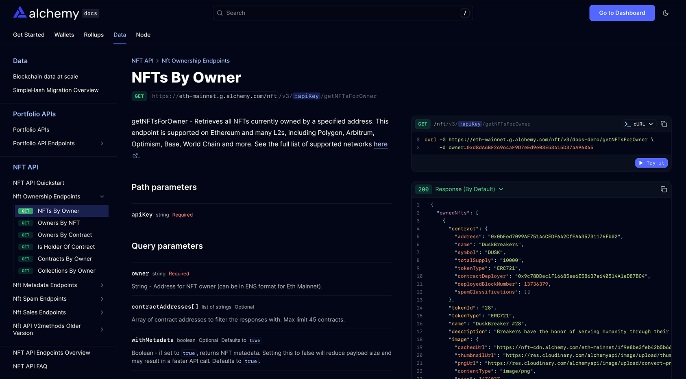

Fern generates OpenRPC Reference documentation from an [OpenRPC](https://open-rpc.org/) specification.

<Frame caption={<a href="https://www.alchemy.com/docs/data/nft-api/api-reference/nft-ownership-endpoints/get-nf-ts-for-owner-v-3">Example of Alchemy's docs site</a>}>
  
</Frame>

## Configuration

<Steps>
<Step title="Set up your project structure">

Add your OpenRPC specification file (e.g., `openrpc.yaml`) to your `/fern` directory and create a `generators.yml` that references it:

```yaml generators.yml
api:
  specs:
    - openrpc: ./openrpc.yml
```

</Step>
<Step title="Add the OpenRPC Reference to your navigation">

Add `- api: API Reference` to your navigation in `docs.yml`:

```yml docs.yml
navigation:
  - api: API Reference
```

</Step>
</Steps>

For a full list of configuration options and layout customizations, see [Customize API Reference layout](/learn/docs/api-references/customize-api-reference-layout).

### Configuration properties

<ParamField path="api.specs[].openrpc" required>
  Path to your OpenRPC specification file. You can include multiple OpenRPC specs if your project exposes more than one JSON-RPC API.
</ParamField>
