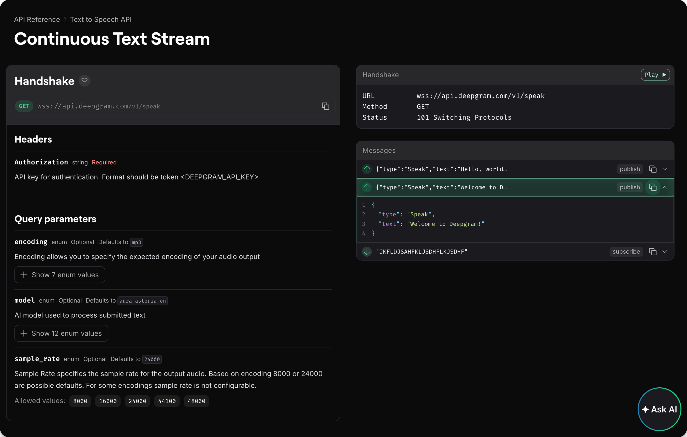

Fern generates WebSocket Reference documentation from an [AsyncAPI specification](/learn/api-definitions/asyncapi/overview).

<Frame caption={<a href="https://developers.deepgram.com/reference/text-to-speech/speak-streaming">Example of how a WebSocket API Reference renders in Fern</a>}>
  
</Frame>

<Tip>
  You can also generate typed [WebSocket client libraries in your SDKs](/learn/sdks/deep-dives/websocket-clients).
</Tip>

## Configuration

<Steps>
<Step title="Set up your project structure">

Add your specification file to your `/fern` directory and create a `generators.yml` that references it:

```yaml generators.yml
api:
  path: asyncapi.yml
  origin: https://github.com/your-org/your-repo/blob/main/asyncapi.yml # optional
```

</Step>
<Step title="Add the WebSocket Reference to your navigation">

Add `- api: API Reference` to your navigation in `docs.yml`:

```yml docs.yml
navigation:
  - api: API Reference
```

</Step>
<Step title="Customize the layout">

For a full list of configuration options and layout customizations, see [Customize API Reference layout](/learn/docs/api-references/customize-api-reference-layout).

</Step>
</Steps>

### Include more than one WebSocket Reference

To include multiple WebSocket definitions in your documentation, use the `api-name` property. The `api-name` corresponds to the folder name containing your WebSocket definition.

<Files>
  <Folder name="fern" defaultOpen>
    <File name="fern.config.json" />
    <File name="docs.yml" />
    <Folder name="streaming-api" defaultOpen>
      <File name="asyncapi.yml" comment="Streaming WebSocket AsyncAPI spec" />
      <File name="generators.yml" />
    </Folder>
    <Folder name="realtime-api" defaultOpen>
      <File name="asyncapi.yml" comment="Realtime WebSocket AsyncAPI spec" />
      <File name="generators.yml" />
    </Folder>
  </Folder>
</Files>

```yaml title="docs.yml"
navigation:
  - api: Streaming API
    api-name: streaming-api
  - api: Realtime API
    api-name: realtime-api
```
