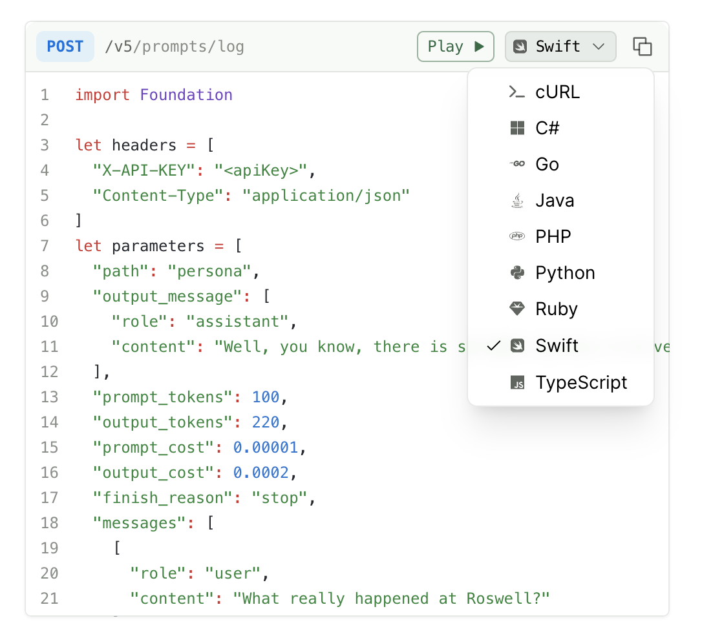

<Frame>

</Frame>

## What are HTTP snippets?

HTTP snippets show API request examples using common HTTP clients like cURL, Python's `requests` library, and TypeScript's `fetch` API. These are generic code examples that demonstrate how to call your API directly, without using an SDK.

<Note title="HTTP snippets vs. SDK snippets">
HTTP snippets are different from [SDK snippets](/learn/docs/api-references/sdk-snippets). HTTP snippets show generic HTTP client code (like cURL or `requests`), while SDK snippets show code using your generated Fern SDKs. If you have SDK snippets configured, those will display by default. HTTP snippets display automatically when no SDK snippets are available.
</Note>

## Configuration

All documentation sites include HTTP snippets by default. To control which languages appear in the HTTP snippet selector, use the `settings.http-snippets` configuration in your `docs.yml` file.

<Note>
  curl is always displayed in the HTTP snippets selector and can't be removed via `docs.yml` configuration. To hide it, [use custom CSS](/docs/customization/custom-css-js#custom-css).
</Note>

<CodeBlock title="docs.yml">

```yaml
# Disable all HTTP snippets except curl
settings:
  http-snippets: false

# Enable only specific languages (in addition to curl)
settings:
  http-snippets:
    - python
    - ruby
```
</CodeBlock>

<Warning>
The `settings.http-snippets` configuration controls HTTP snippets only. To configure SDK snippets, use the `snippets` key under your API Reference in the navigation section. See [SDK snippets](/learn/docs/api-references/sdk-snippets) for details.
</Warning>

## How it works

### Request examples

To generate HTTP snippets, add request examples to your API definition:
- For Fern Definition: Follow the [examples documentation](/learn/api-definition/fern/examples)
- For OpenAPI: Follow the [request/response examples documentation](/learn/api-definition/openapi/extensions/others#request--response-examples)

### Supported languages

HTTP snippets support the following languages. Fern development work is driven by customer requests – request support for languages not listed here by [opening an issue](https://github.com/fern-api/fern/issues/new/choose).

* csharp
* curl
* dotnet
* go
* java
* python
* ruby
* typescript

### Set default snippet language

To set the default snippet language for the code snippet selector, use the `default-language` key at the top indentation level of `docs.yml`. This setting applies to both HTTP snippets and SDK snippets.

<CodeBlock title="docs.yml">
```yaml {1}
default-language: python

navigation:
  - api: API Reference
```
</CodeBlock>

### Generated features

HTTP snippets automatically include:
- Authentication headers with placeholders (e.g., `<apiKey>`)
- Query parameters and request body formatting
- Content-Type headers
- Error handling patterns
- SSL/TLS configuration where applicable

### Display behavior

- If your API has SDK snippets, those will be shown by default
- If no SDK snippets exist, HTTP snippets will display automatically
- User language preferences are saved client-side

Check out [Hume's API Reference](https://dev.hume.ai/reference/voices/create) to see HTTP snippets in action.
