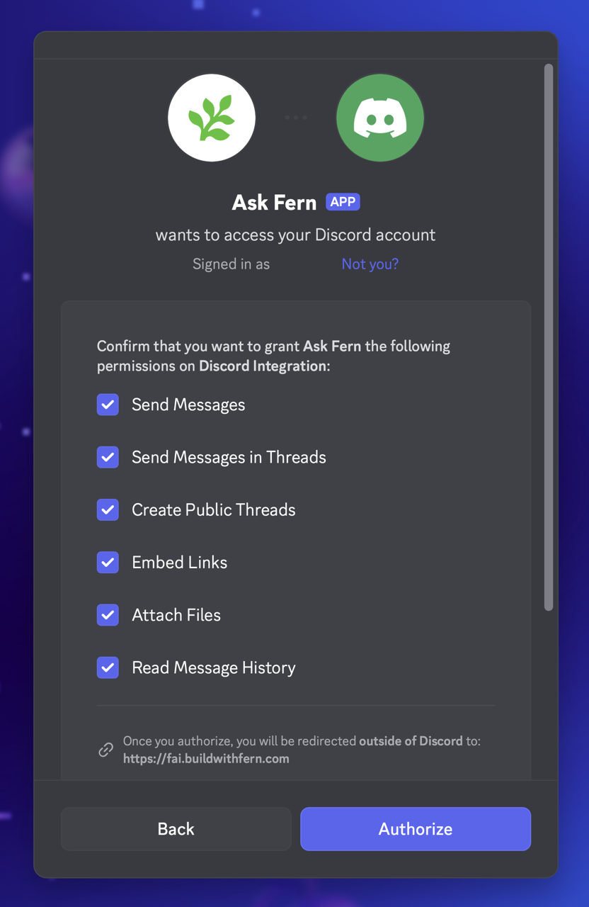
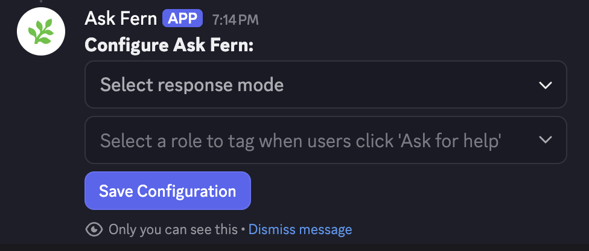
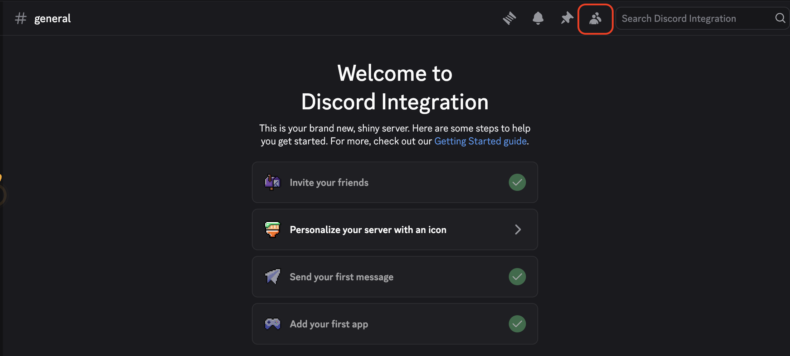
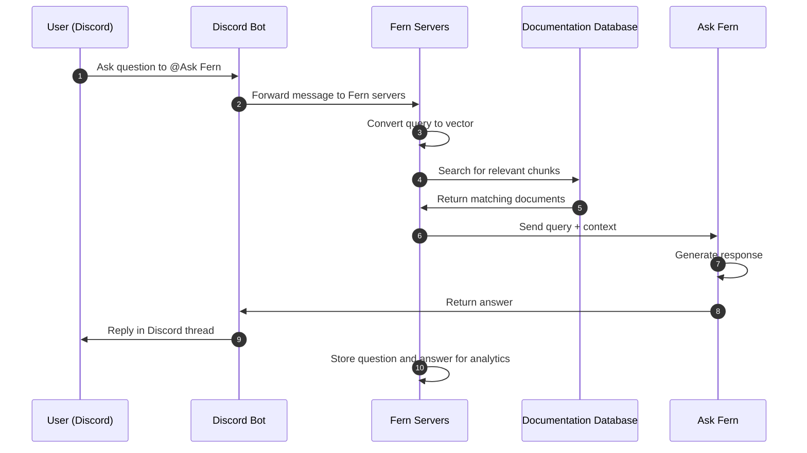

<Markdown src="/snippets/agent-directive.mdx"/>

<Info>
  Ask Fern is also available for Slack. See the [Slack app documentation](/learn/docs/ai-features/ask-fern/slack-app) for setup instructions.
</Info>

The Ask Fern Discord bot allows customers to ask questions about your products directly in Discord channels and receive AI-generated answers from your documentation database.

Fern stores all questions and answers from Discord interactions for [analytics purposes](/learn/docs/ai-features/ask-fern/overview#analytics).

## Setup

Install the Ask Fern bot in your Discord server and configure it for your channels.

<Note>
  To install Ask Fern in your Discord server, you must have **Manage Server** permissions. This is set in **Server Settings > People > Roles**.
</Note>

<Steps>
<Step title="Get your unique install link">

Use the [API Explorer](/learn/docs/ai-features/ask-fern/api-reference/discord/create-discord-integration) to get a unique Discord installation link for your organization. 

You will need:
- Your [Fern token](/learn/cli-api-reference/cli-reference/commands#fern-token)
- Your domain without protocol or path (e.g., `website.com`, not `https://website.com/docs`)

You can alternatively use this cURL request:
```bash
curl -X POST "https://fai.buildwithfern.com/discord/install?domain=<YOUR_DOMAIN>" \
     -H "Authorization: Bearer <YOUR_FERN_TOKEN>"
```

Follow the URL returned in the `integration_url` response field.

</Step>
<Step title="Add to your server">
You'll be redirected to Discord to authorize the Ask Fern bot. Select the server where you want to add Ask Fern and click **Authorize**.
<Frame>
  
</Frame>
</Step>
<Step title="Configure channels">

Once the bot is added to your server, use the `/configure` slash command in each channel where you want the bot to respond. Without this configuration, the bot won't respond to messages in that channel.
<Frame>
  
</Frame>
</Step>
</Steps>

## Configuration

Customize the bot's behavior to match your workflow needs.

### Bot settings per channel

Use the `/configure` slash command in any channel to adjust the settings. This opens an interactive menu where you can configure:

| Setting | Description |
|---------|-------------|
| **Response mode** | Controls whether the bot responds only when directly mentioned with `@Ask Fern` (`mentions_only`) or automatically responds to questions while ignoring casual chat (`auto`). |
| **Help role** | Optionally select a role or user to tag when users click the "Ask for help" button on bot responses. |

After selecting your preferences, click **Save Configuration** to apply the changes.
<Frame>
  
</Frame>
### Customize the bot name

You can rename the bot to match your brand (example: "YourCompanyName Support"):

<Note>
  To rename your Bot, you must have **Change Nickname** permissions. This is set in Server **Settings > People > Roles**
</Note>
<Steps>
  <Step>
    Go to the Members List section at the top of the Discord server
    <Frame>
      
    </Frame>
  </Step>
  <Step>
    Right click the AskFern bot and select "Change Nickname"
  </Step>
  <Step>
    Enter your preferred bot name and click "Save"
  </Step>
</Steps>
Now, users will see your custom bot name instead of the default "Ask Fern" name.

## Architecture

When a user asks Ask Fern a question in Discord, the bot receives the message and triggers Fern's servers to search your documentation database and retrieve relevant context. Using that context, Ask Fern generates a response and replies in a thread.

<Accordion title="Diagram">

</Accordion>
