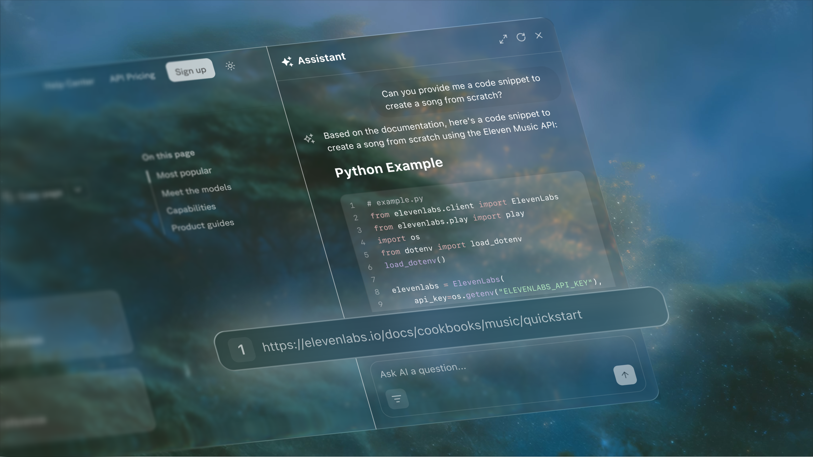

## Analytics

The Ask Fern tab of the [Fern Dashboard](http://dashboard.buildwithfern.com) displays queries and conversations per day on your documentation site. You can view data by week, month, year, or all-time periods.

Drill down into individual conversations to see the exact user queries and Ask Fern responses, helping you understand how users interact with your documentation. 

<Frame>
  
</Frame>

You can also export data to CSV format to identify trends and optimize your documentation strategy.

## Citations

Fern's AI search includes citations that link directly to source documentation, showing users where information comes from and providing immediate context. By referencing specific documentation sections, citations verify answer sources while enabling users to easily explore topics in greater depth.

When Ask Fern references content from [custom sources added via the Documents or Websites API](/learn/docs/ask-fern/content-sources), it includes the associated URL as a citation, allowing users to access the original source material.

<Frame>
  
</Frame>

## Insights

<Markdown src="/snippets/wip-callout.mdx" />

Fern analyzes Ask Fern query patterns to surface actionable recommendations for improving your documentation. After collecting sufficient query data over a month, Fern processes this through specialized models that analyze query-response pairs to identify documentation gaps, extract common themes, and generate specific suggestions for enhancing your docs.

Insights are currently provided as a monthly report delivered directly by the Fern team.

## Evaluation

<Markdown src="/snippets/wip-callout.mdx" />

Fern evaluates how accurately Ask Fern answers questions on your documentation site compared to competitor AI search solutions. 

Fern first generates evaluation questions from your documentation files, then runs those questions through both Ask Fern and competitor systems. Finally, Fern evaluates each answer against the original documentation for accuracy. You receive detailed performance metrics and comparative analysis.

Evals are currently provided as custom analysis delivered directly by the Fern team.

## Role-based access control

Ask Fern automatically respects the [role-based access control (RBAC) settings configured in your documentation](/learn/docs/authentication/rbac). When users query Ask Fern, they only receive answers from documentation they have permission to access based on their assigned roles.

This works at all levels, from entire sections down to individual pages and conditional content within pages. 
