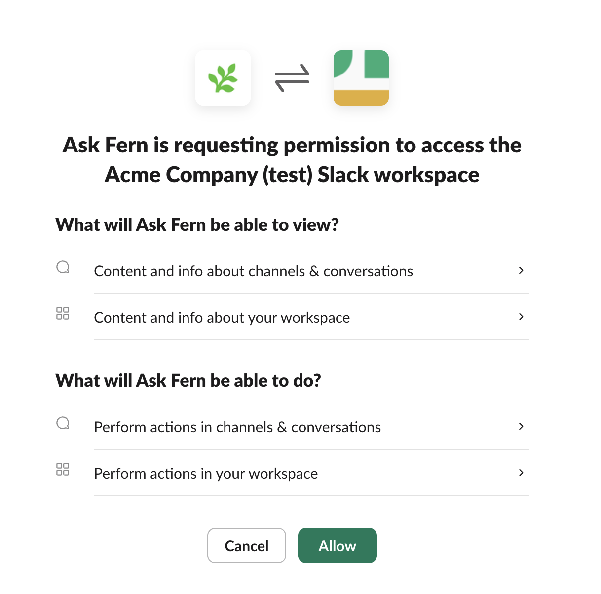
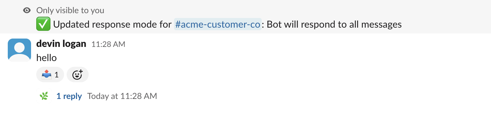
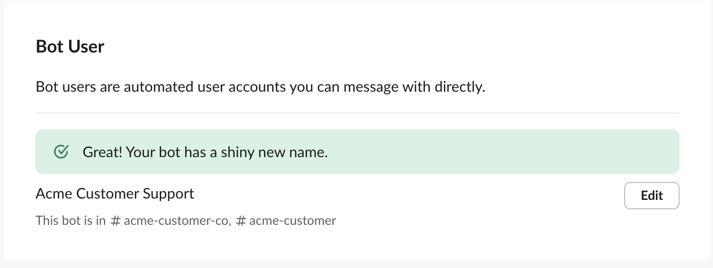
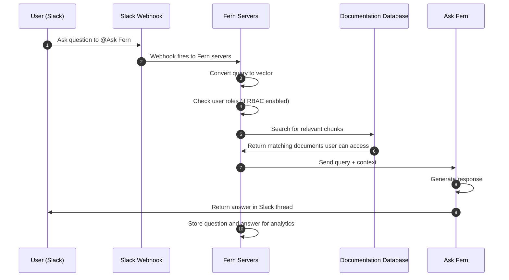

The Ask Fern Slack app allows customers to ask questions about your products directly in Slack channels and receive AI-generated answers from your documentation database.

Fern stores all questions and answers from Slack interactions for [analytics purposes](/learn/docs/ai-features/ask-fern/overview#analytics).

## Setup

Install the Ask Fern app in your workspace and add the bot to customer channels. 

<Note>
  To install Ask Fern in your organization's Slack workspace, you must be a Slack admin.
</Note>

<Steps>
<Step title="Get your unique install link">

Use the [API Explorer](/learn/docs/ai-features/ask-fern/api-reference/slack-ask-fern/get-slack-install-link) to get a unique Slack installation link for your organization. Provide:
- Your Fern API key
- Your domain without protocol or path (e.g., `website.com`, not `https://website.com/docs`)

You can alternatively use this cURL request:
```bash
curl -G https://fai.buildwithfern.com/slack/get-install \
     -H "Authorization: Bearer <YOUR_FERN_TOKEN>" \
     --data-urlencode domain=<YOUR_DOMAIN>
```

Follow the URL returned in the `install_url` response field.

</Step>
<Step title="Add to your workspace">
You'll be redirected to Slack to authorize the Ask Fern app. Select the workspace where you want to add Ask Fern and click **Allow**.

<Frame>
  
</Frame>

</Step>
<Step title="Add to customer channels">

Once you've installed it in your workspace, add the bot to customer Slack channels to give it access. Customers will see that `@Ask Fern was added to the channel` and can start asking questions immediately.

</Step>
</Steps>

## Configuration

Customize the bot's behavior to match your workflow needs.

### Bot settings per channel

Use the `/fern` slash command in any channel to adjust the settings:

| Command | Description | Example |
|---------|-------------|---------|
| **respond_to** | Controls whether the Ask Fern bot responds to all messages (`all`), reponds only when directly mentioned with `@Ask Fern` (`mentions_only`), or determines when to respond to messages depending on context (`auto`). Set to `auto` by default. | `/fern respond_to all` |
| **roles** | Specifies which RBAC roles (comma-separated) should be used to filter Ask Fern responses (if you have [role-based access control](/learn/docs/authentication/features/rbac) configured) | `/fern roles developer,admin` |
| **show** | Show the current settings | `/fern show` |
| **help** | Get help with Ask Fern slash commands | `/fern help` |

<Frame caption="After configuring respond_to all, bot responds to messages even when not directly mentioned">
  
</Frame>

### Customize the bot name

You can rename the bot to match your brand (example: "YourCompanyName Support"):

1. In Slack, go to **Apps** in the sidebar and click **Ask Fern**
2. Click the **About** tab, then **Configuration**
3. Scroll to **Bot User** section and click **Edit**
4. Enter your preferred bot name and save changes

<Frame>
  
</Frame>

Now customers will see `@YourCompanyName Support was added to the channel` instead of the default `@Ask Fern` name.

### Collaborative FAQ generation

You can improve the Slack bot's knowledge base by teaching it from real customer interactions. When the bot provides answers in Slack, you can refine those responses and save them for future reference.

How it works:

1. **A user asks a question** - The bot responds in the channel
2. **Review the response** - If the answer needs improvement, reply in the thread to the bot's message
3. **Provide corrections** - Add missing context, correct inaccuracies, or clarify the response
4. **Request indexing** - Ask the bot to index the improved response (e.g., "Index this response" or "Please save this")
5. **Iterate if needed** - The bot will generate an improved answer. Continue refining until you're satisfied
6. **Confirm indexing** - When the response looks good, tell the bot to save it. The bot will confirm the Q&A pair has been indexed

Once indexed, Ask Fern will use this curated question-answer pair to inform future responses to similar questions, giving more accurate answers over time.


<Accordion title="Indexing conversation example">

**User –** *@PlantSupport* what's the best way to care for succulents
indoors?

**Plant Support bot –** Succulents need bright, indirect light and should be watered every 2-3 weeks. Make sure the soil dries out completely between waterings.

**Support Lead –** *@PlantSupport* This is good but you should mention drainage holes and the
risk of root rot. Also, watering frequency depends on the season - less in
winter. Let's index this thread.

**Plant Support bot:** I'd be happy to help you index this thread! Let me work
with you to create a clear Q&A pair for your knowledge base. Based on the
conversation, the main question is about caring for indoor succulents. Let me
draft an improved Q&A pair:

Question: "What's the best way to care for succulents indoors?"

Ideal Response:

Succulents thrive indoors with the following care:*

- Light: Provide bright, indirect sunlight (6+ hours daily near a south or east-facing window)
- Watering: Water thoroughly every 2-3 weeks during spring and summer,
reducing to once a month in winter. Always wait until the soil is
completely dry between waterings
- Drainage: Use pots with drainage holes and well-draining soil
(cactus/succulent mix) to prevent root rot
- Warning: Overwatering is the most common cause of succulent death. Root rot
develops quickly in waterlogged soil

Does this capture the question and response accurately? Would you like me to adjust anything before saving it to your knowledge base?

**Support Lead:** *@PlantSupport* Perfect! Please save this.

**Plant Support bot –** Successfully indexed! This Q&A pair has been added to your knowledge base and will be used to inform future responses about indoor succulent care.

</Accordion>


## Architecture

When a user asks Ask Fern a question in Slack, a webhook triggers Fern's servers to search your documentation database and retrieve relevant context. Using that context, Ask Fern generates a response.

<Accordion title="Diagram">

</Accordion>
