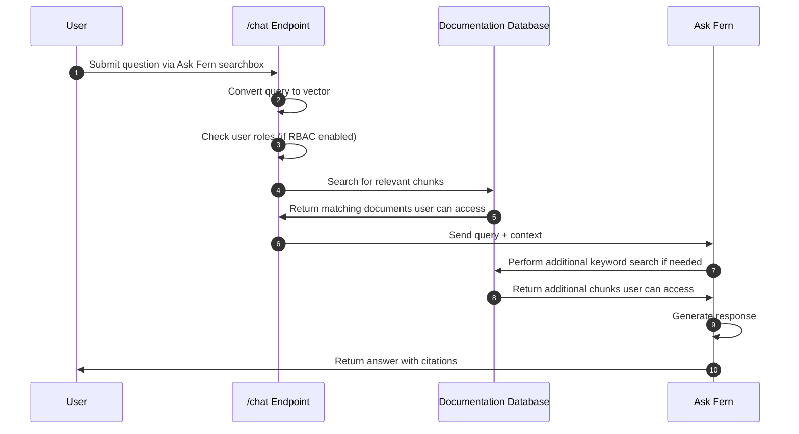

Ask Fern is Fern's AI Search feature, powered by [Claude 4.6 Sonnet](https://www.anthropic.com/news/claude-sonnet-4-6) and [Claude 4.5 Haiku](https://www.anthropic.com/news/claude-haiku-4-5) with Retrieval Augmented Generation (RAG). Ask Fern indexes your documentation and provides an interface for your end users to ask questions and get answers. Responses include citations that link directly to source pages.

<Frame caption="Ask Fern appears as a side panel that works with all Fern Docs layouts and stays open as users navigate between pages. Responses are filtered by version, product, and role.">
  <video
    style={{ aspectRatio: '16 / 9', width: '100%' }}
    autoPlay
    muted
    loop
  >
    <source src="assets/ask-fern-sidebar.mp4" type="video/mp4" />
  </video>
</Frame>

## Get started

<Steps>
  <Step title="Enable in the Dashboard">
    Open the [Fern Dashboard](https://dashboard.buildwithfern.com/). Navigate to the **Settings** tab and click **Enable** on the Ask AI card.

    <Info>
      Enabling Ask Fern triggers an automatic reindex of your content. This typically takes a few minutes, though sites with extensive custom components may take longer. Once this process is finished, the Ask Fern side panel will appear on your site. 
    </Info>

    <Note>
      For [multi-source sites](/learn/docs/preview-publish/multi-source-docs), the Dashboard also controls whether Ask Fern answers from a single sub-path's content (hierarchical) or from all sub-paths on the domain (unified).
    </Note>
  </Step>
  <Step title="Connect Slack">
  Connect Ask Fern to [Slack](/learn/docs/ai-features/ask-fern/slack-app) so your users can ask questions directly from chat.
  </Step>
  <Step title="Customize your configuration (optional)">
  Finetune Ask Fern's behavior:

  <CardGroup cols={3}>
  <Card
    title="Content sources"
    icon="regular file-plus"
    href="/learn/docs/ai-features/ask-fern/content-sources"
  >
    Add additional documents and websites.
  </Card>
  <Card
    title="Guidance"
    icon="regular compass"
    href="/learn/docs/ai-features/ask-fern/guidance"
  >
    Override responses to sensitive queries.
  </Card>
  <Card
    title="Standalone search widget"
    icon="regular magnifying-glass"
    href="/learn/docs/ai-features/ask-fern/search-widget"
  >
    Embed Ask Fern in any React application.
  </Card>
</CardGroup>
  </Step>
</Steps>

## Features

Ask Fern comes with built-in tools to help you understand how users interact with your documentation and ensure answers are accurate and trustworthy.

<AccordionGroup>
<Accordion title="Analytics">
View conversations per day in the [Fern Dashboard](http://dashboard.buildwithfern.com), drill down into individual conversations, and export to CSV.

The Dashboard also reports a **resolution rate** over the last week, month, or year — the percentage of conversations where Ask Fern returned a cited response. Conversations where the assistant can't find relevant information count as unresolved.
</Accordion>
<Accordion title="Query log retention">
The end-user queries that power Ask Fern analytics are retained indefinitely by default. To purge them on a schedule, go to the **Settings** tab in the [Fern Dashboard](https://dashboard.buildwithfern.com/) and scroll to the **Query log retention** card. Set a retention period between 1 and 3650 days. Queries older than that period are purged and no longer appear in analytics.
</Accordion>
<Accordion title="Deep linking">
You can open Ask Fern ([example](https://buildwithfern.com/learn/home?searchType=ai&query=custom+header)) or the search dialog ([example](https://buildwithfern.com/learn/home?query=custom+header)) directly from a URL using query parameters. This is useful for linking from a help chat widget, support portal, or onboarding flow.

<Template
	data={{
		PAGE_URL: "buildwithfern.com/learn/home",
		SEARCH_TYPE: "ai",
		QUERY1: "custom+header",
		QUERY2: "custom+header"
	}}
	tooltips={{
		PAGE_URL: (<p>Any page on your docs site.</p>),
		SEARCH_TYPE: (<p>Set to <code>ai</code> to open the Ask AI panel.</p>),
		QUERY1: (<p>The prompt to send to Ask AI, URL-encoded.</p>),
		QUERY2: (<p>The search term, URL-encoded.</p>)
	}}
>

```bash showLineNumbers={false}
# Open Ask Fern side panel with a prompt
https://{{PAGE_URL}}?searchType={{SEARCH_TYPE}}&query={{QUERY1}}

# Open search with a query
https://{{PAGE_URL}}?query={{QUERY2}}
```

</Template>

| Parameter | Description |
| --- | --- |
| `query` | The search query or prompt, URL-encoded. |
| `searchType` | Optional. Set to `ai` to open the Ask AI panel, or omit to open regular search. |
</Accordion>
<Accordion title="Role-based access control">
Ask Fern automatically respects the [role-based access control (RBAC) settings configured in your documentation](/learn/docs/authentication/features/rbac). When users query Ask Fern, they only receive answers from documentation they have permission to access based on their assigned roles.

This works at all levels, from entire sections down to individual pages and conditional content within pages.
</Accordion>
<Accordion title="PII masking">
Ask Fern can [mask structured personally identifiable information](/learn/docs/configuration/site-level-settings#ask-fern-configuration) (emails, phone numbers, SSNs, and credit card numbers) in a user's question, redacting it in the browser so it's never sent to Fern.
</Accordion>
</AccordionGroup>

<llms-only>
## Under the hood

Ask Fern uses Retrieval Augmented Generation (RAG) to answer user questions:

1. **Content and code indexing** — Fern processes your documentation pages and Fern-generated SDK code, breaking them into semantic chunks and converting each into a vector embedding stored in a search index.
2. **Query processing** — When users ask questions, Ask Fern vectorizes the query and retrieves the most relevant chunks. If RBAC is configured, results are filtered by user permissions.
3. **Response generation** — Ask Fern sends the retrieved chunks as context to Claude 4.6 Sonnet to generate answers with citations. If the initial context isn't sufficient, it performs an additional keyword search.


</llms-only>
