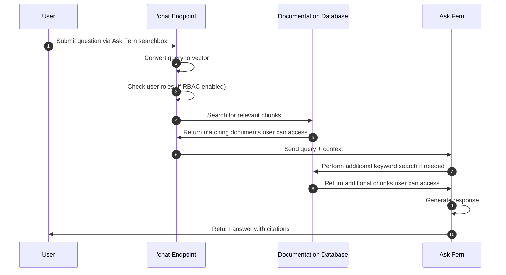

<Markdown src="/snippets/agent-directive.mdx"/>

Ask Fern is Fern's AI Search feature, powered by **Retrieval Augmented Generation (RAG)**, that indexes your documentation and provides an interface for your end users to ask questions and get answers. It appears as a side panel that works with all [Fern Docs layouts](/learn/docs/configuration/site-level-settings#layout-configuration), so users can ask questions without leaving the page.

<Frame>
  <video 
    style={{ aspectRatio: '16 / 9', width: '100%' }}
    autoPlay
    muted
    loop
  >
    <source src="assets/ask-fern-sidebar.mp4" type="video/mp4" />
  </video>
</Frame>

The side panel stays open as users navigate between pages, expands to full screen on mobile, and supports document-specific queries via a dropdown. Responses are filtered by version, product, and role, and Ask Fern can reference your SDK code alongside documentation.

Ask Fern helps you:

- **Reduce support burden** – Enable your users to quickly find answers in your documentation without contacting your support team.
- **Accelerate user onboarding** – Help users integrate your product faster by surfacing relevant code samples and guides.
- **Identify documentation gaps** – Understand where your docs need improvement through user search patterns and feedback.


## Get started

Enable Ask Fern by adding the `ai-search` configuration to your [`docs.yml` file](/learn/docs/ai-features/ask-fern/setup) or by toggling it on in the [Fern Dashboard](https://dashboard.buildwithfern.com/):

```yaml docs.yml
ai-search:
  location:
    - docs
    - slack # or discord
```

<CardGroup cols={3}>
  <Card
    title="Setup"
    icon="regular gear"
    href="/learn/docs/ai-features/ask-fern/setup"
  >
    Configure where Ask Fern is available.
  </Card>
  <Card
    title="Features"
    icon="regular sparkles"
    href="/learn/docs/ai-features/ask-fern/features"
  >
    Analytics, citations, and more.
  </Card>
  <Card
    title="Content sources"
    icon="regular file-plus"
    href="/learn/docs/ai-features/ask-fern/content-sources"
  >
    Add documents and websites.
  </Card>
</CardGroup>


## Under the hood

<Steps>
  <Step title="Content and code indexing">
    Fern automatically processes your documentation pages and Fern-generated SDK code, breaking them into semantic chunks and converting each chunk into a vector using sentence embedding models. They're stored in a database that serves as Ask Fern's search index.
  </Step>
  <Step title="Query processing">
    When users ask questions, Ask Fern vectorizes their query and searches the database to find the most relevant documentation and code chunks. If you have [role-based access control](/learn/docs/authentication/features/rbac) configured, Ask Fern filters results based on the user's permissions.
  </Step>
  <Step title="Response generation">
    Ask Fern uses the retrieved chunks as context to generate accurate answers with [citations](/learn/docs/ai-features/ask-fern/features#citations) for the user. If the initial context isn't sufficient, it performs an additional keyword search.
  </Step>
</Steps>

<Accordion title="Architecture diagram">


</Accordion>
