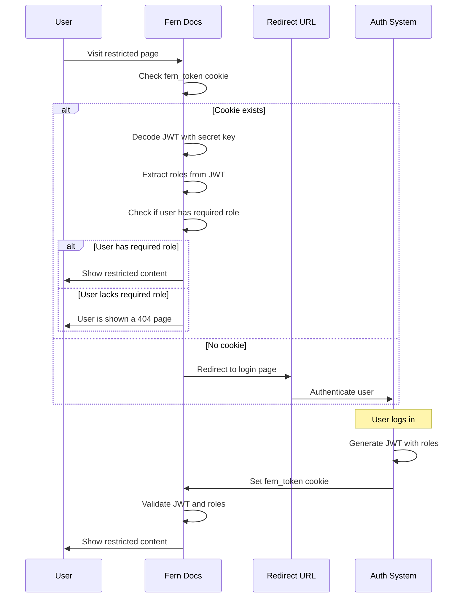

<Markdown src="/snippets/enterprise-plan.mdx"/>

With JWT, you manage the entire auth flow. This involves building and signing a [`fern_token`](/learn/docs/authentication/overview#how-authentication-works) cookie that integrates your docs with your existing login system. Like [OAuth](/learn/docs/authentication/setup/oauth), JWT enables:

- **Login only** — gate docs behind authentication
- **[RBAC](/learn/docs/authentication/features/rbac)** — restrict content by user role
- **[API key injection](/learn/docs/authentication/features/api-key-injection)** — pre-fill API keys in the [API Explorer](/learn/docs/api-references/api-explorer)

## How it works

1. A user clicks **Login** on your docs site and is redirected to your authentication page.
2. After authentication, your system signs a [JWT](https://jwt.io) with a secret key from Fern and sets it as a `fern_token` cookie.
3. Fern reads the token to determine the user's access and credentials.

<Accordion title="Architecture diagram">

</Accordion>

## Configuration

<Steps>
<Step title="Get your secret key">
Reach out to Fern to get your secret key and send them the URL of your authentication page. This is where users are redirected after clicking **Login**.
</Step>

<Step title="Build the `fern` claim">
The JWT payload must include a `fern` claim. What you include in the token's `fern` claim controls which features are enabled: login only, RBAC, or API key injection.

<CodeBlocks>
```json Login only
{
  "fern": {}
}
```

```json RBAC
{
  "fern": {
    "roles": ["partners"]
  }
}
```

```json API key injection
{
  "fern": {
    "playground": {
      "initial_state": {
        "auth": { "bearer_token": "eyJhbGciOiJIUzI1c" }
      }
    }
  }
}
```

```json API key injection + RBAC
{
  "fern": {
    "roles": ["partners"],
    "playground": {
      "initial_state": {
        "auth": { "bearer_token": "eyJhbGciOiJIUzI1c" }
      }
    }
  }
}
```
</CodeBlocks>
</Step>

<Step title="Set the `fern_token` cookie">
Add logic to your service to sign the JWT and set it as a `fern_token` cookie when a user logs in.

<Accordion title="Example: Complete callback endpoint">
This Next.js endpoint handles the callback from your authentication page. It reads the `state` parameter to determine where to redirect the user, mints a `fern_token` JWT using [jose](https://github.com/panva/jose), sets it as a cookie, and redirects the user back to the docs.

```typescript title="app/api/fern-token/route.ts"
import { SignJWT } from "jose";
import { cookies } from "next/headers";
import { type NextRequest, NextResponse } from "next/server";

export async function GET(req: NextRequest): Promise<NextResponse> {
  const domain = getDomain(req); // your logic to determine the docs domain

  // use the state param to determine redirect location
  const returnTo = req.nextUrl.searchParams.get("state");
  const redirectLocation = returnTo ?? `https://${domain}`;

  // fetch the user's API key, roles, and secret (from your config or database)
  const apiKey = await getApiKeyForUser();
  const roles = await getRolesForUser();
  const secret = await getSecretForDomain(domain);

  if (!secret) {
    // redirect with an error if credentials are missing
    const url = new URL(redirectLocation);
    url.searchParams.set("error", "missing_credentials");
    return NextResponse.redirect(url);
  }

  // mint the JWT using the secret key
  const fernToken = await mintFernToken({ secret, apiKey, roles });

  if (!fernToken) {
    const url = new URL(redirectLocation);
    url.searchParams.set("error", "token_creation_failed");
    return NextResponse.redirect(url);
  }

  // set the fern_token as a cookie on the docs domain
  const cookieJar = await cookies();
  cookieJar.set("fern_token", fernToken, {
    httpOnly: true,
    secure: true,
    sameSite: "lax",
    domain,
  });

  // redirect the user back to the docs
  return NextResponse.redirect(redirectLocation);
}

const encoder = new TextEncoder();

async function mintFernToken({
  secret,
  apiKey,
  roles,
}: {
  secret: string;
  apiKey?: string;
  roles?: string[];
}): Promise<string> {
  const fern: Record<string, unknown> = {};

  if (roles) {
    fern.roles = roles;
  }

  if (apiKey) {
    fern.playground = {
      initial_state: {
        auth: {
          bearer_token: apiKey,
        },
      },
    };
  }

  return await new SignJWT({ fern })
    .setProtectedHeader({ alg: "HS256", typ: "JWT" })
    .setIssuedAt()
    .setExpirationTime("1d") // set to any value
    .setIssuer("https://buildwithfern.com")
    .sign(encoder.encode(secret)); // sign using the secret provided by Fern
}
```
</Accordion>
</Step>

<Step title="Enable RBAC or API key injection (optional)">
Once your `fern_token` is working, configure the features you need:

- **[Role-based access control](/learn/docs/authentication/features/rbac)** — define roles in `docs.yml` and restrict navigation items or page content by role.
- **[API key injection](/learn/docs/authentication/features/api-key-injection)** — configure the `playground` payload, including custom headers, multiple API keys, and per-environment credentials.
</Step>
</Steps>
