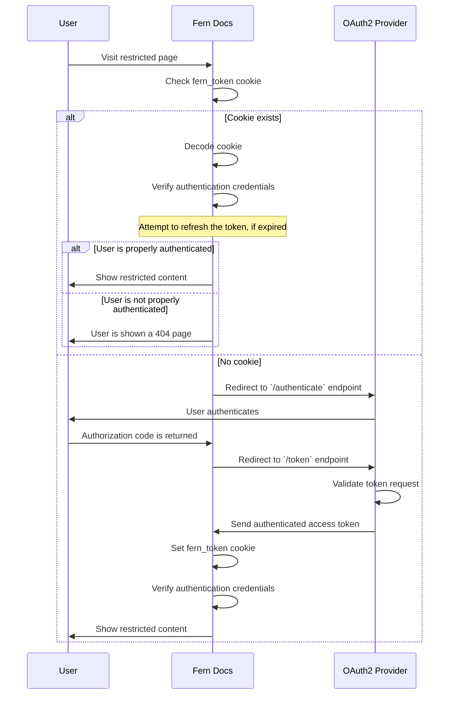

<Markdown src="/snippets/enterprise-plan.mdx"/>

With OAuth, Fern manages the auth flow for you. You give Fern access to your OAuth provider, and Fern handles the [`fern_token`](/learn/docs/authentication/overview#how-authentication-works) cookie that integrates your docs with your existing login system. Like [JWT](/learn/docs/authentication/setup/jwt), OAuth enables:

- **[RBAC](/learn/docs/authentication/features/rbac)** — restrict content by user role
- **[API key injection](/learn/docs/authentication/features/api-key-injection)** — pre-fill API keys in the [API Explorer](/learn/docs/api-references/api-explorer)

<Note>
This page covers OAuth for **docs site authentication** (gating access to documentation pages). If your API uses OAuth client credentials and you want the [API Explorer](/learn/docs/api-references/api-explorer) to handle the token exchange automatically, see [OAuth client credentials in the API Explorer](/learn/docs/api-references/api-explorer#authentication).
</Note>

## How it works

1. A user clicks **Login** on your docs site and Fern initiates an OAuth flow with your provider.
1. The user authenticates on your OAuth provider's login page.
1. Your provider redirects back to Fern with an authorization code, which Fern exchanges for an access token.
1. Fern sets a `fern_token` cookie containing the user's access and credentials.
1. When a user clicks **Logout**, Fern clears the session cookie. If a logout URL is configured, the user is redirected to your OAuth provider's logout endpoint to end the session there as well.

<Accordion title="Architecture diagram">

</Accordion>

## Configuration

<Steps>
<Step title="Create an OAuth client">
Go to your OAuth provider's dashboard and create a new **web application** client.
</Step>

<Step title="Allowlist Fern callbacks">
Allowlist the following callback in your OAuth provider:
`https://<your-domain>/api/fern-docs/oauth2/callback`.

Replace `<your-domain>` with your Fern Docs domain. If you use both a `.docs.buildwithfern.com` and a custom domain, allowlist both.
</Step>

<Step title="Send OAuth client details to Fern">
Send the following to support@buildwithfern.com or your dedicated Slack channel:

- [ ] Docs domain
- [ ] Client ID
- [ ] Client secret
- [ ] Authorization URL (e.g. `https://<your-oauth-tenant>/oauth2/authorize`)
- [ ] Token URL (e.g. `https://<your-oauth-tenant>/oauth2/token`)
- [ ] Scopes (e.g. `openid`, `profile`, `email`)
- [ ] Issuer URL (e.g. `https://<your-domain>`)
- [ ] Logout URL (optional, e.g. `https://<your-oauth-tenant>/oauth2/logout`)

<Note title="Specifying an audience">
If your client is connected to an API, you may need to specify an audience in the authentication request.

The updated authorization URL may look like this: `https://<your-oauth-tenant>/oauth2/authorize?audience=<your-api-identifier>`
</Note>
</Step>

<Step title="Wait for Fern to configure OAuth">
Fern will configure OAuth on your site. You'll receive a notification when authentication is ready.
</Step>

<Step title="Enable RBAC or API key injection (optional)">
Once OAuth is working, configure the features you need:

<AccordionGroup>
<Accordion title="RBAC">
<Steps>
<Step title="Add a custom claim">
Add a custom claim to your OAuth provider's token response so that Fern can determine each user's roles. The resulting token response should look something like this:

```json {12-15} maxLines=7 startLine=10
{
  "iss": "https://your-tenant.us.auth0.com/",
  "sub": "auth0|507f1f77bcf86cd799439011",
  "aud": "your_client_id_here",
  "iat": 1728388800,
  "exp": 1728475200,
  "email": "user@example.com",
  "email_verified": true,
  "name": "John Doe",
  "nickname": "johndoe",
  "picture": "https://s.gravatar.com/avatar/...",
  "roles": [
    "custom-role",
    "user-specific-role"
  ]
}
```

<Warning title="Using a claim other than `roles`">
Some OAuth providers have strict requirements for custom claims. If you need to use a claim other than `roles`, reach out to Fern and specify which claim should be parsed for the user's roles.
</Warning>

<Accordion title="Using Auth0">
To add a custom claim to Auth0, you need to create a **custom action**. This action will be used to add the custom claim to the token response.

1. Go to the **Actions** tab in the Auth0 dashboard.
2. Create a **Custom Action**.
3. Select **Login/Post Login**.
4. Add logic to set a roles.
    ```js Example Action
    exports.onExecutePostLogin = async (event, api) => {
      const roles = event.user.app_metadata?.roles; // or however you store user roles

      if (roles) {
        const namespace: "https://<your-domain>.com"; // important: custom claims must be namespaced
        api.accessToken.setCustomClaim(`${namespace}/roles`, roles);
      }
    };
    ```
5. Click **Create**.
6. Add the action to your **Post Login Flow**.
</Accordion>
</Step>
<Step title="Configure RBAC">
Once your token response includes roles, define those roles in `docs.yml` and assign them to navigation items and page content. See [Role-based access control](/learn/docs/authentication/features/rbac) for the full setup.
</Step>
</Steps>

</Accordion>
<Accordion title="API key injection">
Set up an authenticated account for Fern so Fern can authorize users on your behalf, and configure your OAuth application to return user API keys when Fern requests tokens. Contact support@buildwithfern.com to coordinate this setup.
</Accordion>
</AccordionGroup>
</Step>

</Steps>
