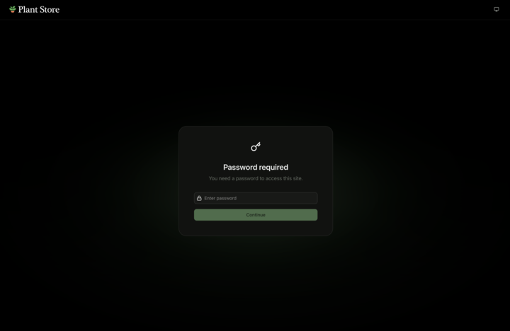

Fern offers several methods of authentication, including Role-Based Access Control (RBAC), Single Sign-On (SSO), and password protection.

**For most situations, use RBAC** for granular access control over your documentation. RBAC works well for sites with multiple audiences (internal teams, partners, customers) and supports API key injection to autopopulate code examples.

API key injection can be set up using either JWT or OAuth, depending on your existing authentication system.

**SSO is simpler** but only provides basic login functionality - it doesn't support RBAC or API key injection. SSO works well for internal-only documentation where everyone should see the same content.

**Password protection is the simplest option**, requiring visitors to enter a shared password before accessing your docs site. This is useful for early stage documentation or when you need basic access control without user management. To enable password protection, contact [Fern Support](mailto:support@buildwithfern.com).

<Note>
Learn how Fern handles user credentials and authentication in the [Security overview](/learn/docs/security/overview).
</Note>

Learn more about Fern's authentication options:

<CardGroup cols={4}>
  <Card title="Role-based access control" icon="fa-duotone fa-people-group" href="/docs/authentication/rbac">
    Granular access for different audiences
  </Card>
  <Card title="API key injection" icon="fa-duotone fa-key" href="/docs/authentication/api-key-injection">
    JWT or OAuth flows available
  </Card>
  <Card title="SSO" icon="fa-duotone fa-user-check" href="/docs/authentication/sso">
    Basic functionality and simple setup
  </Card>
  <Card title="Password protection" icon="fa-duotone fa-lock" href="#password-protection">
    Shared password for basic access control
  </Card>
</CardGroup>

## Password protection

Password protection allows you to restrict access to your documentation site using a shared password. When enabled, visitors see a password prompt before they can view any content.

This option is ideal for:

- Early stage documentation that isn't ready for public access
- Internal documentation that doesn't require individual user tracking
- Temporary access control during development or review periods

To enable password protection on your docs site, contact [Fern Support](mailto:support@buildwithfern.com).
