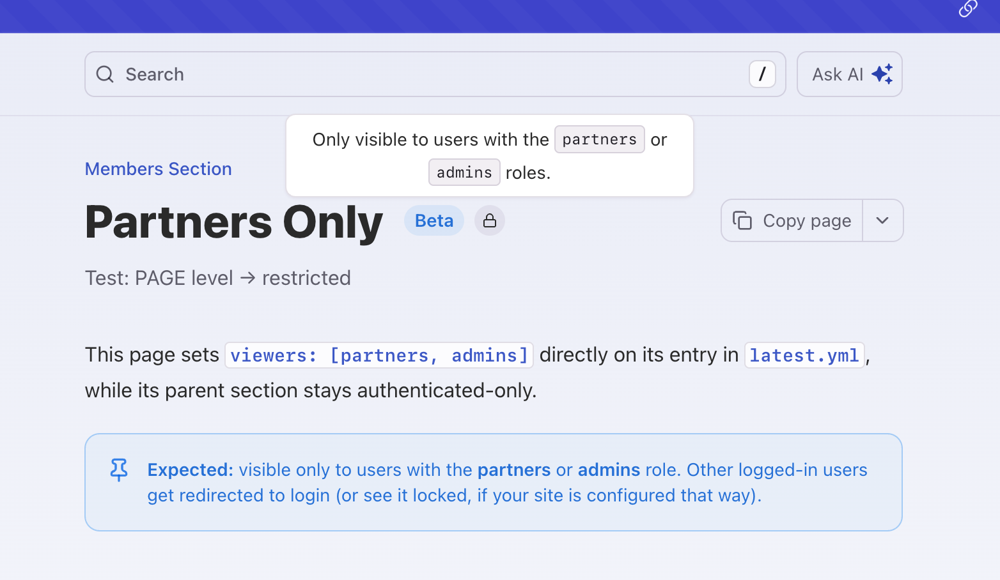

<Warning title="Team and Enterprise feature">
  Password-based RBAC is available on the [Team and Enterprise plans](https://buildwithfern.com/pricing). SSO, JWT, and OAuth-based RBAC require the [Enterprise plan](https://buildwithfern.com/pricing).
</Warning>

RBAC gates pages, sections, and other navigation items by role so each audience sees only the content meant for them. It works with [password protection](/learn/docs/authentication/setup/password-protection), [SSO](/learn/docs/authentication/setup/sso), [JWT](/learn/docs/authentication/setup/jwt), and [OAuth](/learn/docs/authentication/setup/oauth) authentication.

Use it for partner docs, beta features, tiered pricing content, and internal resources. You can combine it with [API key injection](/learn/docs/authentication/features/api-key-injection) when using JWT or OAuth authentication. When RBAC is configured, [Ask Fern](/learn/docs/ai-features/ask-fern/overview) automatically respects these permissions. By default, restricted pages are completely hidden from unauthorized users — if you'd like them to be visible but locked instead, let Fern know during setup.

Restricted pages display a lock icon next to the page title. Hovering over the icon shows which roles have access. The badge appears automatically on all restricted page types, including API Reference endpoints.

<Frame caption='Pages without `viewers` read "Only visible to authenticated users," while pages with `viewers` list the role names that can view the page.'>
  
</Frame>

## Setup

<Info>
  RBAC is configured in `docs.yml` and managed through the [Fern CLI](/learn/cli-api-reference/cli-reference/overview). If you set up your site using the [guided UI](https://dashboard.buildwithfern.com/get-started), you'll need to work with your Fern configuration files directly instead of through the Fern Dashboard.
</Info>

To enable RBAC, first set up an authentication method — [password protection](/learn/docs/authentication/setup/password-protection), [SSO](/learn/docs/authentication/setup/sso), [JWT](/learn/docs/authentication/setup/jwt), or [OAuth](/learn/docs/authentication/setup/oauth) — then define your roles in `docs.yml`:

```yml docs.yml
roles:
 - everyone # every user is given this role
 - partners
 - beta-users
 - admins
```

Every user automatically has the `everyone` role, including unauthenticated visitors. When an unauthenticated visitor requests a gated page, Fern redirects them to your login flow and returns them to the requested page after they authenticate. An authenticated user who lacks the required role sees a 404 page. There is no limit on the number of roles you can define, unless you're using [password protection](/learn/docs/authentication/setup/password-protection), which supports up to three.

## Restricting content

Once RBAC is configured, use `viewers` in your navigation and the `<If />` component in your pages to control what each role can see.

### In navigation

You can assign `viewers` to the following navigation items: `products`, `versions`, `tabs`, `sections`, `pages`, `api references`, and `changelogs`.

If you don't specify viewers, the content will be visible to any _authenticated_ user. To make content publicly accessible, explicitly set viewers to `everyone`.

```yml docs.yml {6-7, 13-15}
navigation:
  - tab: Home
    layout:
      - page: Welcome # this page is public
        path: pages/welcome.mdx
        viewers:
          - everyone
  - tab: Documentation
    layout:
      - page: Overview # this page is visible to all logged-in users
        path: pages/overview.mdx
      - section: Beta Release # this section is visible to beta-users and admins
        viewers:
          - beta-users
          - admins
        contents:
          ...
```

Viewership is inherited. For example, if a section can only be viewed by `admins`, then all its pages and nested sections can also only be viewed by admins.

### In MDX pages

Use the `<If />` component to [conditionally render content](/learn/docs/writing-content/components/if) based on user roles. You can specify one or multiple roles. Content is visible to users who have **any** of the specified roles:

```mdx
<If roles={["partners", "admins"]}>
  <Callout>
    This content is visible to both partners and admins.
  </Callout>
</If>
```

You can also combine `roles` with `products` and `versions` props.

## Preview as a role

On a docs [preview link](/learn/docs/preview-publish/preview-changes#preview-links), a role selector lets you view the site as a specific viewer to verify role-based visibility before publishing. Pick one or more roles to see the site as a user with those roles, or select anonymous to see the public view. The docs re-render with that viewer's visibility applied, including nav pruning, `<If />` blocks, and role-gated tabs and products. With no selection, the preview shows all content regardless of role.

## Example

Fern's RBAC demo site defines the following roles:

```yml docs.yml
roles:
  - everyone
  - work-trial
  - engineers
  - contractors
```

Unauthenticated users can only access sections marked as `viewers: everyone`. After logging in, users with the `work-trial`, `engineers`, or `contractors` role can access work trial content, engineering documentation, and contractor information.

<Frame caption="The `docs.yml` defines roles and gates sections, then the [live site](https://engineering.ferndocs.com/rbac-demo/public-content/) shows the public view.">
  <video
    autoPlay
    muted
    loop
  >
    <source src="assets/rbac.mp4" type="video/mp4" />
  </video>
</Frame>

<llms-only>
## Common errors

### Role "X" is used but not declared at the top level of the docs.yml file.

A [`viewers:`](#in-navigation) entry or [`<If roles={[...]}>`](/learn/docs/writing-content/components/if) reference uses a role that isn't listed under the top-level `roles:` key in `docs.yml`. Add the role to the [`roles`](#setup) list:

```yaml title="docs.yml"
roles:
  - everyone
  - partners
  - beta-users
  - admins
```
</llms-only>
