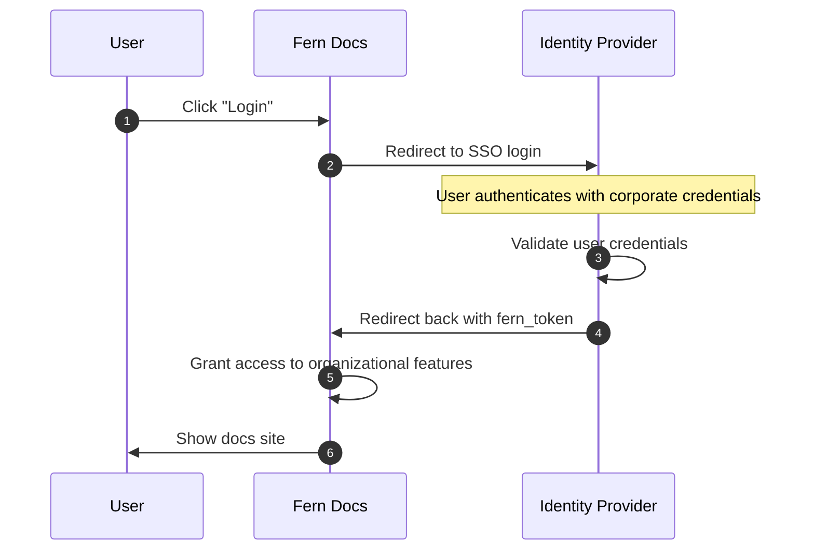

<Markdown src="/snippets/enterprise-plan.mdx"/>

SSO lets your team access your docs through your organization's identity provider using SAML 2.0 or OIDC. Like [RBAC](/learn/docs/authentication/features/rbac) and [API key injection](/learn/docs/authentication/features/api-key-injection), SSO uses the [`fern_token`](/learn/docs/authentication/overview#how-authentication-works) cookie to identify authenticated users. SSO unlocks the [Fern Editor](/learn/docs/writing-content/fern-editor) for browser-based editing and [authenticated preview links](/learn/docs/preview-publish/preview-changes#preview-links).

<Note>SSO provides login-based access control but doesn't support role management or API key injection. For granular access control, use [RBAC](/learn/docs/authentication/features/rbac) instead.</Note>

## How it works

When a user clicks **Login**, Fern redirects them to your identity provider. After authenticating with their corporate credentials, the identity provider redirects back to Fern with a `fern_token`, granting access to your docs.

<Accordion title="Architecture diagram">

</Accordion>

## Setup

Fern supports any SAML 2.0 or OIDC provider (Okta, Google Workspace, Auth0, Azure AD, OneLogin, etc.). [Contact Fern](https://buildwithfern.com/book-demo) or reach out via Slack. Fern will work with your security team to connect to your identity provider.
