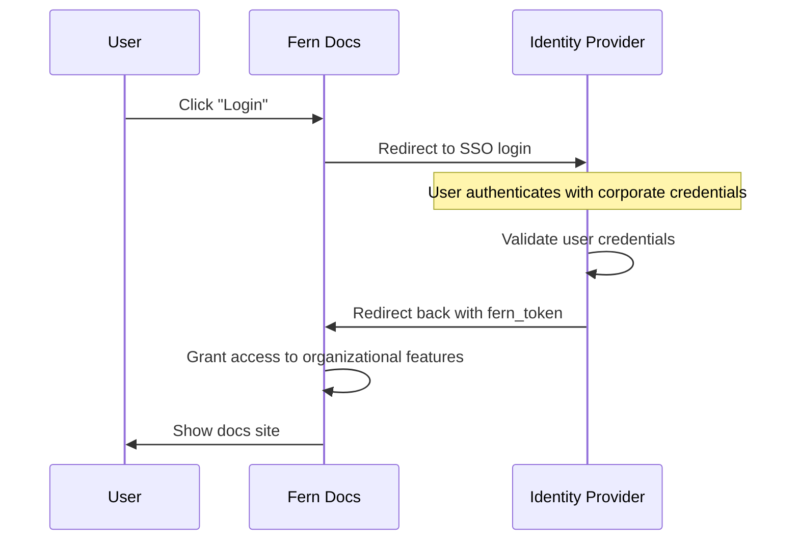

Fern’s Single Sign-On (SSO) is an enterprise feature that lets your team securely access your docs through your organization’s identity provider. This is designed for internal contributors, such as technical writers, product managers, or engineers, who need access to want to contribute to your documentation, view web analytics, or manage organizational settings.

<Note>SSO does not support Role-Based Access Control or API Key Injection.</Note>

## What SSO unlocks

When SSO is enabled for your organization, authenticated users of Fern gain access to:

- **Manage Users of your Organization**: Add teammates and configure settings for your organization
- **Access Ask Fern Analytics**: See AI-assisted search usage and browse verbatim user questions
- **View Web Analytics**: Track key site metrics, like page views and unique visitors **(coming soon)**
- **Use the Visual Editor**: Make edits to your docs from the browser
- **Send Authenticated Preview Links** Only authenticated users can view [preview links](docs/preview-publish/previewing-changes-locally)

## How it works

Fern's SSO integration allows your team to use their existing corporate credentials to access your Fern Docs site. Instead of managing separate Fern accounts, users authenticate through your organization's identity provider and are automatically granted appropriate access to your Fern resources.

### Architecture diagram

## Supported identity providers

Fern supports SSO integration with any identity provider that implements industry-standard protocols:

- **SAML 2.0**: Compatible with providers like Okta, OneLogin, Azure AD, and others
- **OIDC (OpenID Connect)**: Works with Google Workspace, Auth0, and other OIDC-compliant providers

## Setting up SSO

SSO is available as part of the Enterprise plan. Reach out via Slack or [contact our team](https://buildwithfern.com/contact) to begin the SSO setup process. Fern will work with one of your security administrators to connect to your identity provider.

