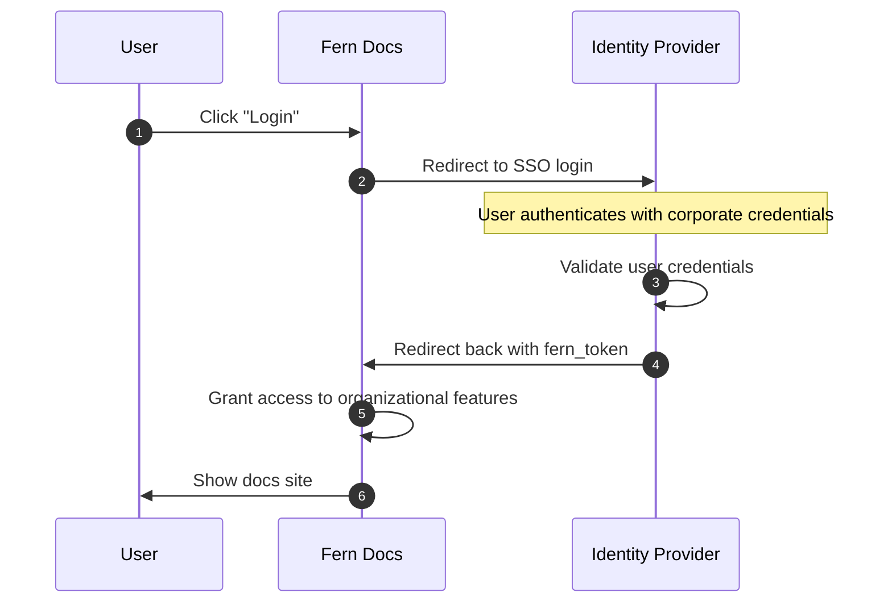

<Markdown src="/snippets/enterprise-plan.mdx"/>

SSO lets your team access your docs through your organization's identity provider using SAML 2.0 or OIDC. Like [RBAC](/learn/docs/authentication/features/rbac) and [API key injection](/learn/docs/authentication/features/api-key-injection), SSO uses the [`fern_token`](/learn/docs/authentication/overview#how-authentication-works) cookie to identify authenticated users. SSO unlocks the [Fern Editor](/learn/docs/writing-content/fern-editor) for browser-based editing and [authenticated preview links](/learn/docs/preview-publish/preview-changes#preview-links).

<Note>SSO supports [RBAC](/learn/docs/authentication/features/rbac) for role-gated content, but not [API key injection](/learn/docs/authentication/features/api-key-injection). For pre-filled API keys, use [JWT](/learn/docs/authentication/setup/jwt) or [OAuth](/learn/docs/authentication/setup/oauth).</Note>

## How it works

When a user clicks **Login**, Fern redirects them to your identity provider. After authenticating with their corporate credentials, the identity provider redirects back to Fern with a `fern_token`, granting access to your docs.

<Accordion title="Architecture diagram">

</Accordion>

## Setup

Fern supports any SAML 2.0 or OIDC provider (Okta, Google Workspace, Auth0, Azure AD, OneLogin, etc.). [Contact Fern](https://buildwithfern.com/book-demo) or reach out via Slack. Fern will work with your security team to connect to your identity provider.

## Role-based access control

SSO can gate content by role. Fern reads each user's roles from the WorkOS token issued at login, then applies the [`roles`](/learn/docs/authentication/features/rbac#setup) and [`viewers`](/learn/docs/authentication/features/rbac#in-navigation) rules in your `docs.yml`.

Fern's SSO runs on [WorkOS](/learn/docs/getting-started/how-it-works), so roles are assigned through your WorkOS organization. Fern coordinates this setup with you.

<Steps>
<Step title="Enable Organization Roles in WorkOS">
Turn on Organization Roles (RBAC) for your organization, then define a role for each audience you gate content for (for example, `admins` or `partners`). Each role's slug is the value Fern reads from the token.
</Step>

<Step title="Assign roles to users">
Give each user a role in one of two ways:

- Assign a role directly to a member of the organization.
- Map your identity provider's SSO or directory groups to WorkOS roles so members inherit a role from their group membership. Group mapping requires directory sync (SCIM).
</Step>

<Step title="Declare the same roles in `docs.yml`">
List the WorkOS role slugs under `roles` in `docs.yml`, then gate navigation and page content with `viewers` and the `<If />` component. See [Role-based access control](/learn/docs/authentication/features/rbac) for the full setup.
</Step>
</Steps>

Fern reads the organization role by default. To read roles from a different token claim instead (for example, a directory-group claim), tell Fern which claim to parse.
