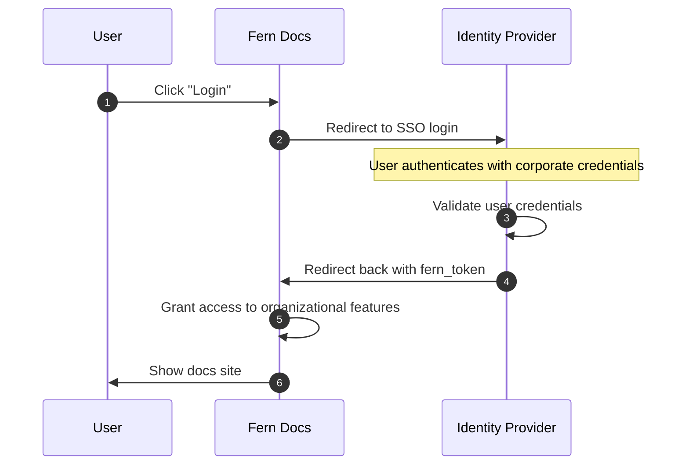

<Markdown src="/snippets/enterprise-plan.mdx"/>

Fern’s Single Sign-On (SSO) is an enterprise feature that lets your team securely access your docs through your organization’s identity provider.

<Note>SSO does not support Role-Based Access Control or API Key Injection.</Note>

## What SSO unlocks

When SSO is enabled for your organization, authenticated users of Fern can:

- **Use the Fern Editor**: Make edits to your docs from the browser
- **Send Authenticated Preview Links** Only authenticated users can view [preview links](/learn/docs/preview-publish/preview-changes#preview-links)

## How it works

Fern's SSO integration allows your team to use their existing corporate credentials to access your Fern Docs site. 

### Architecture diagram

## Supported identity providers

Fern supports SSO integration with any identity provider that implements industry-standard protocols:

- **SAML 2.0**: Compatible with providers like Okta, OneLogin, Azure AD, and others
- **OIDC (OpenID Connect)**: Works with Google Workspace, Auth0, and other OIDC-compliant providers

## Setting up SSO

Reach out via Slack or [contact our team](https://buildwithfern.com/contact) to begin the SSO setup process. Fern will work with one of your security administrators to connect to your identity provider.

