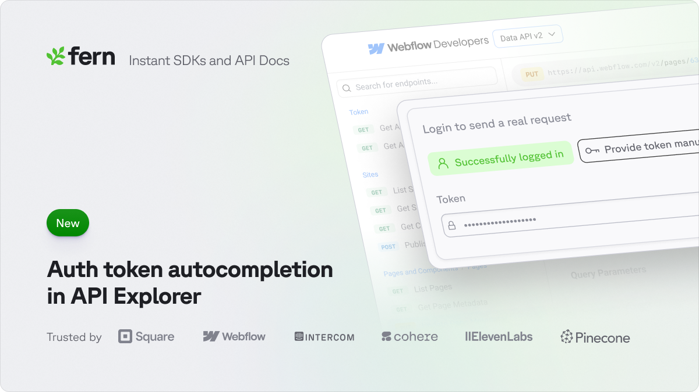

## Auto-Populate Credentials in API Explorer

<ChangelogTags>api-reference</ChangelogTags>

Save developers the hassle of finding and copying their API key. When authenticated, their API credentials will be automatically filled into the API Playground. This way, they can make their first API call even faster.



Check it out live in [Webflow's API Explorer](https://developers.webflow.com/data/reference/sites/list?playground=/data/reference/sites/list).

<Button intent="none" outlined rightIcon="arrow-right" href="/learn/docs/api-references/api-explorer">Read the docs</Button>

## Card Component System

<ChangelogTags>components</ChangelogTags>

Enhanced documentation card components for better visual organization. Information can now be presented in a more structured and appealing way.

```typescript
interface CardProps {
  title: string;
  description: string;
  icon?: IconName;
  variant?: 'default' | 'bordered' | 'filled';
  actions?: CardAction[];
}

interface CardAction {
  label: string;
  href?: string;
  onClick?: () => void;
}
```

<Button intent="none" outlined rightIcon="arrow-right" href="/learn/docs/writing-content/components/cards">Read the docs</Button>
