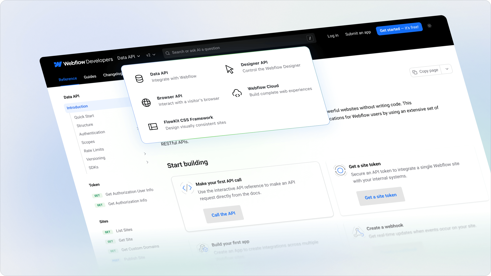

## Introducing The Product Switcher

<ChangelogTags>navigation</ChangelogTags>

Organize your docs by product so developers can find what they need quickly. Perfect for companies with multiple APIs, each with their own references, guides, versions, and changelogs.

Features:

- **Optimized for Search**  with SEO-friendly structure.
- **Keyword search and Ask Fern** work both within and across products.
- **Customizable** to your products with versions and unique icons to reflect your brand identity.

<Frame>

</Frame>

<Button intent="none" outlined rightIcon="arrow-right" href="/learn/docs/configuration/products">Read the docs</Button>
