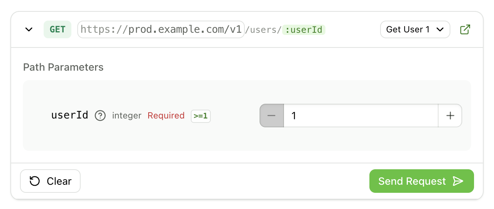

## HTTP Snippets now enabled by default

<ChangelogTags>api-reference, components, docs.yml</ChangelogTags>

HTTP snippets are now enabled by default for all documentation sites, making it easier for developers to see cURL, Python, Ruby, and other HTTP client examples directly in your API reference. Previously, this feature required internal configuration to activate.

You can now control HTTP snippets directly in your `docs.yml` file:

```yaml title="docs.yml"
# Turn off HTTP snippets
settings:
  http-snippets: false

# Or specify only certain languages
settings:
  http-snippets:
    - python
    - ruby
```

<Button intent="none" outlined rightIcon="arrow-right" href="/learn/docs/api-references/http-snippets">Read the docs</Button>

## Introducing Runnable Endpoint

<ChangelogTags>api-reference</ChangelogTags>

Test API endpoints directly from your documentation with our new interactive component. Runnable Endpoint allows your users to send real HTTP requests to your API without leaving your docs, making it easier for developers to explore and understand your API.

<Frame>

</Frame>

Embed the component anywhere in your MDX documentation to create an interactive request builder with form inputs for headers, path parameters, query parameters, and request bodies. Users can execute requests and see real-time responses, complete with status codes and syntax highlighting.

Key features include:

- **Interactive form builder** that automatically generates inputs based on your endpoint definition
- **Multiple examples support** with a dropdown selector when you have multiple pre-configured scenarios
- **Environment selector** for testing against production, staging, or development
- **Form persistence** that saves user input in local storage across sessions
- **Direct navigation** to the full API reference with an "Open in API reference" button

<Button intent="none" outlined rightIcon="arrow-right" href="/learn/docs/writing-content/components/runnable-endpoint">Read the docs</Button>
