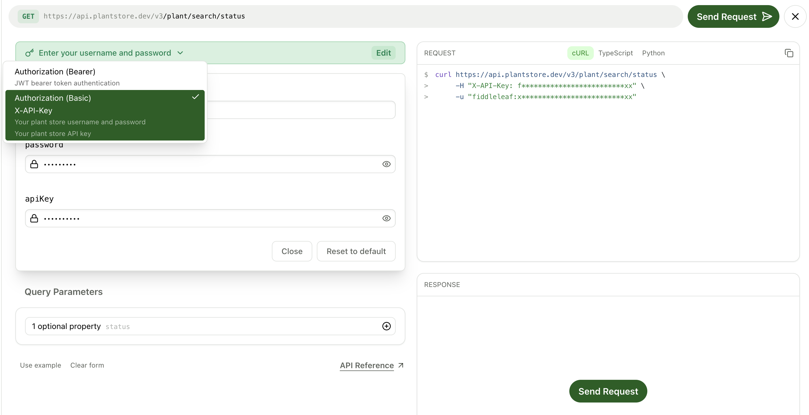

## Multiple authentication schemes in the API Explorer

<ChangelogTags>api-reference</ChangelogTags>

The API Explorer now supports multiple authentication schemes and combinations of authentication schemes for OpenAPI specs.

First, configure your OpenAPI spec with multiple security options:

```yaml openapi.yml {8-11}
/plant/search/status:
  get:
    tags:
      - plant
    summary: Search plants by status
    description: Filter plants based on their current status.
    operationId: searchPlantsByStatus
    security:
      - bearerAuth: []  # Option 1: Bearer token only (OR)
      - basicAuth: []   # Option 2: Basic auth AND API key (combined)
        apiKey: []
```

Then, the API Explorer automatically displays all available authentication options in a dropdown menu, allowing users to select and configure their preferred authentication method before sending requests.

<Frame caption="Authentication dropdown in the API Explorer">

</Frame>

<Button intent="none" outlined rightIcon="arrow-right" href="/learn/docs/api-references/api-explorer">Read the docs</Button>
