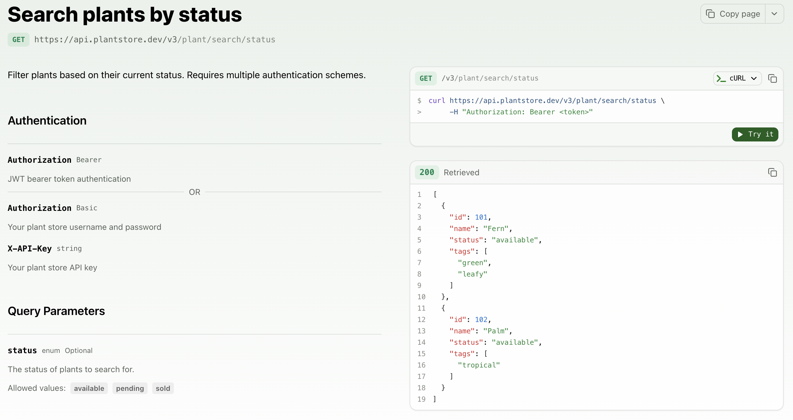

## Multiple authentication schemes in the API Explorer

The API Explorer playground now supports multiple authentication schemes and combinations of authentication schemes. You can configure your OpenAPI spec to allow users to choose between different authentication methods or require multiple authentication methods simultaneously.

When you define multiple security schemes in your OpenAPI specification, the API Explorer automatically displays all available authentication options. Users can select and configure the authentication method that matches their implementation.




Configure your OpenAPI spec with multiple security options:

```yaml OpenAPI specification
/plant/search/status:
  get:
    tags:
      - plant
    summary: Search plants by status
    description: Filter plants based on their current status.
    operationId: searchPlantsByStatus
    security:
      - bearerAuth: []
      - basicAuth: []
        apiKey: []
```

In this example, the endpoint accepts either bearer token authentication or a combination of basic authentication and API key authentication. Multiple security requirement objects (top-level list items) are treated as OR options, while multiple schemes within a single object are combined with AND. The API Explorer displays these options in a dropdown menu, allowing users to select and configure their preferred authentication method before sending requests.

Learn more about configuring authentication in the [API Explorer documentation](/learn/docs/api-references/api-explorer/overview).
