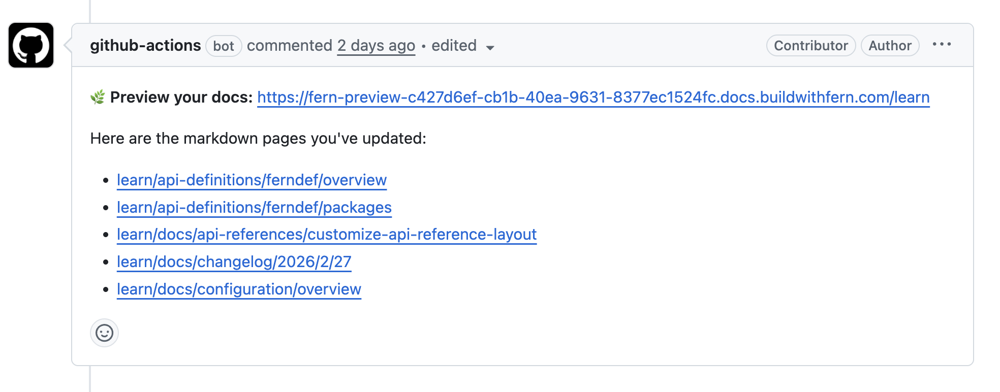

## Preview workflow with direct page links

<ChangelogTags>local-development, docs.yml</ChangelogTags>

You can now use an updated GitHub Actions preview workflow that comments on your pull request with direct links to every page you changed, so reviewers can jump straight to affected pages without navigating through the full site. The comment updates with a new preview link and refreshed page links when you push new commits.

<Frame>
    
</Frame>

To adopt this workflow, replace your `.github/workflows/preview-docs.yml` with the updated version. New sites created through the [guided UI](https://dashboard.buildwithfern.com/get-started) or [CLI quickstart](/learn/docs/getting-started/quickstart) include it automatically.

<Button intent="none" outlined rightIcon="arrow-right" href="/learn/docs/preview-publish/preview-changes#automate-with-github-actions">Read the docs</Button>
