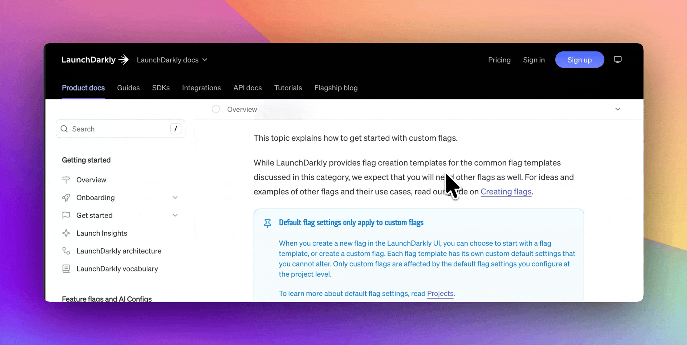

## Mobile table of contents bar

Pages using the [`guide` and `overview` layouts](/learn/docs/configuration/page-level-settings#layout) can now display a sticky table of contents bar below the header on mobile and tablet viewports. The bar shows a scroll progress indicator and the current heading, and expands to the full table of contents when tapped.

<Frame>
  
</Frame>

Enable it by adding `mobile-toc: true` under `layout` in `docs.yml`:

```yaml docs.yml
layout:
  mobile-toc: true
```

<Button intent="none" outlined rightIcon="arrow-right" href="/learn/docs/configuration/site-level-settings#layout-configuration">Read the docs</Button>
