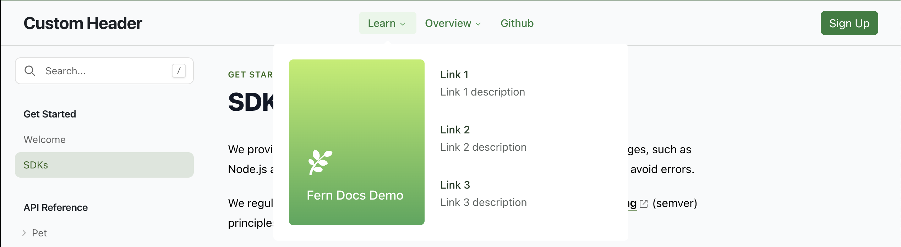
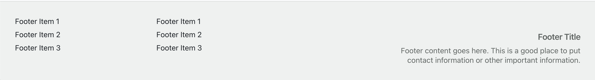

This page covers how to customize your docs with CSS, JavaScript, and custom components. However, you can [customize many things directly in your `docs.yml` file](/docs/configuration/site-level-settings), including colors, typography, navbar links, layout, analytics, and metadata. Try these built-in options first before adding custom code. 

## Custom CSS

You can add custom CSS to your docs to further customize the look and feel. The defined class names are applied across all MDX files. See the [CSS selectors reference](/learn/docs/customization/css-selectors-reference) for a complete list of available `.fern-*` selectors.

<Steps>
### Create `styles.css`

Add a `styles.css` file and include it in your `fern/` project:

<CodeBlock title="Add the styles.css file">
```bash {5}
  fern/
  ├─ openapi/
  ├─ pages/
  ├─ images/
  ├─ styles.css
  ├─ docs.yml
  └─ fern.config.json
```
</CodeBlock>

### Edit `docs.yml`

In `docs.yml`, specify the path to the `styles.css` file:

<CodeBlock title="docs.yml">
```yaml
css: ./styles.css
```
</CodeBlock>

### Add multiple custom CSS files (optional)

You can specify any number of custom CSS files:

<CodeBlock title="docs.yml">
```yaml
css:
  - ./css/header-styles.css
  - ./css/footer-styles.css
```
</CodeBlock>

</Steps>

<Note>
For customizing the background, logo, font, and layout of your Docs via Fern's built-in styling, 
check out the [Global Configuration](/learn/docs/configuration/site-level-settings). 
</Note>

### Common use cases

<AccordionGroup>
<Accordion title="Hiding page elements">

You can use custom CSS to hide specific Fern docs components that you don't want
to display.

<CodeBlock title="styles.css">
    ```css
    .fern-layout-footer-toolbar { # Hides Fern feedback widget
      display: none !important;
    }
    ```
</CodeBlock>

You can target other Fern UI components using their CSS class names. See the [CSS selectors reference](/learn/docs/customization/css-selectors-reference) for all available selectors, or use your browser's developer tools to inspect elements. 
</Accordion>
<Accordion title="Adding custom styling">

You can use custom CSS to create brand-specific styling for tables, components, and other elements in your documentation.

<CodeBlock title="styles.css">
```css maxLines=10

.petstore-table {
    background-color: white;
    border: 1px solid #DEDEE1;
    border-radius: 4px;
}

.dark .petstore-table { 
    background-color: #1e1e1e;
    border: 1px solid #2e2e2e;
}

.petstore-table thead {
    position: sticky;
    top: 0;
}

.petstore-table thead tr {
    background-color: #edecee;
    border: 1px solid #DEDEE1;
    border-radius: 4px 4px 0px 0px;
}

.dark .petstore-table thead tr {
    background-color: #2e2e2e;
    border: 1px solid #2e2e2e;
}

.petstore-table th {
    padding: 6px;
}

.petstore-table tbody td {
    padding: 6px;
}

.petstore-table tbody tr:nth-child(odd) {
    border: 1px solid #DEDEE1;
}
.petstore-table tbody tr:nth-child(even) {
    border: 1px solid #DEDEE1;
    background-color: #f7f6f8;
}

.dark .petstore-table tbody tr:nth-child(odd) {
    border: 1px solid #2e2e2e;
}

.dark .petstore-table tbody tr:nth-child(even) {
    border: 1px solid #2e2e2e;
    background-color: #2e2e2e;
}
```
</CodeBlock>
</Accordion>
</AccordionGroup>

### Inline CSS on MDX pages

You can add CSS directly within an MDX page using a `<style>` tag. This is useful for page-specific styles that don't need to be applied globally.

<CodeBlocks>
<CodeBlock title="page.mdx">
```mdx
---
title: My page
---

<style>
{`
.tropical-callout {
  background: linear-gradient(135deg, #2d5016 0%, #4a7c23 100%);
  border-radius: 8px;
  padding: 16px;
  color: white;
}

.dark .tropical-callout {
  background: linear-gradient(135deg, #1a3009 0%, #2d5016 100%);
}
`}
</style>

<div className="tropical-callout">
  Monstera deliciosa thrives in bright, indirect light.
</div>
```
</CodeBlock>
</CodeBlocks>

The CSS must be wrapped in curly braces and backticks (`{``}`) to be valid JSX. Use the `.dark` selector prefix to define styles for dark mode.

## Custom JavaScript

Customize the behavior of your Docs site by injecting custom JavaScript globally.Add a `custom.js` file and include it in your `fern/` project:

<CodeBlock title="Add the custom.js file">
```bash {5}
  fern/
  ├─ openapi/
  ├─ pages/
  ├─ images/
  ├─ custom.js
  ├─ docs.yml
  └─ fern.config.json
```
</CodeBlock>

In `docs.yml`, specify the path to the `custom.js` file:

<CodeBlock title="docs.yml">
```yaml
js: ./custom.js
```
</CodeBlock>

You can also specify multiple custom JS files stored locally and remote:

<CodeBlock title="docs.yml">
```yaml
js:
  - path/to/js/file.js
  - path: path/to/another/js/file.js
    strategy: beforeInteractive
  - url: https://example.com/path/to/js/file.js
```
</CodeBlock>

<Note>
We use `path` for local sources and `url` for remote sources.
</Note>

### Strategy

Optionally, specify the strategy for each custom JavaScript file. Choose from `beforeInteractive`, `afterInteractive` (default), and `lazyOnload`. 

<CodeBlock title="docs.yml">
```yaml
js:
  - path: path/to/another/js/file.js
    strategy: beforeInteractive
```
</CodeBlock>

### Common use cases

- Integrate with [third-party platforms](/docs/integrations/overview) that Fern doesn't natively support
- Implement custom search (also requires [your Algolia credentials](/docs/customization/search))
- Insert scripts and widgets

## Custom header and footer

<Markdown src="/snippets/pro-plan.mdx"/>

Replace Fern's default header or footer with your own React components. Custom components are server-side rendered for better SEO and performance.

<Steps>
### Create a component file

Create a TSX or JSX file with a default export that returns your component:

<CodeBlock title="components/CustomFooter.tsx">
```tsx
export default function CustomFooter() {
    return (
        <footer className="w-full py-8 px-6 bg-gray-100 dark:bg-gray-900 border-t border-gray-200 dark:border-gray-800">
            <div className="max-w-7xl mx-auto flex flex-col md:flex-row justify-between items-center gap-4">
                <div className="text-sm text-gray-600 dark:text-gray-400">
                    Plant Store API Documentation
                </div>
                <div className="flex gap-6">
                    <a
                        href="https://github.com/your-org"
                        className="text-sm text-gray-600 dark:text-gray-400 hover:text-gray-900 dark:hover:text-gray-100"
                    >
                        GitHub
                    </a>
                    <a
                        href="https://your-site.com"
                        className="text-sm text-gray-600 dark:text-gray-400 hover:text-gray-900 dark:hover:text-gray-100"
                    >
                        Website
                    </a>
                </div>
            </div>
        </footer>
    );
}
```
</CodeBlock>

### Reference in docs.yml

Add the `header` or `footer` property to your `docs.yml` file, pointing to your component:

<CodeBlock title="docs.yml">
```yaml
header: ./components/CustomHeader.tsx
footer: ./components/CustomFooter.tsx
```
</CodeBlock>

### Add to mdx-components (required)

Include your components directory in the `experimental.mdx-components` configuration so the CLI can upload the files:

<CodeBlock title="docs.yml">
```yaml
experimental:
  mdx-components:
    - ./components
```
</CodeBlock>
</Steps>

### Component requirements

Custom header and footer components must meet these requirements:

- The file must have a **default export** returning a React component
- Use standard React and JSX syntax (TSX or JSX files)
- Tailwind CSS classes are available for styling
- Use the `.dark` class prefix for dark mode styles

### Benefits over client-side injection

Server-side rendered custom components provide several advantages over the [client-side JavaScript approach](#custom-components-client-side):

- **No layout shifts**: Components render with the initial page load, eliminating flashes or jumps
- **Better SEO**: Search engines can index the rendered content
- **Faster page loads**: No additional JavaScript bundle to download and execute

## Custom components (client-side)

For components other than header and footer, or if you need more control over rendering, you can use client-side JavaScript to inject custom components into the DOM.

To implement your own components in Fern Docs, write JavaScript to render your 
custom components in the DOM. Build to CSS and JavaScript files that 
are stored in `fern/` and referenced in `docs.yml`:

<CodeBlocks>
<CodeBlock title="fern/">
```bash {5-7}
  fern/
  ├─ openapi/
  ├─ pages/
  ├─ images/
  ├─ dist/
    └─ output.css
    └─ output.js
  ├─ docs.yml
  └─ fern.config.json
```
</CodeBlock>
<CodeBlock title="docs.yml">
```yaml
css: ./dist/output.css
js: ./dist/output.js
```
</CodeBlock>
</CodeBlocks>

### Example custom components

See this [GitHub repo](https://github.com/fern-api/docs-custom-js-example) 
and its [generated docs page](https://custom-js-example.docs.buildwithfern.com/get-started/welcome) 
for an example of how to replace the Fern `header` and `footer` with custom React components using client-side JavaScript. 

#### Example custom header

<Frame>
   
</Frame>

```JavaScript
ReactDOM.render(
  React.createElement(NavHeader),
  document.getElementById('fern-header'),
)
```

#### Example custom footer

<Frame>
   
</Frame>

```JavaScript
ReactDOM.render(
  React.createElement(NavFooter),
  document.getElementById('fern-footer'),
)
```

### Important notes

- `ReactDOM.render()` may need to be called multiple times to prevent it from unmounting (this side-effect will be removed in the future).
- `yarn build` or `npm build` must generate files with deterministic names to be referenced in `docs.yml`. The above example uses a [`vite` config](https://github.com/fern-api/docs-custom-js-example/blob/main/custom-app/vite.config.ts) to accomplish this.
- For your hosted Docs site, you may need to update your CD steps to include building the react-app.
- Custom components aren't supported in local development, but are supported in preview links.

<Info>
This approach is subject to change, with notice, as we make improvements to the plugin architecture.
</Info>                                        