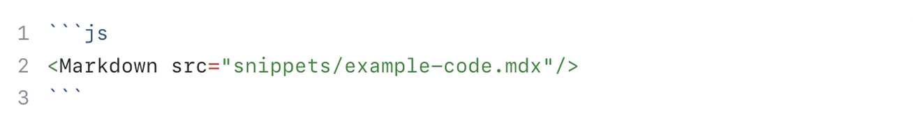
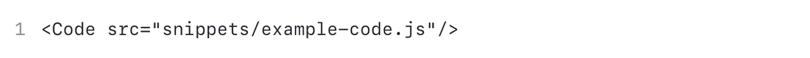

Fern uses [Shiki](https://shiki.matsu.io/) for syntax highlighting in code blocks. 
It's reliable and performant. Below are examples of how you can configure syntax highlighting in code snippets.

## Basic

To create a code snippet, you need to wrap your code in three backticks. 
You can also specify the language for syntax highlighting after the opening backticks.

<Tabs>
  <Tab title="Example">
    ```js
    console.log("hello world")
    ```
  </Tab>
  <Tab title="Markdown">
    ````mdx
    ```js
    console.log("hello world")
    ```
    ````
  </Tab>
</Tabs>


## Titles

You can add a title to your code snippet by adding a title after the language identifier.

<Tabs>
  <Tab title="Example">
    ```js Hello World Snippet
    console.log("hello world")
    ```
  </Tab>
  <Tab title="Markdown">
    ````mdx
    ```js Hello World Snippet
    console.log("hello world")
    ```
    ````

    <Note>
      You may also use a `title` prop or `filename` prop to achieve the same result. 
      
      For example, `title="Hello World Snippet"` or `filename="Hello World Snippet"`.
    </Note>
  </Tab>
</Tabs>

## Line highlighting

You can highlight specific lines in your code snippet by placing a numeric range inside `{}` 
after the language identifier.

<Tabs>
  <Tab title="Example">
    ```js {2-4}
    console.log("Line 1");
    console.log("Line 2");
    console.log("Line 3");
    console.log("Line 4");
    console.log("Line 5");
    ```
  </Tab>
  <Tab title = "Markdown">
    ````markdown
    ```javascript {2-4}
    console.log("Line 1");
    console.log("Line 2");
    console.log("Line 3");
    console.log("Line 4");
    console.log("Line 5");
    ```
    ````

    <Note>
      The range is inclusive and can be a single number, a comma-separated list of numbers, or ranges.

      For example, `{1,3,5-7}` will highlight lines 1, 3, 5, 6, and 7.
    </Note>
  </Tab>
</Tabs>

## Line focusing

Instead of highlighting lines, you can focus on specific lines by adding a comment `[!code focus]` or by adding a 
`focus` attribute after the language identifier. The `focus` attribute works the same way as the `highlight` attribute.

<Tabs>
  <Tab title="Example">
    ```javascript focus={2-4}
    console.log("Line 1");
    console.log("Line 2");
    console.log("Line 3");
    console.log("Line 4");
    console.log("Line 5");
    ```
  </Tab>
  <Tab title = "Markdown">
    ````markdown
    ```javascript focus={2-4}
    console.log("Line 1");
    console.log("Line 2");
    console.log("Line 3");
    console.log("Line 4");
    console.log("Line 5");
    ```
    ````
  </Tab>
</Tabs>

## Start line

You can control which line appears first in your code block by adding a `startLine` attribute after the language identifier. This is particularly useful for longer code snippets where you want to highlight the main logic while still providing the complete context.

<Tabs>
  <Tab title="Example">
    ```javascript startLine={6}
    console.log("Line 1");
    console.log("Line 2");
    console.log("Line 3");
    console.log("Line 4");
    console.log("Line 5");
    console.log("Line 6");
    console.log("Line 7");
    console.log("Line 8");
    console.log("Line 9");
    console.log("Line 10");
    console.log("Line 11");
    console.log("Line 12");
    console.log("Line 13");
    console.log("Line 14");
    console.log("Line 15");
    console.log("Line 16");
    console.log("Line 17");
    console.log("Line 18");
    console.log("Line 19");
    console.log("Line 20");
    console.log("Line 21");
    console.log("Line 22");
    console.log("Line 23");
    console.log("Line 24");
    console.log("Line 25");
    console.log("Line 26");
    console.log("Line 27");
    console.log("Line 28")
    ```
  </Tab>
  <Tab title="Markdown">
    ````markdown
    ```javascript startLine={6}
    console.log("Line 1");
    console.log("Line 2");
    console.log("Line 3");
    console.log("Line 4");
    console.log("Line 5");
    console.log("Line 6");
    console.log("Line 7");
    console.log("Line 8");
    console.log("Line 9");
    console.log("Line 10");
    console.log("Line 11");
    console.log("Line 12");
    console.log("Line 13");
    console.log("Line 14");
    console.log("Line 15");
    console.log("Line 16");
    console.log("Line 17");
    console.log("Line 18");
    console.log("Line 19");
    console.log("Line 20");
    console.log("Line 21");
    console.log("Line 22");
    console.log("Line 23");
    console.log("Line 24");
    console.log("Line 25");
    console.log("Line 26");
    console.log("Line 27");
    console.log("Line 28")
    ```
    ````
  </Tab>
</Tabs>

## Max height

You can control the max height of the code block by adding 
a `maxLines` attribute after the language identifier. The 
`maxLines` attribute should be a number representing the maximum 
number of lines to display. By default, the code block will display up to 20 lines.

When you use `maxLines`, an expand button automatically appears on hover in the top-right corner, allowing users to view the full code content in an expanded overlay that displays over the page.

<Tabs>
  <Tab title="Example: maxLines=10">
    ```python maxLines=10
    def is_prime(num):
        """Check if a number is prime."""
        if num <= 1:
            return False
        for i in range(2, num):
            if num % i == 0:
                return False
        return True

    start = 10
    end = 50

    print(f"Prime numbers between {start} and {end} are:")

    prime_numbers = []

    for num in range(start, end+1):
        if is_prime(num):
            prime_numbers.append(num)

    for prime in prime_numbers:
        print(prime)
    ```
  </Tab>
  <Tab title = "Markdown">
    ````markdown maxLines=10
    ```python maxLines=10
    def is_prime(num):
        """Check if a number is prime."""
        if num <= 1:
            return False
        for i in range(2, num):
            if num % i == 0:
                return False
        return True

    start = 10
    end = 50

    print(f"Prime numbers between {start} and {end} are:")

    prime_numbers = []

    for num in range(start, end+1):
        if is_prime(num):
            prime_numbers.append(num)

    for prime in prime_numbers:
        print(prime)
    ```
    ````

    <Note>
      To disable the default 20 lines limit, you can set `maxLines` to `0`.
    </Note>
  </Tab>
</Tabs>

To hide the expand button or add custom styling, target the `.fern-expand-button` selector:

```css
/* Hide the expand button */
.fern-expand-button {
  display: none;
}
```

## Wrap overflow

By default, long lines that exceed the width of the code block become scrollable:

<Tabs>
  <Tab title="Example">
    ```txt title="Without wordWrap"
    A very very very long line of text that may cause the code block to overflow and scroll as a result. 
    ```
  </Tab>
  <Tab title="Markdown">
    ````markdown
    ```txt title="Without wordWrap"
    A very very very long line of text that may cause the code block to overflow and scroll as a result. 
    ```
    ````
  </Tab>
</Tabs>

To disable scrolling and wrap overflow onto the next line, use the `wordWrap` prop:

<Tabs>
  <Tab title="Example">
    ```txt title="With wordWrap" wordWrap
    A very very very long line of text that may cause the code block to overflow and scroll as a result. 
    ```
  </Tab>
  <Tab title="Markdown">
    ````markdown
    ```txt title="With wordWrap" wordWrap
    A very very very long line of text that may cause the code block to overflow and scroll as a result. 
    ```
    ````
  </Tab>
</Tabs>


## Deep-linking

You can make specific text within code blocks clickable by defining a `links` map. This is useful for linking to documentation, API references, or related resources directly from your code examples.

The `links` property accepts a map where keys are matching patterns (exact strings or regex) and values are the URLs to link to.

### Exact string matching

<Tabs>
  <Tab title="Example">
    <CodeBlock
      links={{"PlantClient": "/docs/writing-content/demo#plantclient", "createPlant": "/docs/writing-content/demo#createplant"}}
    >
    ```typescript
    import { PlantClient } from "@plantstore/sdk";

    const client = new PlantClient({ apiKey: "YOUR_API_KEY" });
    const plant = await client.createPlant({
      name: "Monstera",
      species: "Monstera deliciosa"
    });
    ```
    </CodeBlock>
  </Tab>
  <Tab title="Markdown">
    ````markdown
    <CodeBlock
      links={{"PlantClient": "/docs/writing-content/demo#plantclient", "createPlant": "/docs/writing-content/demo#create_plant"}}
    >
    ```typescript 
    import { PlantClient } from "@plantstore/sdk";

    const client = new PlantClient({ apiKey: "YOUR_API_KEY" });
    const plant = await client.createPlant({
      name: "Monstera",
      species: "Monstera deliciosa"
    });
    ```
    </CodeBlock>
    ````

    <Note>
      The `links` property uses JSON format. Each key in the map is matched exactly against text in the code block, and matching text becomes a clickable link to the corresponding URL.
    </Note>
  </Tab>
</Tabs>

### Regex pattern matching

You can use regex patterns for more flexible matching. This is useful when you want to link multiple variations or patterns of text.

<Tabs>
  <Tab title="Example">
    <CodeBlock
      links={{"Plant\\w+": "/docs/writing-content/demo#type-definitions", "create_\\w+": "/docs/writing-content/demo#create_plant"}}
    >
    ```python
    from plantstore import PlantClient, PlantConfig

    client = PlantClient(api_key="YOUR_API_KEY")
    plant = client.create_plant(
        name="Fiddle Leaf Fig",
        species="Ficus lyrata"
    )
    ```
    </CodeBlock>
  </Tab>
  <Tab title="Markdown">
    ````markdown
    <CodeBlock
       links={{"Plant\\w+": "/docs/writing-content/demo#type-definitions", "create_\\w+": "/docs/writing-content/demo#create_plant"}}
    >
    ```python 
    from plantstore import PlantClient, PlantConfig

    client = PlantClient(api_key="YOUR_API_KEY")
    plant = client.create_plant(
        name="Fiddle Leaf Fig",
        species="Ficus lyrata"
    )
    ```
    </CodeBlock>
    ````

    <Note>
      When using regex patterns, remember to escape special characters with double backslashes (e.g., `\\w+`, `\\d+`) in the JSON string.
    </Note>
  </Tab>
</Tabs>

## Combining props

You can combine the `title`, `highlight`, `focus`, `startLine`, `maxLines`, `wordWrap`, and `links`
props to create a code block with a title, highlighted lines, specific starting line,
a maximum height, and clickable links.

<Tabs>
  <Tab title="Example">
    ```javascript title="Hello, World!" {6-8} maxLines=5 startLine={4}
    console.log("Line 1");
    console.log("Line 2");
    console.log("Line 3");
    console.log("Line 4");
    console.log("Line 5");
    console.log("Line 6");
    console.log("Line 7");
    console.log("Line 8");
    console.log("Line 9");
    console.log("Line 10");
    ```
  </Tab>
  <Tab title = "Markdown">
    ````markdown maxLines=5
    ```javascript title="Hello, World!" {6-8} maxLines=5 startLine={4}
    console.log("Line 1");
    console.log("Line 2");
    console.log("Line 3");
    console.log("Line 4");
    console.log("Line 5");
    console.log("Line 6");
    console.log("Line 7");
    console.log("Line 8");
    console.log("Line 9");
    console.log("Line 10");
    ```
    ````
  </Tab>
</Tabs>


## Code Blocks with Tabs

The `CodeBlocks` component allows you to display multiple code blocks in a tabbed interface.

<Tabs>
  <Tab title="Example">
    <CodeBlocks>
      ```ruby title="hello_world.rb"
      puts "Hello World"
      ```

      ```php title="hello_world.php"
      <?php
      echo "Hello World";
      ?>
      ```

      ```rust title="hello_world.rs"
      fn main() {
          println!("Hello World");
      }
      ```
    </CodeBlocks>
  </Tab>
  <Tab title="Markdown">
    ````jsx maxLines=0
    <CodeBlocks>
      ```ruby title="hello_world.rb"
      puts "Hello World"
      ```

      ```php title="hello_world.php"
      <?php
      echo "Hello World";
      ?>
      ```

      ```rust title="hello_world.rs"
      fn main() {
          println!("Hello World");
      }
      ```
    </CodeBlocks>
    ````
  </Tab>
</Tabs>

## Language synchronization

Multiple `CodeBlocks` on a documentation site automatically synchronize. This
means when a user selects a `CodeBlock` with a specific language, all other
`CodeBlocks` across your documentation site with the same language will
automatically sync and switch to match. Language preferences are stored in
client-side local storage and persist across browser sessions.

The example below demonstrates language sync in action – choosing a language in
either set of `CodeBlocks` will automatically update both sets to match:

<CodeBlocks>
  ```python title="Python"
  print("First code block!")
  ```

  ```typescript title="TypeScript"
  console.log("First code block!");
  ```

  ```go title="Go"
  fmt.Println("First code block!")
  ```

  ```csharp title="C#"
  Console.WriteLine("First code block!");
  ```

  ```java title="Java"
  System.out.println("First code block!");
  ```

  ```ruby title="Ruby"
  puts "First code block!"
  ```
</CodeBlocks>

<CodeBlocks>
  ```python title="Python"
  print("Second code block - syncs with the one above!")
  ```

  ```typescript title="TypeScript"
  console.log("Second code block - syncs with the one above!");
  ```

  ```go title="Go"
  fmt.Println("Second code block - syncs with the one above!")
  ```

  ```csharp title="C#"
  Console.WriteLine("Second code block - syncs with the one above!");
  ```

  ```java title="Java"
  System.out.println("Second code block - syncs with the one above!");
  ```

  ```ruby title="Ruby"
  puts "Second code block - syncs with the one above!"
  ```
</CodeBlocks>

<Note title="Tabs and CodeBlocks integration">
  `CodeBlocks` automatically synchronize with [`<Tab>` components that have a `language` property](/docs/writing-content/components/tabs#language-synchronization).
</Note>

### Linking to language-specific content

<Markdown src="snippets/language-url.mdx" />

### Override synchronization

You can override the synchronization of code blocks by setting the `for` prop.

<Tabs>
  <Tab title="Example">
    <CodeGroup>
      ```bash title="Install using npm" for="npm"
      npm install plantstore
      ```
      ```bash title="Install using pnpm" for="pnpm"
      pnpm add plantstore
      ```
      ```bash title="Install using yarn" for="yarn"
      yarn add plantstore
      ```
    </CodeGroup>
    
    <CodeGroup>
      ```bash title="Uninstall using npm" for="npm"
      npm uninstall plantstore
      ```
      ```bash title="Uninstall using pnpm" for="pnpm"
      pnpm remove plantstore
      ```
      ```bash title="Uninstall using yarn" for="yarn"
      yarn remove plantstore
      ```
    </CodeGroup>
  </Tab>
  <Tab title="Markdown">
    ````md
    <CodeGroup>
      ```bash title="Install using npm" for="npm"
      npm install plantstore
      ```
      ```bash title="Install using pnpm" for="pnpm"
      pnpm add plantstore
      ```
      ```bash title="Install using yarn" for="yarn"
      yarn add plantstore
      ```
    </CodeGroup>
    
    <CodeGroup>
      ```bash title="Uninstall using npm" for="npm"
      npm uninstall plantstore
      ```
      ```bash title="Uninstall using pnpm" for="pnpm"
      pnpm remove plantstore
      ```
      ```bash title="Uninstall using yarn" for="yarn"
      yarn remove plantstore
      ```
    </CodeGroup>
    ````
  </Tab>
</Tabs>

## Embed local code files

<Tabs>
  <Tab title="Example">
    Option A
    ```js
    <Markdown src="snippets/example-code.mdx" />
    ```
    
    Option B
    <Code src="snippets/example-code.js" />
  </Tab>
  <Tab title="Markdown">
    Option A
    <Frame>
    
    </Frame>

    Option B
    <Frame>
      
    </Frame>
  </Tab>
</Tabs>
