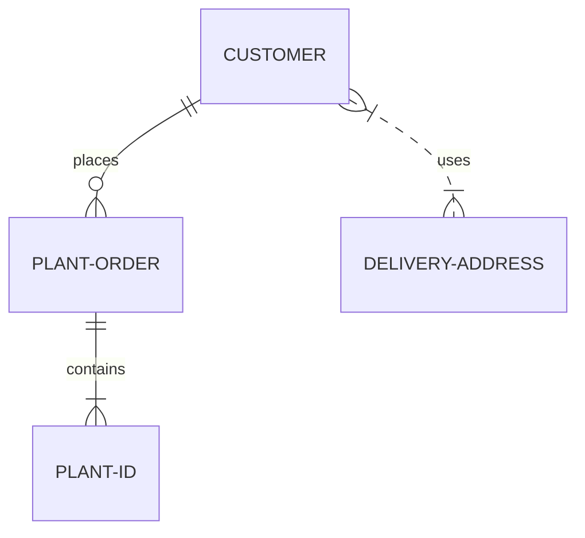

Enhance your documentation with rich media content including images, videos, PDFs, mathematical equations, and diagrams.

## Images

You can use locally stored images or URLs to include images in your Markdown pages. Use either [Markdown syntax](https://www.markdownguide.org/basic-syntax/#images-1) or the [`` HTML tag](https://developer.mozilla.org/en-US/docs/Web/HTML/Element/img) to insert the image. Don't use the `<embed>` element, as it has inconsistent browser support.

<Info title="Image paths">
  You can reference images using paths relative to the page's location (using `./` or `../`) or relative to the `fern` folder root (using `/`). For example, an image at `fern/assets/images/logo.png` can be referenced from any page as `/assets/images/logo.png`.
</Info>

<Tabs>
  <Tab title="Markdown">
    ```markdown
    <!-- Relative to page location -->
    

    <!-- Relative to fern folder root -->
    
    ```
  </Tab>
  <Tab title="HTML">
    ```html
    <!-- Relative to page location -->
    

    <!-- Relative to fern folder root -->
    
    ```
  </Tab>
</Tabs>

Common image attributes:

| Attribute | Description |
| --------- | ----------- |
| `src` | URL or path to the image file |
| `alt` | Alternative text for accessibility |
| `title` | Tooltip text shown on hover |
| `width` and `height` | Dimensions of the image (px) |
| `noZoom` | Disables image zoom functionality |

<Note>
For more details about the HTML image element and its attributes, see the [MDN documentation on the img element](https://developer.mozilla.org/en-US/docs/Web/HTML/Element/img).
</Note>

## PDFs

Embed PDFs using the `<iframe>` element. Don't use the `<embed>` element, as it has inconsistent browser support.

<Tabs>
<Tab title="Rendered PDF">
<iframe src="../default-components/all-about-ferns.pdf" width="100%" height="500px" style={{ border: 'none', borderRadius: '0.5rem' }} />
</Tab>
<Tab title="PDF syntax">
```html
<iframe src="../default-components/all-about-ferns.pdf" width="100%" height="500px" style={{ border: 'none', borderRadius: '0.5rem' }} />
```
</Tab>
</Tabs>

## Videos

### Local videos

You can embed videos in your documentation using the HTML `<video>` tag. This gives you control over video playback settings like autoplay, looping, and muting. Don't use the `<embed>` element, as it has inconsistent browser support.

<Markdown src="/products/docs/snippets/html-video-syntax-callout.mdx" />

<Tabs>
<Tab title="Rendered video">
<video
    src="./embed-fern-waving.mp4"
    width="854"
    height="480"
    autoPlay
    loop
    muted
    controls
>
</video>
</Tab>
<Tab title="Video syntax">
```html
<video
    src="path/to/your/video.mp4"
    poster="path/to/your/thumbnail.png"
    width="854"
    height="480"
    autoPlay
    loop
    playsInline
    muted
    controls
>
</video>
```

</Tab>
</Tabs>

You can also wrap the video in a container div for additional styling:

```html
<div class="card-video">
    <video
        src="path/to/your/video.mp4"
        poster="path/to/your/thumbnail.png"
        width="854"
        height="480"
        autoPlay
        loop
        playsInline
        muted
        controls
    >
    </video>
</div>
```

Common video attributes:

| Attribute | Description |
| --------- | ----------- |
| `src` | URL or path to the video file |
| `poster` | URL or path to a preview image shown while the video is loading or before the user hits play |
| `width` and `height` | Dimensions of the video player |
| `autoPlay` | Video starts playing automatically |
| `loop` | Video repeats when finished |
| `playsInline` | Video plays inline on mobile devices instead of fullscreen |
| `muted` | Video plays without sound |
| `controls` | Shows video player controls (play/pause, volume, etc.) |

<Note>
For more details about the HTML video element and its attributes, see the [MDN documentation on the video element](https://developer.mozilla.org/en-US/docs/Web/HTML/Element/video).
</Note>

### Embed YouTube or Loom videos

You can embed videos from YouTube, Loom, Vimeo, and other streaming platforms using an `<iframe>` element.

<Warning>
  `.mdx` files use JSX syntax, not pure HTML. Attributes for HTML elements like `<video>` and `<iframe>` that are embedded in `.mdx` pages must be written in `camelCase` rather than lowercase. For example, use `autoPlay` instead of `autoplay`.
</Warning>

<Tabs>
  <Tab title="Rendered Loom video">
  <iframe
    src="https://www.loom.com/embed/2e7f038de6894c69bf9c0d2525b0ad7f?sid=8bb327d2-8ba6-413c-a832-8d80282ad527"
    width="100%"
    height="450px"
    frameBorder="0"
    allowFullScreen
  ></iframe>
  </Tab>
  <Tab title="Loom video syntax">
    ```mdx
    <iframe
      src="https://www.loom.com/embed/2e7f038de6894c69bf9c0d2525b0ad7f?sid=8bb327d2-8ba6-413c-a832-8d80282ad527"
      width="100%"
      height="450px"
      frameBorder="0"
      allowFullScreen
    ></iframe>
    ```
  </Tab>
</Tabs>

See an example of [how it renders](https://elevenlabs.io/docs/conversational-ai/guides/integrations/zendesk#demo-video) on the corresponding docs page from the ElevenLabs documentation.

## External sites

You can embed any external web page in your documentation using an `<iframe>`.

<Info>
  If the target site sets headers like `X-Frame-Options` or a restrictive `Content-Security-Policy`, the browser blocks the embed. Verify that the site you want to embed allows being framed.
</Info>

<Tabs>
  <Tab title="Rendered external site">
  <iframe
    src="https://en.wikipedia.org/wiki/Fern"
    style="width: 100%; height: 500px; border: none; border-radius: 8px;"
  ></iframe>
  </Tab>
  <Tab title="External site syntax">
  ```mdx
  <iframe
    src="https://en.wikipedia.org/wiki/Fern"
    style="width: 100%; height: 500px; border: none; border-radius: 8px;"
  />
  ```
  </Tab>
</Tabs>

When [embedding a Fern Docs site](/learn/docs/customization/embedded-mode) inside another application, append `?embedded=true` to the URL to hide the header and footer.

## LaTeX

Fern supports [LaTeX](https://www.latex-project.org/) math equations. To use LaTeX, wrap your inline math equations in `$`. For example, `$(x^2 + y^2 = z^2)$` will render $x^2 + y^2 = z^2$.

For display math equations, wrap the equation in `$$`. For example:

```latex
$$
% \f is defined as #1f(#2) using the macro
\f\relax{x} = \int_{-\infty}^\infty
    \f\hat\xi\,e^{2 \pi i \xi x}
    \,d\xi
$$
```

$$
% \f is defined as #1f(#2) using the macro
\f\relax{x} = \int_{-\infty}^\infty
    \f\hat\xi\,e^{2 \pi i \xi x}
    \,d\xi
$$

### Displaying literal dollar signs

Text containing dollar amounts (like prices, budgets, or costs) may unintentionally render as math equations. To display literal dollar signs, escape them with a backslash (`\`):

<div className="highlight-frame">
  <div className="highlight-frame-content">
    Without escaping: The product costs $10 and shipping is $5

    With escaping: The product costs \$10 and shipping is \$5
  </div>
</div>


```markdown Markdown wordWrap
Without escaping: The product costs $10 and shipping is $5
With escaping: The product costs \$10 and shipping is \$5
```

## Diagrams
Fern supports creating diagrams within your Markdown using [Mermaid](https://mermaid.js.org/). Mermaid offers a variety of diagrams, including flowcharts, entity-relationship models, and Gantt charts. To include a Mermaid diagram in your Markdown file, create a codeblock marked with `mermaid`.

````markdown

````


