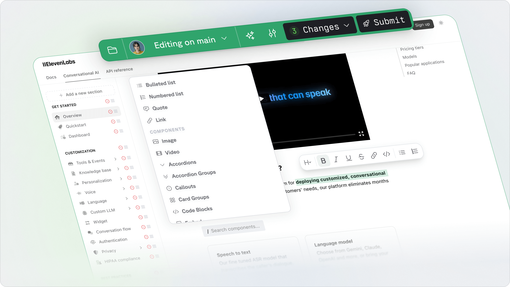

Fern Editor lets you modify your documentation without touching code. Make changes directly in your browser while maintaining your Git-based workflow.

<Frame
    caption="Edit your docs visually with Fern Editor"
    background="subtle"
>
    
</Frame>

## Try Fern Editor

  <Button intent="primary" href="https://dashboard.buildwithfern.com/" rightIcon="arrow-right">
    Open Dashboard
  </Button>

After logging in, connect your GitHub account. Then open Fern Editor from the Docs settings.it

## Key Features

<CardGroup cols={2}>
  <Card title="Easy to use" icon="duotone bolt">
  - Edit inline, use the slash (`/`) menu to add components
  - Preview changes as you type - no local setup
  - Works across your entire docs site
  </Card>

  <Card title="GitHub‑backed workflow" icon="fa-github">
  - Publishing creates a pull request with your changes
  - Keep code review, CI checks, and branch protections
  </Card>
</CardGroup>

All Fern components are supported. See the full list in the Components Overview: [Components Overview](https://buildwithfern.com/learn/docs/writing-content/components/overview).

## Why Fern Editor

- Makes updating your docs site super simple
- GitHub-backed so you’ll always have a PR to review and merge

<Tip>
Have feedback? Use the Feedback button in the top-right of the editor.
</Tip>

## FAQ

<AccordionGroup>
  <Accordion title="How is “WYSIWYG” related to Fern Editor?">
  “WYSIWYG” is a common term for visual editing. Fern Editor is our visual editor - same idea, clearer name.
  </Accordion>

  <Accordion title="Why is a GitHub‑backed editor important?">
  Your changes become pull requests. That means code review, auditability, CI checks, and merge control with branch protections - no surprises in production.
  </Accordion>

  <Accordion title="Does Fern Editor support all components?">
  Yes. Fern Editor supports all built‑in components. See the full list here: [Components Overview](https://buildwithfern.com/learn/docs/writing-content/components/overview).
  </Accordion>

  <Accordion title="Can I use Fern Editor without local setup or CLI?">
  Yes. Edit directly in the browser - no local environment required. Your GitHub PR keeps your normal review and CI process.
  </Accordion>

  <Accordion title="How do I start using Fern Editor?">
  Log in to the [Dashboard](https://dashboard.buildwithfern.com/), connect GitHub, then open Fern Editor from the top navigation.
  </Accordion>

  <Accordion title="Is Fern Editor good for SEO and performance?">
  Yes. Pages are server‑rendered and optimized for SEO. Components within accordions and tabs are still indexable.
  </Accordion>

  <Accordion title="What browsers and devices does Fern Editor support?">
  Modern Chromium, Firefox, and Safari on desktop. Mobile editing is not yet supported.
  </Accordion>
</AccordionGroup>

