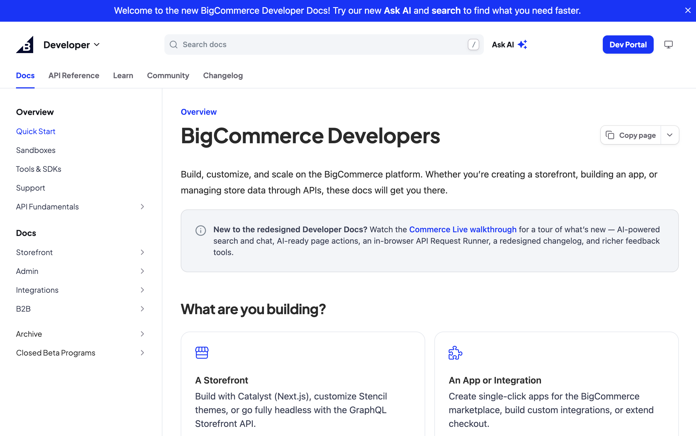

Use an announcement banner to draw attention to new features, updates, and product launches. When configured, the announcement bar appears at the top of your docs site. After the user dismisses the bar, it will reappear the next time you update the announcement.

<Frame caption="BigCommerce uses an announcement banner to welcome visitors to their [developer docs](https://docs.bigcommerce.com/developer/docs/overview/quick-start) and point them to Ask AI and search.">

</Frame>

## Setup

Add an `announcement` property with a `message` to your `docs.yml`:

```yml docs.yml
announcement:
    message: "🚀 New feature: Announcements are available! (<a href=\"https://buildwithfern.com/learn/docs/customization/announcement-banner\" target=\"_blank\">Learn more</a>) 🚀"
```

The announcement message supports Markdown and HTML. You can include links, images, and other formatting, including [custom CSS](/learn/docs/customization/custom-css-js#custom-css).

## Configuring announcements at multiple levels

Announcements can be configured at multiple levels to target specific products or versions. The override hierarchy is:

1. **Version-level** - Highest priority, always shown when defined for a specific version
2. **Product-level** - Used when no version-level announcement exists for a product
3. **Config-level** - Fallback announcement shown across all products/versions when no specific override is defined

Add the `announcement` property directly to items in the `products:` or `versions:` lists in your `docs.yml` file. 

The below example shows a multi-product docs site where the Docs product
displays "Docs product is in beta", the SDKs v1 version shows "v1 is in
maintenance mode", and the SDKs v2 version inherits the product-level message
"New SDK features available!"

```yaml docs.yml
# Config-level announcement (fallback for all products/versions)
announcement:
  message: "Welcome to our documentation!"

products:
  - display-name: Docs
    path: ./products/docs/docs.yml
    # Product-level announcement (overrides config-level for this product)
    announcement:
      message: "Docs product is in beta. Features may change."

  - display-name: SDKs
    path: ./products/sdks/sdks.yml
    announcement:
      message: "New SDK features available!"
    
    versions:
      - display-name: v1
        path: ./products/sdks/v1/docs.yml
        # Version-level announcement (highest priority, overrides product and config)
        announcement:
          message: "v1 is in maintenance mode. Upgrade to v2."
      
      - display-name: v2
        path: ./products/sdks/v2/docs.yml
        # This version will show the product-level announcement
```
