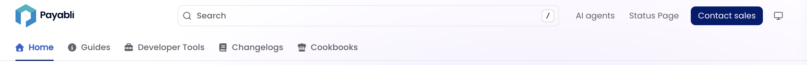

<Markdown src="/snippets/agent-directive.mdx"/>

<Markdown src="/snippets/enterprise-plan.mdx"/>

Replace Fern's default header or footer with your own React components. Components are server-side rendered for better SEO and performance, with no layout shifts.

<Frame caption={<a href="https://docs.payabli.com">Payabli's custom header</a>}>
  
</Frame>

<Steps>
  ### Create your component

  Your component file must have a default export returning a React component. Tailwind CSS classes are available, including the `dark:` prefix for dark mode styles:

  ```tsx components/CustomHeader.tsx
  export default function CustomHeader() {
      return (
          <header className="w-full py-4 px-6 bg-white dark:bg-gray-900 border-b border-gray-200 dark:border-gray-800">
              <div className="max-w-7xl mx-auto">
                  Plant Store API Documentation
              </div>
          </header>
      );
  }
  ```

  ```tsx components/CustomFooter.tsx
  export default function CustomFooter() {
      return (
          <footer className="w-full py-8 px-6 bg-gray-100 dark:bg-gray-900">
              <div className="max-w-7xl mx-auto">
                  Plant Store API Documentation
              </div>
          </footer>
      );
  }
  ```

  ### Add the component paths to `docs.yml`

  ```yaml docs.yml
  header: ./components/CustomHeader.tsx
  footer: ./components/CustomFooter.tsx
  ```

  ### Specify your components directory in `docs.yml`

  Add your components directory to `docs.yml` so that the Fern CLI can scan your components directory and upload them to the server.

  ```yml docs.yml
  experimental:
    mdx-components:
      - ./components
  ```
</Steps>
